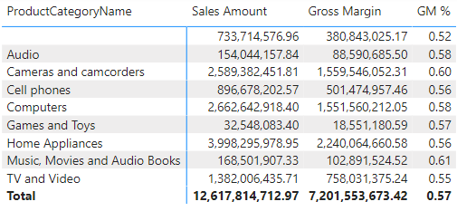
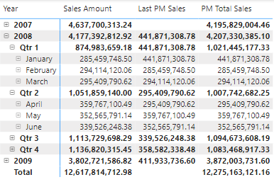
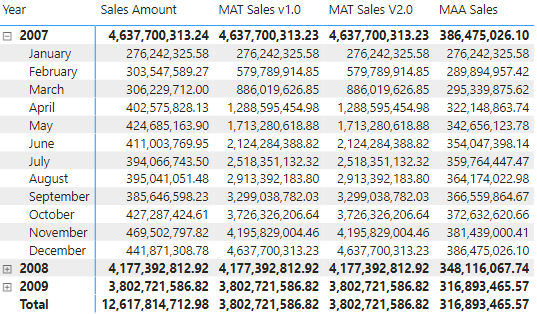
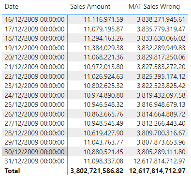

# DAX

## Columnas calculadas

La expresión DAX definida para una columna calculada opera en el contexto de la fila actual de la tabla a la que pertenece la columna calculada. Cualquier referencia a una columna devuelve el valor de esa columna para la fila actual. No podemos acceder directamente a los valores de otras filas.
Sin embargo, tenga en cuenta que una columna calculada utiliza una valiosa RAM. Aunque esta técnica es útil durante el desarrollo de proyectos, es un mal hábito en producción porque cada cálculo intermedio se almacena en la RAM y desperdicia espacio valioso.

## Medidas
Las columnas calculadas son útiles, pero puede definir los cálculos en un modelo DAX de otra manera. Siempre que no desee calcular valores para cada fila, sino agregar valores de muchas filas en una tabla, estos cálculos le resultarán útiles; se llaman medidas.
Por ejemplo, puede definir algunas columnas calculadas en la tabla Ventas para calcular el monto del margen bruto:

## Diferencia entre medidas y Columnas Calculadas
La diferencia es el contexto de la evaluación. Una medida se evalúa en el contexto de un elemento visual o en el contexto de una consulta DAX. Sin embargo, una columna calculada se calcula en el nivel de fila de la tabla a la que pertenece. El contexto del elemento visual (contexto de filtro) depende de las selecciones del usuario en el informe o del formato de la consulta DAX. Por lo tanto, cuando utilizamos SUM(Sales[SalesAmount]) en una medida, nos referimos a la suma de todas las filas que se agregan en una visualización. Sin embargo, cuando usamos Sales[SalesAmount] en una columna calculada, nos referimos al valor de la columna SalesAmount en la fila actual.

# Funciones de tabla
Una expresión DAX normalmente devuelve un valor único, como una cadena o un número. Una expresión que da como resultado un valor único se llama expresión escalar. Al definir una medida o una columna calculada, siempre da cómo expresiones escalares.
En este ejemplo, SUMX itera sobre la tabla Ventas. Por lo tanto, aunque el resultado del cálculo completo es un valor escalar, durante el cálculo la fórmula escanea la tabla de Ventas. El mismo código podría iterar el resultado de una función de tabla, como el siguiente código. Este código calcula el monto de ventas solo para filas mayores que uno:

```
Sales Amount Multiple Items = SUMX (
    FILTER (
        FactSales,
        FactSales[SalesQuantity] > 1
    ),
    FactSales[SalesQuantity] * FactSales[UnitPrice]
)
```


Utilizamos una función FILTER en lugar de la referencia a Ventas. Intuitivamente, FILTER es una función que filtra el contenido de una tabla en función de una condición. Por ahora, es importante tener en cuenta que siempre que haga referencia al contenido de una tabla, puede reemplazar la referencia con el resultado de una función de tabla.
En el código anterior verá un filtro aplicado a una agregación de suma. Esta no es una buena práctica. 
Allí, usamos variables para almacenar valores escalares. Sin embargo, las variables también pueden almacenar tablas. 
En una columna calculada o dentro de una iteración, también se puede utilizar la función RELATEDTABLE para acceder todas las filas de una tabla relacionada. Por ejemplo, la siguiente columna calculada en la tabla Producto calcula el monto de ventas del producto correspondiente:

```
Product(Product Sales Amount) = SUMX (
    RELATEDTABLE( FactSales ),
    FactSales[SalesQuantity] * FactSales[UnitPrice]
)
```

## FILTER

FILTER recibe una tabla y una condición lógica como parámetros. Como resultado, FILTER devuelve todas las filas que cumplen la condición. FILTER es a la vez una función de tabla y un iterador al mismo tiempo. Para devolver un resultado, escanea la tabla evaluando la condición fila por fila. En otras palabras, itera la tabla.
Por ejemplo, la siguiente tabla calculada devuelve los productos Fabrikam (siendo Fabrikam una marca).

```
FabrikamProducts = 
FILTER (
'DimProduct',
DimProduct[BrandName] = "Fabrikam"
)
```


FILTER se usa a menudo para reducir el número de filas en iteraciones. Para calcular las ventas de productos rojos, se puede crear una medida como la siguiente:

```
RedSales = SUMX (
    FILTER (
        FactSales,
        RELATED ( DimProduct[ColorName] ) = "Red"
    ),
    FactSales[SalesQuantity] * FactSales[SalesQuantity]
)
```

Puede verse el resultado en la Figura 01-03, junto con las ventas totales.


La Figura 01-03 RedSales muestra la cantidad de ventas de productos rojos únicamente.

La medida RedSales se repitió sobre un subconjunto de la tabla Ventas, es decir, el conjunto de ventas relacionadas con un producto rojo. FILTER agrega una condición a las condiciones existentes. Por ejemplo, RedSales en la fila Audio muestra las ventas de productos que son tanto de la categoría Audio como de color Rojo.
Sin utilizar funciones de tabla, una posible implementación podría ser la siguiente:

```
NumOfRedProducts = SUMX (
    DimProduct,
    IF(
        DimProduct[ColorName] = "Red",
        1,
        0
    )
)
```

El IF interno devuelve 1 o 0 dependiendo del color del producto, y la suma de esta expresión devuelve la cantidad de productos rojos. Aunque funciona, este código es algo complicado. Una mejor implementación de la misma medida es la siguiente:

```
NumOfRedProducts_v2.0 = COUNTROWS (
    FILTER (
         DimProduct,
         DimProduct[ColorName] = "Red"
    )
)
```


# 2 - contextos de evaluación 

Recuerde, el contexto de fila como el contexto de filtro son contextos de evaluación, no son el mismo concepto. 

El contexto del filtro filtra; el contexto de la fila se itera.


Podemos usar esta medida en un informe y observar los resultados, como se muestra en la Figura 4-1.


Figura 4-1 La medida Sales Amount, sin contexto, muestra el total general de ventas.

## Contexto de filtro

El propósito del contexto de filtro es, como su nombre lo indica, filtrar tablas. 
La fórmula calcula exactamente lo que uno esperaría: la suma de todos los montos de ventas. En un informe real, es probable que se divida el valor en una determinada columna. Por ejemplo, podemos seleccionar la marca del producto, usarla en las filas y el informe matricial comienza a revelar información empresarial interesante, como se muestra en la Figura 4-2.


La Figura 2-2 Suma del importe de las ventas, dividida por marca, muestra las ventas de cada marca en filas separadas.

Cuando ls Marca está en las filas, el contexto del filtro filtra una marca para cada celda. Si aumentamos la complejidad de la matriz agregando el año en las columnas, obtenemos el informe de la Figura 4-3.


Figura 2-3 El monto de las ventas se divide por marca y año.

Ahora cada celda muestra un subconjunto de datos pertinentes a una marca y un año. La razón de esto es que el contexto de filtro de cada celda ahora filtra tanto la marca como el año. En la fila Total, el filtro es solo por la marca, mientras que en la columna Total el filtro es solo por el año. El total general es la única celda que calcula la suma de todas las ventas porque, allí, el contexto del filtro no aplica ningún filtro al modelo.
Las reglas del juego deben ser claras en este punto: cuantas más columnas usemos para dividir y dividir, más columnas filtrará el contexto de filtro en cada celda de la matriz. Si se agrega la columna Store[Continent] a las filas, el resultado es, nuevamente, diferente, como se muestra en la Figura 4-4.


Figura 4-4 El contexto está definido por el conjunto de campos en filas y columnas.


## Contexto de fila

El contexto de fila no es una herramienta para filtrar tablas. En cambio, se utiliza para iterar sobre tablas y evaluar valores de columnas.


Cuando creamos una columna calculada sobre una tabla con un millón de filas, DAX crea un contexto de fila que evalúa la expresión que se itera sobre la tabla fila por fila, utilizando el contexto de fila como cursor.
Cuando creamos una columna calculada, DAX crea un contexto de fila de forma predeterminada.

Ahora definimos una columna calculada para calcular el margen bruto:

Sales(Gross Margin) = FactSales[SalesQuantity] * ( FactSales[UnitPrice] - FactSales[UnitCost] )


Figura 02-05 Columna Calculalada Sales(Gross Margin)

Definiremos Gross MarginMargen como medida, como en el siguiente código:

```
Gross Margin = SUMX (
    FactSales,
    FactSales[SalesQuantity] * (FactSales[UnitPrice] - FactSales[UnitCost])
)
```


## SUM in a calculated column

```
Sales(SumOfSalesQuantity) = SUM ( FactSales[SalesQuantity] )
```
Medida con resultado equivalente equivalente:

```
Sales(SumOfSalesQuantity) = SUMX (
     ALL(FactSales), 
     FactSales[SalesQuantity]
)
```

El contexto del filtro está vacío. De hecho, el contexto del filtro se crea mediante elementos visuales o consultas, y una columna calculada se calcula en el momento de la actualización de los datos cuando no se está realizando ningún filtrado. Por lo tanto, SUM funciona en toda la tabla Ventas, agregando el valor de FactSales[SalesQuantity] para todas las filas de Ventas.
Esta columna calculada calcula el mismo valor para cada fila, es decir, el total general de FactSales[SalesQuantity] repetido para todas las filas. La Figura 4-6 muestra el resultado de la columna calculada SumOfSalesQuantity.


Figura 4-6 SUM (FactSales[SalesQuantity]), en una columna calculada, se calcula con respecto a toda la base de datos.

Este ejemplo muestra que los dos contextos de evaluación existen al mismo tiempo, pero no interactúan. Ambos contextos de evaluación trabajan sobre el resultado de una fórmula, pero lo hacen de diferentes maneras. Los agregadores como SUM, MIN y MAX solo usan el contexto de filtro e ignoran el contexto de fila.

## Columnas en una medida

falta completar

## Contexto de fila con iteradores

DAX crea un contexto de fila cada vez que definimos una columna calculada o cuando iniciamos una iteración con una función X. Cuando usamos una columna calculada, la presencia del contexto de la fila es fácil de usar y comprender. De hecho, podemos crear columnas calculadas simples sin siquiera saber acerca de la presencia del contexto de la fila. La razón es que el motor crea automáticamente el contexto de la fila. Por lo tanto, no necesitamos preocuparnos por la presencia del contexto de fila. Por otro lado, cuando utilizamos iteradores somos responsables de la creación y el manejo del contexto de la fila. Además, al utilizar iteradores podemos crear múltiples contextos de filas anidadas; esto aumenta la complejidad del código. Por tanto, es importante comprender con mayor precisión el comportamiento de los contextos de filas con iteradores.

Por ejemplo, mire la siguiente medida DAX:

```
IncreasedSales = SUMX (
     FactSales, 
     FactSales[UnitPrice] * 1.1 
)
```

Como SUMX es un iterador, SUMX crea un contexto de fila en la tabla Ventas y lo utiliza durante la iteración. El contexto de la fila itera la tabla Ventas (primer parámetro) y proporciona la fila actual al segundo parámetro durante la iteración. En otras palabras, DAX evalúa la expresión interna (el segundo parámetro de SUMX) en un contexto de fila que contiene la fila actualmente iterada en el primer parámetro.
Tenga en cuenta que los dos parámetros de SUMX utilizan contextos diferentes. De hecho, cualquier fragmento de código DAX funciona en el contexto donde se llama. Por lo tanto, cuando se ejecuta la expresión, es posible que ya haya un contexto de filtro y uno o varios contextos de fila activos. Mira la misma expresión con comentarios:

```
IncreasedSales = SUMX (
     FactSales, -- External filter and row contexts
     FactSales[UnitPrice] * 1.1 -- External filter and row contexts + new row context
)
```

El primer parámetro, Ventas, se evalúa utilizando los contextos provenientes de la persona que llama. El segundo parámetro (la expresión) se evalúa utilizando los contextos externos más el contexto de fila recién creado.
Todos los iteradores se comportan de la misma manera:
1.Evaluar el primer parámetro en los contextos existentes para determinar las filas a escanear.
2.Cree un nuevo contexto de fila para cada fila de la tabla evaluada en el paso anterior.
3.Repita la tabla y evalúe el segundo parámetro en el contexto de evaluación existente, incluido el contexto de fila recién creado.
4.Agregue los valores calculados durante el paso anterior.
Tenga en cuenta que los contextos originales siguen siendo válidos dentro de la expresión. Los iteradores añaden un nuevo contexto de fila; no modifican los contextos de filtro existentes. Por ejemplo, si el contexto del filtro externo contiene un filtro para el color Rojo, ese filtro sigue activo durante toda la iteración. Además, recuerda que el contexto de la fila se itera; no filtra. Por lo tanto, pase lo que pase, no podemos anular el contexto del filtro externo utilizando un iterador.
Esta regla siempre es válida, pero hay un detalle importante que no es baladí. Si los contextos anteriores ya contenían un contexto de fila para la misma tabla, entonces el contexto de fila recién creado oculta el contexto de fila existente anterior en la misma tabla. Para los novatos en DAX, esta es una posible fuente de errores. Por lo tanto, analizamos la ocultación del contexto de filas con más detalle en las dos secciones siguientes.

## Contextos de filas anidadas en diferentes tablas

## Contexto de filas en una misma tabla

El escenario de tener contextos de filas anidadas en la misma tabla puede parecer raro. Sin embargo, esto sucede con bastante frecuencia y con mayor frecuencia en columnas calculadas. Imaginemos que queremos clasificar los productos según el precio de lista. El producto más caro debe ocupar el puesto 1, el segundo producto más caro debe ocupar el puesto 2, y así sucesivamente. Podríamos resolver el escenario usando la función RANKX. Pero con fines educativos, mostramos cómo resolverlo utilizando funciones DAX más simples.
Para calcular la clasificación, para cada producto podemos contar la cantidad de productos cuyo precio es superior al del producto actual. Si no hay ningún producto con un precio más alto que el precio actual del producto, entonces el producto actual es el más caro y su clasificación es 1. Si solo hay un producto con un precio más alto, entonces la clasificación es 2. De hecho, ¿qué Lo que estamos haciendo es calcular la clasificación de un producto contando el número de productos con un precio más alto y sumando 1 al resultado.
Por lo tanto, se puede crear una columna calculada usando este código, donde usamos PriceOfCurrentProduct como marcador de posición para indicar el precio del producto actual.


FALTA TERMINAR


## EARLIER

DAX proporciona una función que accede a los contextos de la fila exterior: EARLIER. EARLIER recupera el valor de una columna utilizando el contexto de la fila anterior en lugar del último. Por lo tanto, podemos expresar el valor de PriceOfCurrentProduct usando EARLIER ( Product[UnitPrice] ).
EARLIER es una función simple, una vez que comprende el concepto de contexto de fila y anidamiento. Por ejemplo, el siguiente código resuelve el escenario anterior sin utilizar variables:

## FILTER, ALL e interacciones de contexto

utilizamos FILTER como una forma conveniente de filtrar una tabla. FILTER es una función común que se puede utilizar siempre que se desee aplicar un filtro que restrinja aún más el contexto del filtro existente.
Imaginemos que queremos crear una medida que cuente la cantidad de productos rojos. Con los conocimientos adquiridos hasta ahora, la fórmula es sencilla:

NumOfRedProducts = 
VAR RedProducts = FILTER (
    DimProduct,
    DimProduct[ColorName] = "red"
)
RETURN COUNTROWS ( RedProducts )


Podemos usar esta fórmula dentro de un informe. Por ejemplo, coloque la marca del producto en las filas para generar el informe que se muestra en la Figura 4-08.


Figura 4-08 Podemos contar el número de productos rojos usando la función FILTER.

Marca es una columna de la tabla Producto. Dentro de cada celda del informe, el contexto del filtro filtra una marca determinada. Por lo tanto, cada celda muestra la cantidad de productos de la marca determinada que también son rojos. La razón de esto es que FILTER itera la tabla Producto tal como es visible en el contexto de filtro actual, que solo contiene productos con esa marca específica. Puede parecer trivial, pero es mejor repetirlo unas cuantas veces antes de que exista la posibilidad de olvidarlo.
En este punto, es posible que desee definir otra fórmula que devuelva la cantidad de productos rojos independientemente de la selección realizada en la segmentación. En otras palabras, el código debe ignorar la selección realizada en la segmentación y siempre debe devolver el número de todos los productos rojos.

Para lograr esto, la función ALL resulta útil. ALL devuelve el contenido de una tabla ignorando el contexto del filtro. Podemos definir una nueva medida, denominada NumOfAllRedProducts, usando esta expresión:

NumOfAllRedProducts :=
VAR AllRedProducts = FILTER (
    ALL ( DimProduct ),
    DimProduct[ColorName] = "Red"
)
RETURN COUNTROWS ( AllRedProducts )

FILTER no itera el Producto. En cambio, itera ALL (DimProduct).
ALL ignora el contexto del filtro y siempre devuelve todas las filas de la tabla, de modo que FILTER devuelve los productos rojos incluso si los productos fueron filtrados previamente por otra marca o color.
El resultado que se muestra en la Figura 4-09, aunque correcto, podría resultar sorprendente.


ALL, como se esperaba, ignora los filtros de la tabla Producto. No sólo ignora el filtro del color, sino que también ignora el filtro de la marca.

# Contextos y relaciones de filas

El contexto de la fila se itera; no filtra. La iteración es el proceso de escanear una tabla fila por fila y realizar una operación mientras tanto. 
Durante una iteración, el contexto de la fila itera una tabla individual y proporciona un valor a todas las columnas de la tabla, y solo a esa tabla.


RELATED requiere un contexto de fila (es decir, una iteración) en la tabla en el lado múltiple de una relación. Si el contexto de la fila estuviera activo en un lado de una relación, entonces RELATED ya no sería útil porque RELATED encontraría varias filas siguiendo la relación. En este caso, es decir, cuando se itera un lado de una relación, la función a utilizar es RELATIONTABLE. RELATEDTABLE devuelve todas las filas de la tabla en los muchos lados que están relacionadas con la tabla iterada actualmente. Por ejemplo, si uno quiere calcular el número de ventas de cada producto, la siguiente fórmula definida como una columna calculada en Producto resuelve el problema:

```
Product(NumberOfSales) = 
VAR SalesOfCurrentProduct = RELATEDTABLE ( FactSales )
RETURN COUNTROWS ( SalesOfCurrentProduct )
```

Esta expresión cuenta el número de filas en la tabla Ventas que corresponde al producto actual. El resultado es visible en la Figura 4-10.


La Figura 4-18 RELATERDTABLE es útil en un contexto de fila en un lado de la relación.  
Tanto RELATED como RELATIONTABLE pueden atravesar una cadena de relaciones; no se limitan a un solo salto. Por ejemplo, se puede crear una columna con el mismo código que antes pero, esta vez, en la tabla Categoría de producto:

```
Product Category (NumberOfSales) = 
VAR SalesOfCurrentProductCategory = RELATEDTABLE ( FactSales )
RETURN COUNTROWS ( SalesOfCurrentProductCategory )
```

El resultado es el número de ventas de la categoría, que recorre la cadena de relaciones desde Categoría de Producto a Subcategoría de Producto, luego a Producto para finalmente llegar a la tabla de Ventas.
De manera similar, se puede crear una columna calculada en la tabla Producto que copie el nombre de la categoría de la tabla Categoría de producto.

## DISTINCT y SUMMARIZE en contexto de filtro

Ahora que tiene una comprensión sólida de los contextos de evaluación, podemos utilizar este conocimiento para resolver un escenario paso a paso. Mientras tanto, proporcionamos el análisis de algunos detalles que, con suerte, arrojarán más luz sobre los conceptos fundamentales de contexto de fila y contexto de filtro. Además, en este ejemplo también describimos con más detalle la función RESUMEN, presentada brevemente en el Capítulo 3, “Uso de funciones básicas de tabla”.
Antes de entrar en más detalles, tenga en cuenta que este ejemplo muestra varios cálculos inexactos antes de llegar a la solución correcta. El propósito es educativo porque queremos enseñar el proceso de escritura de código DAX en lugar de brindar una solución. En el proceso de creación de una medida, es probable que cometa varios errores iniciales. En este ejemplo guiado, describimos la forma correcta de razonar, que le ayudará a resolver errores similares por sí mismo.
El requisito es calcular la edad promedio de los clientes de Contoso. Aunque parezca un requisito legítimo, no es completo. ¿Estamos hablando de su edad actual o de su edad en el momento de la venta? Si un cliente compra tres veces, ¿debe contar como un evento o como tres eventos en promedio? ¿Qué pasa si compran tres veces a diferentes edades? Necesitamos ser más precisos. Aquí está el requisito más completo: "Calcule la edad promedio de los clientes en el momento de la venta, contando a cada cliente solo una vez si realizó varias compras a la misma edad".
La solución se puede dividir en dos pasos:
• Calcular la edad del cliente cuando se produjo la venta.
• Promediarlo
La edad del cliente cambia con cada venta. Por lo tanto, la edad debe almacenarse en la tabla Ventas. Para cada fila de Ventas, se puede calcular la edad del cliente en el momento en que se produjo la venta. Una columna calculada se adapta perfectamente a esta necesidad:


falta falta


Products = DISTINCTCOUNT ( FactSales[ProductKey] ) -- Count customers in filter context


# 03 - CALCULATE

CALCULATE y CALCULATETABLE son las únicas funciones que pueden crear un nuevo contexto de filtro manipulando el existente.


```
Sales Amount = SUMX(
    FactSales, 
    FactSales[SalesQuantity] * FactSales[UnitPrice]
)

Gross Margin = SUMX ( 
    FactSales,
    FactSales[SalesQuantity] * (FactSales[UnitPrice] - FactSales[UnitCost])
)

GM % = DIVIDE(
    [Gross Margin], [Sales Amount]
)
```

Usando estas tres medidas definidas, se puede construir el primer informe




Figura 03-01 Las tres medidas proporcionan información rápida al margen de diferentes categorías.

El siguiente paso en la elaboración del informe es más complejo. De hecho, el informe final que queremos es el de la Figura 03-02 que muestra dos columnas adicionales: el margen bruto de los productos de la marca Contoso, tanto como cantidad como porcentaje.

```
Contoso GM :=
VAR ContosoSales = -- Saves the rows of Sales which are related

FILTER (
     -- to Contoso-branded products into a variable
    FactSales,
    RELATED ( DimProduct[BrandName] ) = "Contoso"
)

VAR ContosoMargin = -- Iterates over ContosoSales
SUMX (
     -- to only compute the margin for Contoso
    ContosoSales,
    FactSales[SalesQuantity] * ( FactSales[UnitPrice] - FactSales[UnitCost] )
)
RETURN ContosoMargin
```

La variable ContosoSales contiene las filas de Ventas relacionadas con todos los productos de la marca Contoso. Una vez calculada la variable, SUMX itera en ContosoSales para calcular el margen. Debido a que la iteración está en la tabla Ventas y el filtro está en la tabla Producto, es necesario usar RELATED para recuperar el producto relacionado para cada fila en Ventas. De manera similar, se puede calcular el margen bruto de Contoso iterando la variable ContosoSales dos veces:

```
Contoso GM % = 
VAR ContosoSales = -- Saves the rows of Sales which are related
FILTER ( -- to Contoso-branded products into a variable
    FactSales,
    RELATED ( DimProduct[BrandName] ) = "Contoso"
)
VAR ContosoMargin = -- Iterates over ContosoSales
    SUMX ( -- to only compute the margin for Contoso
        ContosoSales,
        FactSales[SalesQuantity] * ( FactSales[UnitPrice] - FactSales[UnitCost] )
)
VAR ContosoSalesAmount = -- Iterates over ContosoSales
    SUMX ( -- to only compute the sales amount for Contoso
        ContosoSales,
        FactSales[SalesQuantity] * FactSales[UnitPrice]
    )
VAR Ratio =
DIVIDE ( 
    ContosoMargin, 
    ContosoSalesAmount
)
RETURN Ratio
```


Figura 03-02 Las dos últimas columnas del informe muestran el monto del margen bruto y el porcentaje del margen bruto para los productos de la marca Contoso.

CALCULATE crea un nuevo contexto de filtro basado en el conjunto de argumentos de filtro. Una vez que se calcula el nuevo contexto de filtro, CALCULATE lo aplica al modelo y continúa con la evaluación de la expresión. Por lo tanto, al aprovechar CALCULATE, el código para Contoso Margin y Contoso GM % se vuelve mucho más simple:

```
Contoso GM (CALCULATE) = CALCULATE (
    [Gross Margin], -- Computes the gross margin
    DimProduct[BrandName] = "Contoso" -- In a filter context where brand = Contoso
)

Contoso GM % (CALCULATE) = CALCULATE (
    [GM %], -- Computes the gross margin percentage
    DimProduct[BrandName] = "Contoso" -- In a filter context where brand = Contoso
)
```

CALCULATE le permite crear nuevos contextos de filtro manipulando los filtros en el contexto actual. De hecho, hasta ahora hemos mantenido el ejemplo en un nivel bastante alto cuando, de hecho, la definición inicial de las medidas de Contoso no es semánticamente equivalente a la definición final. Hay algunas diferencias que es necesario comprender bien.

Ahora que ha tenido una exposición inicial a CALCULAR, es hora de comenzar a aprender los detalles de esta función. **CALCULATE es la única función DAX que puede modificar el contexto del filtro**; y recuerda, cuando mencionamos CALCULATE, también incluimos CALCULATETABLE. CALCULATE no modifica un contexto de filtro: crea un nuevo contexto de filtro fusionando sus parámetros de filtro con el contexto de filtro existente. Una vez que CALCULATE finaliza, su contexto de filtro se descarta y el contexto de filtro anterior vuelve a ser efectivo.
Sintaxis de CALCULATE:
CALCULATE ( Expression, Condition1, ... ConditionN )

El primer parámetro es la expresión que CALCULATE evaluará. Antes de evaluar la expresión, CALCULATE calcula los argumentos del filtro y los utiliza para manipular el contexto del filtro.
Lo primero que hay que tener en cuenta sobre CALCULATE es que los argumentos del filtro no son condiciones booleanas: los argumentos del filtro son tablas. Siempre que utiliza una condición booleana como argumento de filtro de CALCULATE, DAX la traduce en una tabla de valores.

El uso de una condición booleana es sólo un atajo para la sintaxis CALCULATE completa.
```
Contoso GM (FILTER) = CALCULATE (
    [Gross Margin], -- Computes the gross margin
    FILTER ( -- Using as valid values for Product[Brand]
        ALL ( DimProduct[BrandName] ), -- any value for Product[Brand]
        DimProduct[BrandName] = "Contoso" -- which is equal to "Contoso"
    )
)
```

Las dos sintaxis son equivalentes y no existen diferencias semánticas ni de rendimiento entre ellas. Dicho esto, especialmente cuando estás aprendiendo CALCULATE por primera vez, es útil leer siempre los argumentos de filtro como tablas. Esto hace que el comportamiento de CALCULATE sea más evidente. Una vez que te acostumbres a CALCULATE la semántica, la versión compacta de la sintaxis es más conveniente. Es más corto y más fácil de leer.
Un argumento de filtro es una tabla, es decir, una lista de valores. La tabla proporcionada como argumento de filtro define la lista de valores que serán visibles (para la columna) durante la evaluación de la expresión. En el ejemplo anterior, FILTER devuelve una tabla con una sola fila que contiene un valor de DimProducto[BrandName] que es igual a "Contoso". En otras palabras, "Contoso" es el único valor que CALCULATE hará visible para la columna DimProducto[BrandName]. Por lo tanto, CALCULATE filtra el modelo incluyendo solo productos de la marca Contoso. Considere estas dos definiciones:

```
Sales Amount = SUMX(
    FactSales, 
    FactSales[SalesQuantity] * FactSales[UnitPrice]
)

Contoso Sales = CALCULATE (
    [Sales Amount],
    FILTER (
        ALL ( DimProduct[BrandName] ),
        DimProduct[BrandName] = "Contoso"
    )
)
```

El parámetro de filtro de FILTER en CALCULATE de Contoso Sales escanea ALL (DimProducto [BrandName]); por lo tanto, el nuevo filtro sobrescribe cualquier filtro previamente existente en la marca del producto. Esto es más evidente cuando se utilizan las medidas en un informe que se desglosa por marca. Puede ver en la Figura 03-03 que Ventas de Contoso informa en todas las filas/marcas el mismo valor que el Monto de ventas para Contoso específicamente.


Figura 03-03 Contoso Sales sobrescribe el filtro existente con el nuevo filtro para Contoso.


En cada fila, el informe crea un contexto de filtro que contiene la marca relevante. Por ejemplo, en la fila de Litware, el contexto de filtro original creado por el informe contiene un filtro que solo muestra productos Litware. Luego, CALCULATE evalúa su argumento de filtro, que devuelve una tabla que contiene solo Contoso. El filtro recién creado sobrescribe el filtro existente anteriormente en la misma columna. 

CALCULATE no sobrescribe todo el contexto del filtro original. Solo reemplaza los filtros previamente existentes en las columnas contenidas en el argumento del filtro. De hecho, si se cambia el informe para dividirlo ahora por Producto[Categoría].

ver figura 5.6


Conceptos básicos de CALCULATE, podemos resumir su semántica:
• CALCULATE hace una copia del contexto de filtro actual.
• CALCULATE evalúa cada argumento de filtro y produce, para cada condición, la lista de valores válidos para las columnas especificadas.
• Si dos o más argumentos de filtro afectan a la misma columna, se fusionan usando un operador AND (o usando la intersección establecida en términos matemáticos).
• CALCULATE utiliza la nueva condición para reemplazar los filtros existentes en las columnas del modelo. Si una columna ya tiene un filtro, el nuevo filtro reemplaza al existente. Por otro lado, si la columna no tiene un filtro, CALCULATE agrega el nuevo filtro al contexto del filtro.
• Una vez que el nuevo contexto de filtro está listo, CALCULATE aplica el contexto de filtro al modelo y calcula el primer argumento: la expresión. Al final, CALCULATE restaura el contexto del filtro original y devuelve el resultado calculado.

Nota
CALCULATE realiza otra tarea muy importante: transforma cualquier contexto de fila existente en un contexto de filtro equivalente (transición de contexto). CALCULATE crea un contexto de filtro a partir de los contextos de fila existentes.
CALCULATE acepta filtros de dos tipos:
• Listas de valores, en forma de expresión de tabla. En ese caso, proporcione la lista exacta de valores que desea que sean visibles en el nuevo contexto de filtro. El filtro puede ser una tabla con cualquier número de columnas. Solo se considerarán en el filtro las combinaciones existentes de valores en diferentes columnas.
• Condiciones booleanas, como Producto[Color] = “Blanco”. Estos filtros deben funcionar en una sola columna porque el resultado debe ser una lista de valores para una sola columna. Este tipo de argumento de filtro también se conoce como predicado.
Si utiliza la sintaxis con una condición booleana, DAX la transforma en una lista de valores. Por lo tanto, siempre que escriba este código:

```
Sales Amount Red Products = CALCULATE (
    [Sales Amount],
    DimProduct[ColorName] = "Red"
)
```

DAX transforma la expresión en esto:
```
Sales Amount Red Products (FILTER) = CALCULATE (
    [Sales Amount],
    FILTER (
        ALL ( DimProduct[ColorName] ),
        DimProduct[ColorName] = "Red"
    )
)
```
Sólo puede hacerse referencia a una columna en un argumento de filtro con una condición booleana. Si la expresión booleana hace referencia a dos o más columnas, entonces debe escribir explícitamente la iteración FILTER.

## Usar CALCULATE para calcular porcentajes


Un patrón que aparece con frecuencia es el de los porcentajes. Cuando se trabaja con porcentajes, es muy importante definir exactamente el cálculo requerido. 
Podemos comenzar con un simple cálculo porcentual. Queremos crear el siguiente informe que muestre el monto de las ventas junto con el porcentaje sobre el total general. Puedes ver en la Figura 5-8 el resultado que queremos obtener.


Para calcular el porcentaje, es necesario dividir el valor de Importe de ventas en el contexto de filtro actual por el valor de Importe de ventas en un contexto de filtro que ignora el filtro existente en Categoría. 
En cada fila del informe, el contexto del filtro ya contiene la categoría actual. Por lo tanto, para Importe de ventas, el resultado se filtra automáticamente por la categoría dada. El denominador de la relación debe ignorar el contexto del filtro actual para evaluar el total general. Debido a que los argumentos de filtro de CALCULATE son tablas, basta con proporcionar una función de tabla que ignore el contexto de filtro actual en la categoría y siempre devuelva todas las categorías, independientemente de cualquier filtro. Mire la siguiente definición de medida:
```
All Category Sales = CALCULATE ( -- Changes the filter context of
    [Sales Amount], -- the sales amount
    ALL ( DimProductCategory[ProductCategoryName] ) -- making ALL categories visible
)
```

ALL elimina el filtro de la columna Producto[Categoría] del contexto del filtro. Así, en cualquier celda del informe, ignora cualquier filtro existente sobre las categorías. El efecto es que se elimina el filtro de la categoría aplicada por la fila del informe. Mire el resultado en la Figura 03-04. Puede ver que cada fila del informe para la medida Ventas de todas las categorías devuelve el mismo valor en todo momento: el total general del Monto de ventas.


Figura 03-04. ALL elimina el filtro en Categoría, por lo que CALCULATE define un contexto de filtro sin ningún filtro en Categoría.

La medida Ventas de todas las categorías no es útil por sí sola. Es poco probable que un usuario desee crear un informe que muestre el mismo valor en todas las filas. Sin embargo, ese valor es perfecto como denominador del porcentaje que buscamos calcular. De hecho, la fórmula para calcular el porcentaje se puede escribir de esta manera:

```
Sales Pct = 
VAR CurrentCategorySales = -- CurrentCategorySales contains
    [Sales Amount] -- the sales in the current context
VAR AllCategoriesSales = -- AllCategoriesSales contains
    CALCULATE ( -- the sales amount in a filter context
    [Sales Amount], -- where all the product categories
    ALL ( DimProductCategory[ProductCategoryName] ) -- are visible
)
VAR Ratio = DIVIDE (
    CurrentCategorySales,
    AllCategoriesSales
)
RETURN Ratio
```

ALL tiene una semántica específica cuando se usa como argumento de filtro de CALCULATE. De hecho, no reemplaza el contexto del filtro con todos los valores. En su lugar, CALCULATE usa ALL para eliminar el filtro en la columna de categoría del contexto del filtro. 
De hecho, el porcentaje funciona bien si el informe se divide por categoría. El código elimina el filtro de la categoría, pero no toca ningún otro filtro existente. Por lo tanto, si el informe agrega otros filtros, es posible que el resultado no sea exactamente el que se desea lograr. Por ejemplo, observe el informe en la Figura 5-10 donde agregamos la columna Producto[Color] como segundo nivel de detalle en las filas del informe.


Figura 03-05 Agrega el color al informe produce resultados inesperados a nivel de color.

Si observamos los porcentajes, el valor a nivel de categoría es correcto, mientras que el valor a nivel de color parece incorrecto. De hecho, los porcentajes de color no cuadran, ni al nivel de categoría ni al 100%. Para comprender el significado de estos valores y cómo se evalúan, siempre es de gran ayuda centrarse en una celda y comprender exactamente qué sucedió con el contexto del filtro. Concéntrese en la Figura 5-11.


falta figura


Si observamos los porcentajes, el valor a nivel de categoría es correcto, mientras que el valor a nivel de color parece incorrecto. De hecho, los porcentajes de color no cuadran, ni al nivel de categoría ni al 100%. Para comprender el significado de estos valores y cómo se evalúan, siempre es de gran ayuda centrarse en una celda y comprender exactamente qué sucedió con el contexto del filtro. Concéntrese en la Figura 5-11.

La Figura 5-11 ALL en Producto[Categoría] elimina el filtro de categoría, pero deja intacto el filtro de color.  
El contexto de filtro original creado por el informe contenía un filtro por categoría y un filtro por color. CALCULATE no sobrescribe el filtro de Producto[Color], que solo elimina el filtro de Producto[Categoría]. Como resultado, el contexto del filtro final solo contiene el color. Por lo tanto, el denominador del ratio contiene las ventas de todos los productos del color dado (negro) y de cualquier categoría.
Que el cálculo sea incorrecto no es un comportamiento inesperado de CALCULATE. El problema aquí es que la fórmula ha sido diseñada para funcionar específicamente con un filtro en una categoría, dejando cualquier otro filtro intacto. La misma fórmula tiene mucho sentido en un informe diferente. Observe lo que sucede si se cambia el orden de las columnas y se crea un informe que divide primero por color y después por categoría, como en la Figura 03-06.


Figura 03-06 El resultado parece más razonable una vez que se intercambian el color y la categoría.  
El informe de la Figura 03-06 tiene mucho más sentido. La medida calcula el mismo resultado, pero es más intuitivo gracias al diseño del informe. El porcentaje mostrado es el porcentaje de la categoría dentro del color dado. Color a color, el porcentaje siempre suma 100%.

Volviendo al ejemplo: el objetivo es arreglar el cálculo para que calcule el porcentaje frente a un filtro de categoría o color. 
Una posible solución es dejar que CALCULATE elimine el filtro tanto de la categoría como del color. Agregar múltiples argumentos de filtro a CALCULATE logra este objetivo:

```
Sales Pct (Category-Color) = 
VAR CurrentCategorySales = [Sales Amount]
VAR AllCategoriesAndColorSales = CALCULATE (
    [Sales Amount],
    ALL ( DimProductCategory[ProductCategoryName] ), -- The two ALL conditions could also be replaced
    ALL ( DimProduct[ColorName] ) -- by ALL ( DimProductCategory[ProductCategoryName], DimProduct[ColorName] )
)
VAR Ratio = DIVIDE (
    CurrentCategorySales,
    AllCategoriesAndColorSales
)
RETURN Ratio
```

Esta última versión de Sales Pct funciona bien con el informe que contiene el color y la categoría, pero aún sufre limitaciones similares a las versiones anteriores. De hecho, produce el porcentaje correcto con color y categoría (como puede ver en la Figura 03-07), pero fallará tan pronto como se agreguen otras columnas al informe.


Figura 03-07 Con ALL en categoría de producto y color, los porcentajes ahora se suman correctamente.  

Agregar otra columna al informe crearía la misma inconsistencia observada hasta ahora. Si el usuario desea crear un porcentaje que elimine todos los filtros en la tabla Producto, aún podría usar la función ALL pasando una tabla completa como argumento:

```
Sales Pct All Products = 
VAR CurrentCategorySales = [Sales Amount]
VAR AllProductSales = CALCULATE (
    [Sales Amount],
    ALL ( DimProduct ),
    ALL(DimProductCategory[ProductCategoryName])
)
VAR Ratio = DIVIDE (
    CurrentCategorySales,
    AllProductSales
)
RETURN Ratio
```


ALL en la tabla Producto elimina cualquier filtro en cualquier columna de la tabla Producto. En la Figura 5-14 puede ver el resultado de ese cálculo.


La Figura 03-08 ALL utilizados en la tabla de productos elimina los filtros de todas las columnas de la tabla de Productos Y SUBACATEGORY.  
CALCULATE y ALL juntos, puede eliminar filtros de una columna, de varias columnas o de una tabla completa. El verdadero poder de CALCULATE es que ofrece muchas opciones para manipular un contexto de filtro, y sus capacidades no terminan ahí. De hecho, es posible que desee analizar los porcentajes dividiendo también columnas de diferentes tablas. 


VALUES devuelve la lista de valores de una columna en el contexto de filtro actual. Debido a que el resultado de VALUES es una tabla, se puede utilizar como argumento de filtro para CALCULATE. Como resultado, CALCULATE aplica un filtro en la columna dada, restringiendo sus valores a los devueltos por VALUES. Mira el siguiente código:

```
Pct All Sales CY = 
VAR CurrentCategorySales = [Sales Amount]
VAR AllSalesInCurrentYear = CALCULATE (
    [Sales Amount],
    ALL ( FactSales ),
    ALL( DimProductCategory ),
    VALUES ( DimCalendar[Date] )
)
VAR Ratio = DIVIDE (
    CurrentCategorySales,
    AllSalesInCurrentYear
)
RETURN Ratio
```

Una vez utilizada en el informe, la medida representa el 100% para cada año, aún computando el porcentaje con respecto a cualquier otro filtro aparte del año. Verá esto en la Figura 03-09.


Figura 03-09 Al utilizar VALORES, puede restaurar parte del contexto del filtro, leyéndolo desde el contexto del filtro original.

 
Aquí hay una revisión del diagrama:
• La celda que contiene 7,11% (ventas de teléfonos celulares para el año calendario 2007) tiene un contexto de filtro que filtra los teléfonos celulares para el año calendario 2007.
• CALCULATE tiene dos argumentos de filtro: ALL ( FactSales ), ALL( DimProductCategory ), VALUES ( DimCalendar[Date] ).
• ALL (Ventas) elimina el filtro de la tabla Ventas.
• VALUES VALUES ( DimCalendar[Date] ) evalúa la función VALORES en el contexto del filtro original, aún afectado por la presencia de CY 2007 en las columnas. Como tal, devuelve el único año visible en el contexto del filtro actual, es decir, CY 2007.
Los dos argumentos de filtro de CALCULATE se aplican al contexto de filtro actual, lo que da como resultado un contexto de filtro que solo contiene un filtro en el año calendario. El denominador calcula las ventas totales en un contexto de filtro con el año fiscal 2007 únicamente.
Es de suma importancia entender claramente que los argumentos de filtro de CALCULATE se evalúan en el contexto de filtro original donde se llama a CALCULATE. De hecho, CALCULATE cambia el contexto del filtro, pero esto sólo ocurre después de que se evalúan los argumentos del filtro.
Usar ALL en una tabla seguido de VALUES en una columna es una técnica que se utiliza para reemplazar el contexto del filtro con un filtro en esa misma columna.

## KEEPFILTERS

CALCULATE sobrescriben cualquier filtro previamente existente en la misma columna. Así, la siguiente medida devuelve las ventas de Audio independientemente de cualquier filtro previamente existente en DimProductCategory[ProductCategoryName]:

```
Audio Sales = CALCULATE (
    [Sales Amount],
    DimProductCategory[ProductCategoryName] = "Audio"
)
```

CALCULATE sobrescribe los filtros existentes en las columnas donde se aplica un nuevo filtro. Todas las columnas restantes del contexto del filtro se dejan intactas. En caso de que no desee sobrescribir los filtros existentes, puede ajustar el argumento del filtro con KEEPFILTERS. Por ejemplo, si desea mostrar la cantidad de ventas de audio cuando el audio está presente en el contexto del filtro y un valor en blanco si el audio no está presente en el contexto del filtro, puede escribir la siguiente medida:

```
Audio Sales KeepFilters = CALCULATE (
    [Sales Amount],
    KEEPFILTERS ( DimProductCategory[ProductCategoryName] = "Audio" )
)
```

KEEPFILTERS es el segundo modificador CALCULATE que aprende; el primero fue ALL. KEEPFILTERS altera la forma en que CALCULATE aplica un filtro al nuevo contexto de filtro. En lugar de sobrescribir un filtro existente en la misma columna, agrega el nuevo filtro a los existentes. Por lo tanto, sólo las celdas donde la categoría filtrada ya estaba incluida en el contexto del filtro producirán un resultado visible. Verá esto en la Figura 03-10.


Figura 03-10 KeepFilters de ventas de audio muestra las ventas de productos de audio solo para la fila Audio y para el total general.
KEEPFILTERS En lugar de sobrescribir el filtro existente, mantiene el filtro existente y agrega el nuevo filtro al contexto del filtro. 

Como KEEPFILTERS evita la sobrescritura, el nuevo filtro generado por el argumento de filtro de CALCULATE se agrega al contexto. Si observamos la celda de la medida Audio Sales KeepFilters en la fila Teléfonos celulares, allí el contexto de filtro resultante contiene dos filtros: uno filtra Teléfonos celulares; el otro filtra Audio. La intersección de las dos condiciones da como resultado un conjunto vacío, lo que produce un resultado en blanco.
El comportamiento de KEEPFILTERS es más claro cuando hay varios elementos seleccionados en una columna. Por ejemplo, considere las siguientes medidas; filtran Audio y Computadoras con y sin KEEPFILTERS:

```
KeepFilters Audio-Computers = CALCULATE (
    [Sales Amount],
    KEEPFILTERS ( DimProductCategory[ProductCategoryName] IN { "Audio", "Computers" } )
)

KeepFilters Audio-Computers =  CALCULATE (
    [Sales Amount],
    KEEPFILTERS ( DimProductCategory[ProductCategoryName] IN { "Audio", "Computers" } )
)
```

El informe de la Figura 03-11 muestra que la versión con KEEPFILTERS solo calcula los valores del monto de ventas para Audio y Computadoras, dejando todas las demás categorías en blanco. La fila Total solo tiene en cuenta Audio y Computadoras.


Figura 03-11 Al utilizar KEEPFILTERS, los contextos de filtro original y nuevo se fusionan.

KEEPFILTERS se puede utilizar con un predicado o con una tabla. De hecho, el código anterior también podría escribirse de una forma más detallada:
```
KeepFilters Audio-Computers := CALCULATE (
    [Sales Amount],
    KEEPFILTERS (
        FILTER (
    ALL ( DimProductCategory[ProductCategoryName] ),
    DimProductCategory[ProductCategoryName] IN { "Audio", "Computers" }
        )
    )
)
```


 Al filtrar una sola columna, puede evitarse el uso de FILTER explícitamente. Sin embargo, más adelante verá que las condiciones de filtro más complejas requieren un FILTER explícito.


## Filtrar una sola columna
En la sección anterior, introdujimos argumentos de filtro que hacen referencia a una sola columna en CALCULATE. Es importante tener en cuenta que puedes tener varias referencias a la misma columna en una expresión. Por ejemplo, la siguiente es una sintaxis válida porque hace referencia a la misma columna (Ventas[Precio neto]) dos veces.

```
Sales 10-100 = CALCULATE (
    [Sales Amount],
    FactSales[UnitPrice] >= 10 && FactSales[UnitPrice]<= 100
)
```

De hecho, esto se convierte a la siguiente sintaxis:
```
Sales 10-100 := CALCULATE (
    [Sales Amount],
    FILTER (
        ALL ( Sales[Net Price] ),
        FactSales[UnitPrice] >= 10 && FactSales[UnitPrice]<= 100
    )
)
```

El contexto de filtro resultante producido por CALCULATE solo agrega un filtro sobre la columna  FactSales[UnitPrice]. Una nota importante sobre los predicados como argumentos de filtro en CALCULATE es que, aunque parecen condiciones, son tablas. Si lees el primero de los dos últimos fragmentos de código, parece que CALCULATE evalúa una condición. En cambio, CALCULATE evalúa la lista de todos los valores de  FactSales[UnitPrice] que satisfacen la condición. Luego, CALCULATE usa esta tabla de valores para aplicar un filtro al modelo.
Cuando dos condiciones están en un AND lógico, se pueden representar como dos filtros separados. En efecto, la expresión anterior equivale a la siguiente:

```
Sales 10-100 := CALCULATE (
    [Sales Amount],
    FactSales[UnitPrice] >= 10,
    FactSales[UnitPrice]<= 100
)
```

Sin embargo, tenga en cuenta que los múltiples argumentos de filtro de CALCULATE siempre se combinan con un AND lógico. Por lo tanto, debe utilizar un único filtro en caso de una declaración OR lógica, como en la siguiente medida:

```
Sales Blue+Red :=
CALCULATE (
    [Sales Amount],
'Product'[Color] = "Red" || 'Product'[Color] = "Blue"
)
```
Al escribir varios filtros, combinaría dos filtros independientes en un único contexto de filtro. La siguiente medida siempre produce un resultado en blanco porque no hay productos que sean Azul y Rojo al mismo tiempo:
Sales Blue and Red := CALCULATE (
    [Sales Amount],
    'Product'[Color] = "Red",
    'Product'[Color] = "Blue"
)
De hecho, la medida anterior corresponde a la siguiente medida con un único filtro:

```
Sales Blue and Red :=
CALCULATE (
[Sales Amount],
'Product'[Color] = "Red" &&'Product'[Color] = "Blue"
)
```

El argumento del filtro siempre devuelve una lista vacía de colores permitidos en el contexto del filtro. Por lo tanto, la medida siempre devuelve un valor en blanco.
Siempre que un argumento de filtro haga referencia a una sola columna, puede utilizar un predicado. Le sugerimos que lo haga porque el código resultante es mucho más fácil de leer. También debe hacerlo para condiciones lógicas AND. Sin embargo, nunca olvides que estás confiando únicamente en el azúcar de sintaxis. CALCULATE siempre funciona con tablas, aunque la sintaxis compacta pueda sugerir lo contrario.
Por otro lado, siempre que haya dos o más referencias de columnas diferentes en un argumento de filtro, es necesario escribir la condición FILTER como una expresión de tabla. 

## Filtering with complex conditions

Un argumento de filtro que hace referencia a varias columnas requiere una expresión de tabla explícita. Es importante comprender las diferentes técnicas disponibles para escribir dichos filtros. Recuerde que crear un filtro con la cantidad mínima de columnas requeridas por el predicado suele ser una buena práctica.
Considere una medida que suma las ventas solo de las transacciones con un monto mayor o igual a 1000. Obtener el monto de cada transacción requiere la multiplicación de las columnas Cantidad y Precio neto. Esto se debe a que no tiene una columna que almacene ese monto para cada fila de la tabla Ventas en la base de datos de Contoso de ejemplo. Podrías sentirte tentado a escribir algo como la siguiente expresión, que lamentablemente no funcionará:

```
Sales Large Amount = CALCULATE (
    [Sales Amount],
    FactSales[SalesQuantity] * FactSales[UnitPrice] >= 1000
)
```

Este código no es válido porque el argumento del filtro hace referencia a dos columnas diferentes en la misma expresión. Como tal, DAX no puede convertirlo automáticamente en una condición de FILTRO adecuada. La mejor manera de escribir el filtro requerido es usar una tabla que solo tenga las combinaciones existentes de las columnas a las que se hace referencia en el predicado:

```
Sales Large Amount v2.0 = CALCULATE (
    [Sales Amount],
    FILTER (
        ALL ( FactSales[SalesQuantity], FactSales[UnitCost] ),
        FactSales[SalesQuantity] * FactSales[UnitCost] >= 1000
    )
)
```

Figura 03-12. Ventas de gran importe solo muestra las ventas de transacciones con un gran importe.

Tenga en cuenta que la segmentación de datos de la Figura 03-12 no filtra ningún valor: los dos valores mostrados son los valores mínimo y máximo del precio neto. El siguiente paso es mostrar cómo interactúa la medida con la segmentación de datos. En una medida como Ventas de gran cantidad, debe prestar atención cuando sobrescribe los filtros existentes sobre Cantidad o Precio neto. De hecho, debido a que el argumento del filtro usa ALL en las dos columnas, ignora cualquier filtro previamente existente en las mismas columnas, incluido, en este ejemplo, el filtro de la segmentación de datos. El informe de la Figura 03-12 es el mismo que el de la Figura 03-13 pero, esta vez, la segmentación filtra por precios netos entre 100 y 1000. El resultado es sorprendente.


Figura 5-26 No hay ventas de Audio en el rango de precios actual; Aún así, Ventas de gran cantidad muestra un resultado.

La presencia de valor de grandes cantidades de ventas de audio y música, películas y audiolibros es inesperada. De hecho, para estas dos categorías no hay ventas en el rango de precio neto entre 100 y 1000, que es el contexto de filtro generado por la segmentación. Aun así, la medida de Ventas de Grandes Cantidades está mostrando resultados.
El motivo es que la medida Gran cantidad de ventas ignora el contexto de filtro de Precio neto creado por la segmentación de datos, que sobrescribe el filtro existente sobre Cantidad y Precio neto. Si compara cuidadosamente las figuras 03-12 y 03-13, notará que el valor de Sales Large Amount es idéntico, como si la segmentación de datos no se hubiera agregado al informe. De hecho, Sales Large Amount ignora por completo la segmentación de datos.
Si te concentras en una celda, como el valor de Gran cantidad de ventas para audio, el código ejecutado para calcular su valor es el siguiente:

```
Sales Large Amount V3.0 = CALCULATE (
    CALCULATE (
        [Sales Amount],
        FILTER (
            ALL ( FactSales[SalesQuantity], FactSales[UnitPrice] ),
            FactSales[SalesQuantity] * FactSales[UnitPrice] >= 1000
        )
    ),
    DimProductCategory[ProductCategoryName] = "Audio",
    FactSales[UnitPrice] >= 500
)
```
ESTE CODIGO NO ME FUNCIONA COMO DEBE


En el código, puede ver que el ALL más interno ignora el filtro de Ventas [Precio neto] establecido por el CALCULADO externo. En ese escenario, puede utilizar KEEPFILTERS para evitar la sobrescritura de los filtros existentes:


```
Sales Large Amount KeepFilter = CALCULATE (
    [Sales Amount],
    KEEPFILTERS (
        FILTER (
            ALL ( FactSales[SalesQuantity], FactSales[UnitPrice] ),
            FactSales[SalesQuantity] * FactSales[UnitPrice] >= 1000
        )
    )
)
```


Otra forma de especificar un filtro complejo es utilizar un filtro de tabla en lugar de un filtro de columna. Esta es una de las técnicas preferidas de los novatos en DAX, aunque su uso es muy peligroso. De hecho, la medida anterior se puede escribir usando un filtro de tabla:
```
Sales Large Amount Table := CALCULATE (
    [Sales Amount],
    FILTER (
        FactSales,
        FactSales[SalesQuantity] * FactSales[UnitPrice] >= 1000
    )
)
```

todos los argumentos de filtro de CALCULATE se evalúan en el contexto de filtro que existe fuera del propio CALCULATE. Por lo tanto, la iteración sobre Ventas solo considera las filas filtradas en el contexto de filtro existente, que contiene un filtro sobre Precio Neto. Por lo tanto, la semántica de la medida Sales Large Amount Table corresponde a la medida Sales Large Amount KeepFilter.
Aunque esta técnica parece fácil, debes tener cuidado al utilizarla porque podría tener graves consecuencias en el rendimiento y la precisión de los resultados. Por ahora, recuerde que la mejor práctica es usar siempre un filtro con el menor número posible de columnas.
Además, debes evitar los filtros de tabla porque suelen ser más caros. La tabla Ventas puede ser muy grande y escanearla fila por fila para evaluar un predicado puede ser una operación que requiere mucho tiempo. Por otro lado, el filtro en Sales Large Amount KeepFilter solo itera el número de combinaciones únicas de Cantidad y Precio neto. Ese número suele ser mucho menor que el número de filas de toda la tabla Ventas.

REVISAR ESTA SECCION

## CALCULATE

Iniciemos con esto:


DAX necesita evaluar el resultado de FILTER antes de comenzar la evaluación de SUMX. De hecho, SUMX itera una tabla. Debido a que esa tabla es el resultado de FILTER, SUMX no puede comenzar a ejecutarse antes de que FILTER haya terminado su trabajo. Esta regla se aplica a todas las funciones DAX, excepto CALCULATE y CALCULATETABLE. De hecho, CALCULATE evalúa sus argumentos de filtro primero y solo al final evalúa el primer parámetro, que es la expresión a evaluar para proporcionar el resultado de CALCULATE.
Además, las cosas son un poco más complejas porque CALCULATE cambia el contexto del filtro. Todos los argumentos del filtro se ejecutan en el contexto del filtro fuera de CALCULATE y cada filtro se evalúa de forma independiente. No importa el orden de los filtros dentro de un mismo CALCULATE. En consecuencia, todas las medidas siguientes son completamente equivalentes:

```
Sales Red Contoso v1.0 = CALCULATE (
    [Sales Amount],
    DimProduct[ColorName] = "Red",
    KEEPFILTERS ( DimProduct[BrandName] = "Contoso" )
)

Sales Red Contoso v2.0:= CALCULATE (
    [Sales Amount],
    KEEPFILTERS ( DimProduct[BrandName] = "Contoso" ),
    DimProduct[ColorName] = "Red"
)

Sales Red Contoso v3.0 = 
VAR ColorRed = FILTER (
    ALL ( DimProduct[ColorName] ),
    DimProduct[ColorName] = "Red"
)
VAR BrandContoso = FILTER (
    ALL ( DimProduct[BrandName] ),
    DimProduct[BrandName] = "Contoso"
)
VAR SalesRedContoso = CALCULATE (
    [Sales Amount],
    ColorRed,
    KEEPFILTERS ( BrandContoso )
)
RETURN SalesRedContoso
````
La versión de Sales Red Contoso definida mediante variables es más detallada que las otras versiones, pero es posible que desee usarla en caso de que los filtros sean expresiones complejas con filtros explícitos. De esta manera, es más fácil entender que el filtro se evalúa “antes” de CALCULAR.
Esta regla se vuelve más importante en el caso de declaraciones CALCULATE anidadas. De hecho, los filtros más externos se aplican primero y los más internos se aplican después. Comprender el comportamiento de las declaraciones CALCULATE anidadas es importante, porque se encuentra con esta situación cada vez que anida llamadas de medidas. Por ejemplo, considere las siguientes medidas, donde Sales Green llama Sales Red:
```
Sales Red := CALCULATE (
    [Sales Amount],
    DimProduct[ClassName] = "Red"
)

Green calling Red := CALCULATE (
    [Sales Red],
    DimProduct[ColorName] = "Green"
)
```
Para hacer más evidente la llamada de medida anidada, podemos expandir Sales Green de esta manera:
```
Green calling Red Exp := CALCULATE (
    CALCULATE (
        [Sales Amount],
    DimProduct[ColorName] = "Red"
    ),
    DimProduct[ColorName] = "Green"
)
```
El orden de evaluación es el siguiente:
1.Primero, el CALCULATE externo aplica el filtro, Producto[Color] = “Verde”.  
2.En segundo lugar, el CALCULADO interno aplica el filtro, Producto[Color] = “Rojo”. Este filtro sobrescribe el filtro anterior.  
3.Por último, DAX calcula [Cantidad de ventas] con un filtro para Producto[Color] = “Rojo”.  
Por lo tanto, el resultado de que tanto Rojo como Verde llamen a Rojo sigue siendo Rojo, como se muestra en la Figura 03-14


Figura 03-15. Las últimas tres medidas arrojan el mismo resultado, que siempre son las ventas de productos rojos.


En realidad, el motor utiliza una evaluación diferida para el contexto del filtro. Por lo tanto, en presencia de sobrescrituras de argumentos de filtro, como el código anterior, es posible que el filtro externo nunca se evalúe porque habría sido inútil. Sin embargo, este comportamiento es sólo para optimización. No cambia la semántica de CALCULATE de ninguna manera.
Podemos revisar el orden de la evaluación y cómo se evalúa el contexto del filtro con otro ejemplo. Considere la siguiente medida:


```
Sales YB = CALCULATE (
    CALCULATE (
        [Sales Amount],
        DimProduct[ColorName] IN { "Yellow", "Black" }
    ),
    DimProduct[ColorName] IN { "Black", "Blue" }
)
```


Figura 03-16 El filtro más interno sobrescribe el filtro externo.

Como se vio antes, el filtro más interno sobre Producto[Color] sobrescribe los filtros más externos. Por tanto, el resultado de la medida muestra la suma de productos que son Amarillos o Negros. Al utilizar KEEPFILTERS en el CALCULATE más interno, el contexto del filtro se crea manteniendo los dos filtros en lugar de sobrescribir el filtro existente:

```
Sales YB KeepFilters := CALCULATE (
    CALCULATE (
        [Sales Amount],
        KEEPFILTERS ( DimProduct[ColorName] IN { "Yellow", "Black" } )
    ),
    DimProduct[ClassName] IN { "Black", "Blue" }
)
```


Figura 03-17 Al utilizar KEEPFILTERS, CALCULATE no sobrescribe el contexto del filtro anterior.

Como los dos filtros se mantienen juntos, se cruzan. Por lo tanto, en el nuevo contexto del filtro el único color visible es el Negro porque es el único valor presente en ambos filtros.
Sin embargo, el orden de los argumentos del filtro dentro del mismo CALCULATE es irrelevante porque se aplican al contexto del filtro de forma independiente.

## Transición del contexto

CALCULATE que puede transformar un contexto de fila en un contexto de filtro. Es la operación de transición de contexto, definida de la siguiente manera:
CALCULATE invalida cualquier contexto de fila. Agrega automáticamente como argumentos de filtro todas las columnas que se están iterando actualmente en cualquier contexto de fila, filtrando su valor real en la fila que se está iterando.


### Introduciendo la transición de contexto

Un contexto de fila existe cada vez que ocurre una iteración en una tabla. Dentro de una iteración hay expresiones que dependen del propio contexto de la fila. La siguiente expresión, que ya has estudiado varias veces, resulta útil:

```
Sales Amount = SUMX(
    FactSales, 
    FactSales[SalesQuantity] * FactSales[UnitPrice]
)
```

Las dos columnas Cantidad y Precio unitario tienen un valor en el contexto de la fila actual.

Si se ejecuta en un contexto de fila, CALCULATE invalida el contexto de la fila antes de evaluar su expresión. Dentro de la expresión evaluada por CALCULATE, todos los contextos de fila anteriores ya no serán válidos. Por tanto, el siguiente código produce un error de sintaxis:

```
Sales Amount := SUMX (
    FactSales,
    CALCULATE ( FactSales[SalesQuantity] ) -- No row context inside CALCULATE, ERROR !
)
```

El motivo es que el valor de la columna FactSales[SalesQuantity] no se puede recuperar dentro de CALCULATE porque CALCULATE invalida el contexto de fila que existe fuera de CALCULATE. Sin embargo, esto es sólo una parte de lo que realiza la transición de contexto. La segunda operación, y la más relevante, es que CALCULATE agrega como argumentos de filtro todas las columnas del contexto de fila actual con su valor actual. Por ejemplo, mire el siguiente código:


fallta codigo
No hay argumentos de filtro en CALCULATE. El único argumento CALCULATE es la expresión a evaluar. Por lo tanto, parece que CALCULATE no sobrescribirá el contexto de filtro existente. El punto es que CALCULATE, debido a la transición de contexto, está creando silenciosamente muchos argumentos de filtro. Crea un filtro para cada columna de la tabla iterada. Puede utilizar la Figura 5-34 para obtener una primera visión del comportamiento de la transición de contexto. Utilizamos un conjunto reducido de columnas con fines visuales.

Figure 5-34 When CALCULATE is executed in a row context, it creates a filter context with a filter for each of the columns in the currently iterated table.

Durante la iteración, CALCULATE comienza en la primera fila y calcula SUM (Ventas[Cantidad]). Aunque no hay argumentos de filtro, CALCULATE agrega un argumento de filtro para cada una de las columnas de la tabla iterada. Es decir, hay tres columnas en el ejemplo: Producto, Cantidad y Precio neto. Como resultado, el contexto de filtro generado por la transición de contexto contiene el valor actual (A, 1, 11.00) para cada una de las columnas (Producto, Cantidad, Precio neto). El proceso, por supuesto, continúa para cada una de las tres filas durante la iteración realizada por SUMX.

En otras palabras, la ejecución del SUMX anterior da como resultado estas tres ejecuciones CALCULATE:
Click here to view code image

CALCULATE (
SUM ( Sales[Quantity] ),
Sales[Product] = "A",
Sales[Quantity] = 1,
Sales[Net Price] = 11
) +
CALCULATE (
SUM ( Sales[Quantity] ),
Sales[Product] = "B",
Sales[Quantity] = 2,
Sales[Net Price] = 25
) +
CALCULATE (
SUM ( Sales[Quantity] ),
Sales[Product] = "A",
Sales[Quantity] = 2,
Sales[Net Price] = 10.99
)


Estos argumentos de filtro están ocultos. El motor los agrega automáticamente y no hay forma de evitarlos. 
Resumimos las consideraciones presentadas anteriormente, antes de analizar más a fondo algunas de ellas específicamente:

• La transición de contexto es costosa. Si se utiliza la transición de contexto durante una iteración en una tabla con 10 columnas y un millón de filas, entonces CALCULATE necesita aplicar 10 filtros, un millón de veces. Pase lo que pase, será una operación lenta. Esto no quiere decir que deba evitarse confiar en la transición del contexto. Sin embargo, hace que CALCULATE sea una función que debe usarse con cuidado.
• La transición de contexto no filtra sólo una fila. El contexto de fila original existente fuera de CALCULATE siempre apunta solo a una fila. El contexto de la fila se itera fila por fila. Cuando el contexto de fila se mueve a un contexto de filtro mediante la transición de contexto, el contexto de filtro recién creado filtra todas las filas con el mismo conjunto de valores. Por lo tanto, no debe asumir que la transición de contexto crea un contexto de filtro con una sola fila. Esto es muy importante y volveremos a este tema en las siguientes secciones.
• La transición de contexto utiliza columnas que no están presentes en la fórmula. Aunque las columnas utilizadas en el filtro están ocultas, forman parte de la expresión. Esto hace que cualquier fórmula con CALCULATE sea mucho más compleja de lo que parece. Si se utiliza una transición de contexto, todas las columnas de la tabla forman parte de la expresión como argumentos de filtro ocultos. Este comportamiento podría crear dependencias inesperadas. Este tema también se describe más adelante en esta sección.
• La transición de contexto crea un contexto de filtro a partir de un contexto de fila. Quizás recuerde el mantra del contexto de evaluación: "el contexto de fila itera una tabla, mientras que el contexto de filtro filtra el modelo". Una vez que la transición de contexto transforma un contexto de fila en un contexto de filtro, cambia la naturaleza del filtro. En lugar de iterar una sola fila, DAX filtra todo el modelo; las relaciones se vuelven parte de la ecuación. En otras palabras, la transición de contexto que ocurre en una tabla podría propagar sus efectos de filtrado lejos de la tabla donde se originó el contexto de la fila.
• La transición de contexto se invoca siempre que hay un contexto de fila. Por ejemplo, si uno usa CALCULATE en una columna calculada, se produce una transición de contexto. Hay un contexto de fila automático dentro de una columna calculada, y esto es suficiente para que se produzca la transición de contexto.
• La transición de contexto transforma todos los contextos de las filas. Cuando se realizan iteraciones anidadas en varias tablas, la transición de contexto considera todos los contextos de fila. Los invalida a todos y agrega argumentos de filtro para todas las columnas que actualmente están siendo iteradas por todos los contextos de fila activa.
• La transición de contexto invalida los contextos de fila. Ninguno de los contextos de la fila exterior es válido dentro de la expresión evaluada por CALCULATE. Todos los contextos de la fila exterior se transforman en contextos de filtro equivalentes.

### Transición de contexto en columnas calculadas

Una columna calculada se evalúa en un contexto de fila. Por lo tanto, usar CALCULATE en una columna calculada desencadena una transición de contexto. Usamos esta función para crear una columna calculada en Producto que marca como "Alto rendimiento" todos los productos que, por sí solos, vendieron más del 1% de las ventas totales de todos los productos.
Para producir esta columna calculada, necesitamos dos valores: las ventas del producto actual y las ventas totales de todos los productos. El primero requiere filtrar la tabla Ventas para que solo calcule el monto de ventas del producto actual, mientras que el segundo requiere escanear la tabla Ventas sin filtros activos. Aquí está el código:
```
Product (Performance) = 
VAR TotalSales = -- Sales of all the products
SUMX (
    FactSales, -- Sales is not filtered
    FactSales[SalesQuantity] * FactSales[UnitPrice] -- thus here we compute all sales
)

VAR CurrentSales = CALCULATE ( -- Performs context transition
    SUMX (
        FactSales, -- Sales of the current product only
        FactSales[SalesQuantity] * FactSales[UnitPrice] -- thus here we compute sales of the
) -- current product only
)
VAR Ratio = 0.00001 -- 0.001% expressed as a real number
VAR Result = IF (
    CurrentSales >= TotalSales * Ratio,
    "High Performance product",
    "Regular product"
)
RETURN Result
```

Observa que solo hay una diferencia entre las dos variables: TotalSales se ejecuta como una iteración normal, mientras que CurrentSales calcula el mismo código DAX dentro de una función CALCULATE. Como se trata de una columna calculada, el contexto de la fila se transforma en un contexto de filtro. El contexto del filtro se propaga a través del modelo y llega a Ventas, filtrando solo las ventas del producto actual.
Por tanto, aunque las dos variables parecen similares, su contenido es completamente diferente. TotalSales calcula las ventas de todos los productos porque el contexto de filtro en una columna calculada está vacío y no filtra nada. CurrentSales calcula las ventas del producto actual solo gracias a la transición de contexto realizada por CALCULATE.
La parte restante del código es una simple declaración IF que verifica si se cumple la condición y marca el producto adecuadamente. Se puede utilizar la columna calculada resultante en un informe como el que se ve en la Figura 03-18.


En el código de la columna Calculada de rendimiento, utilizamos CALCULATE y transición de contexto como característica. Antes de continuar, debemos comprobar que hemos considerado todas las implicaciones. La tabla Producto es pequeña y contiene sólo unos pocos miles de filas. Por tanto, el rendimiento no es un problema. El contexto de filtro generado por CALCULATE filtra todas las columnas. ¿Tenemos garantía de que CurrentSales solo contiene las ventas del producto actual? En este caso especial, la respuesta es sí. La razón es que cada fila de Producto es única porque Producto contiene una columna con un valor diferente para cada fila: ProductKey. En consecuencia, se garantiza que el contexto de filtro generado por la transición de contexto solo filtrará un producto.
En este caso, podríamos confiar en la transición de contexto porque cada fila de la tabla iterada es única. Tenga en cuenta que esto no siempre es cierto. Queremos demostrarlo con un ejemplo deliberadamente erróneo. Creamos una columna calculada, en Ventas, que contiene este código:


Al ser una columna calculada, se ejecuta en un contexto de fila. CALCULATE realiza la transición de contexto, por lo que SUMX itera todas las filas en Ventas con un conjunto idéntico de valores correspondientes a la fila actual en Ventas. El problema es que la tabla Ventas no tiene ninguna columna con valores únicos. Por lo tanto, existe la posibilidad de que existan varias filas idénticas y, si existen, se filtrarán juntas. En otras palabras, no hay garantía de que SUMX siempre repita solo una fila en la columna Wrong Amt.
Si tiene suerte, habrá muchas filas duplicadas y el valor calculado por esta columna calculada es totalmente incorrecto. De esta manera, el problema sería claramente visible y reconocido inmediatamente. En muchos escenarios del mundo real, la cantidad de filas duplicadas en las tablas es pequeña, lo que hace que estos cálculos inexactos sean difíciles de detectar y depurar. La base de datos de muestra que utilizamos en este libro no es una excepción. Mire el informe en la Figura 5-36 que muestra el valor correcto para Monto de ventas y el valor incorrecto calculado sumando la columna calculada Monto incorrecto.

03-19

Figura 5-36 La mayoría de los resultados son correctos; sólo dos filas tienen valores diferentes.  
Puedes ver que la diferencia sólo existe a nivel total y para la marca Fabrikam. Hay algunos duplicados en la tabla Ventas (relacionados con algún producto de Fabrikam) que realizan el cálculo dos veces. La presencia de estas filas puede ser legítima: el mismo cliente compró el mismo producto en la misma tienda el mismo día por la mañana y por la tarde, pero la tabla Ventas solo almacena la fecha y no la hora de la transacción. Debido a que la cantidad de duplicados es pequeña, la mayoría de los números parecen correctos. Sin embargo, el cálculo es incorrecto porque depende del contenido de la tabla. Es posible que aparezcan números inexactos en cualquier momento debido a filas duplicadas. Cuantos más duplicados haya, peor será el resultado.
En este caso, confiar en la transición de contexto es una elección equivocada. Debido a que no se garantiza que la tabla solo tenga filas únicas, la transición de contexto no es segura de usar. Un codificador DAX experto debería saber esto de antemano. Además, la tabla Ventas puede contener millones de filas; por lo tanto, esta columna calculada no sólo es incorrecta, sino que también es muy lenta.


falta 

### Transición de contexto con medidas

Cada medida siempre tiene un CALCULATE implícito a su alrededor.
Gracias a CALCULATE, una medida genera una transición de contexto implícita si se ejecuta en presencia de cualquier contexto de fila. 
La primera es que traducir una referencia de medida siempre requiere envolver la expresión de la medida dentro de una función CALCULATE. Por ejemplo, considere la siguiente definición de la medida Importe de ventas y de la columna calculada Ventas del producto en la tabla Producto:

Sales Amount :=
SUMX (
Sales,
Sales[Quantity] * Sales[Net Price]
)

'Product'[Product Sales] = [Sales Amount]

La columna Ventas de productos calcula correctamente la suma del monto de ventas solo para el producto actual en la tabla Producto. De hecho, expandir la medida Monto de ventas en la definición de Ventas de productos requiere la función CALCULAR que envuelve la definición de Monto de ventas:

'Product'[Product Sales] =
CALCULATE
SUMX (
Sales,
Sales[Quantity] * Sales[Net Price]
)
)

Sin CALCULATE, el resultado de la columna calculada produciría el mismo valor para todos los productos. Esto correspondería al monto de ventas de todas las filas de Ventas sin ningún filtrado por producto. La presencia de CALCULATE significa que se produce una transición de contexto, produciendo en este caso el resultado deseado. Una referencia de medida siempre llama a CALCULATE. Sin embargo, también podría provocar grandes errores si olvida que la transición de contexto tiene lugar cada vez que se llama a la medida en un contexto de fila.
Como regla general, siempre puede reemplazar una referencia de medida con la expresión que define la medida incluida dentro de CALCULATE. Considere la siguiente definición de una medida llamada Ventas diarias máximas, que calcula el valor máximo del Monto de ventas calculado día a día:


falta revisar


### Understanding circular dependencies

## Modificaderes de CALCULATE

el más importante de todos estos modificadores es ALL. Cuando ALL se usa directamente en un argumento de filtro CALCULATE, actúa como un modificador CALCULATE en lugar de ser una función de tabla. Otros modificadores importantes incluyen USERELATIONSHIP, CROSSFILTER y ALLSELECTED, que tienen descripciones independientes. Los modificadores ALLEXCEPT, ALLSELECTED, ALLCROSSFILTERED y ALLNOBLANKROW tienen las mismas reglas de precedencia de ALL.

## USERELATIONSHIP
El primer modificador CALCULATE que aprende es USERELATIONSHIP. CALCULATE puede activar una relación durante la evaluación de su expresión utilizando este modificador. Un modelo de datos puede contener relaciones tanto activas como inactivas. Es posible que haya relaciones inactivas en el modelo porque hay varias relaciones entre dos tablas y solo una de ellas puede estar activa.
Por ejemplo, se podría tener la fecha del pedido y la fecha de entrega almacenadas en la tabla Ventas para cada pedido. Normalmente, el requisito es realizar un análisis de ventas basado en la fecha del pedido, pero es posible que sea necesario considerar la fecha de entrega para algunas medidas específicas. En ese escenario, una opción es crear dos relaciones entre Ventas y Fecha: una basada en la Fecha del pedido y otra basada en la Fecha de entrega. 


### CROSSFILTER

CROSSFILTER puede realizar dos operaciones diferentes:
• Puede cambiar la dirección del filtro cruzado de una relación.
• Puede desactivar una relación.
USERELATIONSHIP le permite activar una relación mientras deshabilita la relación activa, pero no puede deshabilitar una relación sin activar otra entre las mismas tablas. CROSSFILTER funciona de una manera diferente. CROSSFILTER acepta dos parámetros, que son las columnas involucradas en la relación, y un tercer parámetro que puede ser NONE, ONEWAY o BOTH. Por ejemplo, la siguiente medida calcula el recuento distinto de colores de producto después de activar la relación entre Ventas y Producto como bidireccional:

```
NumOfColors = CALCULATE (
    DISTINCTCOUNT ( DimProduct[ColorName] ),
    CROSSFILTER ( FactSales[ProductKey], DimProduct[ProductKey], BOTH )
)
```

Como ocurre con USERELATIONSHIP, CROSSFILTER no introduce filtros por sí solo. Sólo cambia la estructura de las relaciones, dejando a otros argumentos de filtro la tarea de aplicar filtros. En el ejemplo anterior, el efecto de la relación solo afecta a la función DISTINCTCOUNT porque CALCULATE no tiene más argumentos de filtro.

### KEEPFILTERS  
Técnicamente, KEEPFILTERS no es un modificador CALCULATE, es un modificador de argumento de filtro. De hecho, no cambia toda la evaluación de CALCULATE. En cambio, cambia la forma en que se aplica un argumento de filtro individual al contexto de filtro final generado por CALCULATE.
Ya comentamos en profundidad el comportamiento de CALCULATE ante la presencia de cálculos como el siguiente:

```
Contoso Sales (KEEPFILTERS) = CALCULATE (
    [Sales Amount],
    KEEPFILTERS ( DimProduct[BrandName] = "Contoso" )
)
```

La presencia de KEEPFILTERS significa que el filtro de Marca no sobrescribe un filtro previamente existente en la misma columna. En cambio, el nuevo filtro se agrega al contexto del filtro, dejando intacto el anterior. KEEPFILTERS se aplica al argumento de filtro individual donde se usa y no cambia la semántica de toda la función CALCULATE.
Hay otra forma de utilizar KEEPFILTERS que es menos obvia. Se pueden usar KEEPFILTERS como modificador para la tabla utilizada para una iteración, como en el siguiente código:

```
ColorBrandSales (KEEPFILTERS) = SUMX (
    KEEPFILTERS (
        ALL ( DimProduct[ColorName], DimProduct[BrandName] ) 
    ),
        [Sales Amount]
)
```


La presencia de KEEPFILTERS como función de nivel superior utilizada en una iteración obliga a DAX a usar KEEPFILTERS en los argumentos de filtro implícitos agregados por CALCULATE durante una transición de contexto. De hecho, durante la iteración sobre los valores de Producto[Color] y Producto[Marca], SUMX invoca CALCULATE como parte de la evaluación de la medida Importe de ventas. En ese punto, se produce la transición de contexto y el contexto de la fila se convierte en un contexto de filtro al agregar un argumento de filtro para Color y Marca.
Debido a que la iteración comenzó con KEEPFILTERS, la transición de contexto no sobrescribirá los filtros existentes. En su lugar, cruzará los filtros existentes. Es poco común utilizar KEEPFILTERS como función de nivel superior en una iteración. 

### ALL en CALCULATE

ALL es una función de tabla. Sin embargo, ALL actúa como un modificador CALCULATE cuando se usa como argumento de filtro en CALCULATE. El nombre de la función es el mismo, pero la semántica de ALL como modificador CALCULATE es ligeramente diferente de lo que cabría esperar.
Al observar el siguiente código, uno podría pensar que ALL devuelve todos los años y que cambia el contexto del filtro haciendo que todos los años sean visibles:

```
All Years Sales := CALCULATE (
    [Sales Amount],
    ALL ( 'Date'[Year] )
)
```
Sin embargo, esto no es cierto. Cuando se utiliza como función de nivel superior en un argumento de filtro de CALCULATE, ALL elimina un filtro existente en lugar de crear uno nuevo.  
Si uno considera TODO como una función de tabla, interpretaría el comportamiento CALCULAR como en la Figura 03-20.


Figura 03-20 Parece que ALL devuelve todos los años y usa la lista para sobrescribir el contexto del filtro anterior.  
El ALL más interno sobre Fecha[Año] es una llamada de función ALL de nivel superior en CALCULATE. Como tal, no se comporta como una función de tabla. En realidad debería leerse como REMOVEFILTER. De hecho, en lugar de devolver todos los años, en ese caso ALL actúa como un modificador CALCULATE que elimina cualquier filtro de su argumento. Lo que realmente sucede dentro de CALCULATE es el diagrama de la Figura 03-21.


La Figura 03-21 ALL elimina un filtro previamente existente del contexto, cuando se usa como REMOVEFILTER.  
La diferencia entre los dos comportamientos es sutil. En la mayoría de los cálculos, la ligera diferencia semántica pasará desapercibida. Sin embargo, cuando comencemos a crear código más avanzado, esta pequeña diferencia tendrá un gran impacto. Por ahora, el detalle importante es que cuando ALL se usa como REMOVEFILTER, actúa como un modificador CALCULATE en lugar de actuar como una función de tabla.
Esto es importante debido al orden de precedencia de los filtros en CALCULATE. Los modificadores CALCULATE se aplican al contexto del filtro final antes de los argumentos de filtro explícitos. Por lo tanto, considere la presencia de ALL en una columna donde KEEPFILTERS se utiliza en otro filtro explícito sobre esa columna; produce el mismo resultado que un filtro aplicado a esa misma columna sin KEEPFILTERS. En otras palabras, las siguientes definiciones de la medida Sales Red producen el mismo resultado:

```
Sales Red = CALCULATE (
    [Sales Amount],
    DimProduct[ColorName] = "Red"
)

Sales Red (KEEPFILTERS) := CALCULATE (
    [Sales Amount],
    KEEPFILTERS ( DimProduct[ColorName] = "Red" ),
    ALL ( DimProduct[ColorName] )
)
```

La razón es que ALL es un modificador CALCULATE. Por lo tanto, ALL se aplica antes de KEEPFILTERS. Además, la misma regla de precedencia de ALL es compartida por otras funciones con el mismo prefijo ALL: Estas son ALL, ALLSELECTED, ALLNOBLANKROW, ALLCROSSFILTERED y ALLEXCEPT. Generalmente nos referimos a estas funciones como ALL* las funciones. Como regla general, ALL* las funciones son modificadores CALCULATE cuando se usan como funciones de nivel superior en los argumentos del filtro CALCULATE.

### ALL y ALLSELECTED sin parámetros
Como todas las funciones ALL*, ALLSELECTED actúa como un modificador CALCULATE cuando se usa como función de nivel superior en CALCULATE. ALLSELECTED es una función de tabla que puede devolver los valores de una columna o de una tabla.
El siguiente código calcula un porcentaje sobre el número total de colores seleccionados fuera del objeto visual actual. La razón es que ALLSELECTED restaura el contexto del filtro fuera del objeto visual actual en la columna Producto[Color].

falta falta


## Normas CALCULATE

En esta sección final de un capítulo largo y difícil, ahora podemos proporcionar la guía definitiva para CALCULAR. Es posible que desee consultar esta sección varias veces mientras lee la parte restante del libro. Siempre que necesite recordar el complejo comportamiento de CALCULATE, encontrará la respuesta en esta sección.
No temas volver aquí varias veces. Empezamos a trabajar con DAX hace muchos años y todavía debemos recordar estas reglas para fórmulas complejas. DAX es un lenguaje limpio y potente, pero es fácil olvidar pequeños detalles aquí y allá que en realidad son cruciales para determinar el resultado del cálculo de escenarios particulares.
En resumen, este es el panorama general de CALCULATE:
• CALCULATE se ejecuta en un contexto de evaluación, que contiene un contexto de filtro y puede contener uno o más contextos de fila. Este es el contexto original.  
• CALCULATE crea un nuevo contexto de filtro, en el que evalúa su primer argumento. Este es el nuevo contexto de filtro. El nuevo contexto de filtro solo contiene un contexto de filtro. Todos los contextos de fila desaparecen en el nuevo contexto de filtro debido a la transición de contexto.  
• CALCULATE acepta tres tipos de parámetros:  
• Una expresión que será evaluada en el nuevo contexto de filtro. Este es siempre el primer argumento.  
• Un conjunto de argumentos de filtro explícitos que manipulan el contexto del filtro original. Cada argumento de filtro puede tener un modificador, como KEEPFILTERS.
• Un conjunto de modificadores CALCULATE que pueden cambiar el modelo y/o la estructura del contexto del filtro original, eliminando algunos filtros o alterando la arquitectura de relaciones.  
• Cuando el contexto original incluye uno o más contextos de fila, CALCULATE realiza una transición de contexto agregando argumentos de filtro implícitos y ocultos. Los argumentos de filtro implícitos obtenidos por contextos de fila que iteran expresiones de tabla marcadas como KEEPFILTERS también son modificados por KEEPFILTERS.  
Al utilizar todos estos parámetros, CALCULATE sigue un algoritmo muy preciso. Es necesario entenderlo bien si el desarrollador espera poder entender ciertos cálculos complejos.  
1.CALCULATE evalúa todos los argumentos de filtro explícitos en el contexto de evaluación original. Esto incluye tanto los contextos de fila originales (si los hay) como el contexto de filtro original. Todos los argumentos de filtro explícitos se evalúan de forma independiente en el contexto de evaluación original. Una vez finalizada esta evaluación, CALCULATE comienza a construir el nuevo contexto de filtro.    
2.CALCULATE hace una copia del contexto de filtro original para preparar el nuevo contexto de filtro. Descarta los contextos de fila originales porque el nuevo contexto de evaluación no contendrá ningún contexto de fila.  
3.CALCULATE realiza la transición de contexto. Utiliza el valor actual de las columnas en los contextos de fila originales para proporcionar un filtro con un valor único para todas las columnas que se iteran actualmente en los contextos de fila originales. Este filtro puede contener o no una fila individual. No hay garantía de que el nuevo contexto de filtro contenga una sola fila en este momento. Si no hay contextos de fila activos, se omite este paso. Una vez que todos los filtros implícitos creados por la transición de contexto se aplican al nuevo contexto de filtro, CALCULATE pasa al siguiente paso.  
4.CALCULATE evalúa los modificadores CALCULATE USERELATIONSHIP, CROSSFILTER y ALL*. Este paso ocurre después del paso 3. Esto es muy importante porque significa que se pueden eliminar los efectos de la transición de contexto usando ALL, como se describe en el Capítulo 10. Los modificadores CALCULATE se aplican después de la transición de contexto, por lo que pueden alterar los efectos. de la transición del contexto.  
5.CALCULATE evalúa todos los argumentos de filtro explícitos en el contexto de filtro original. Aplica su resultado al nuevo contexto de filtro generado después del paso 4. Estos argumentos de filtro se aplican al nuevo contexto de filtro una vez que se ha producido la transición del contexto para que puedan sobrescribirlo, después de la eliminación del filtro; su filtro no se elimina mediante ningún modificador ALL*. —y después de que se haya actualizado la arquitectura de relaciones. Sin embargo, la evaluación de los argumentos del filtro ocurre en el contexto del filtro original y no se ve afectada por ningún otro modificador o filtro dentro de la misma función CALCULATE.
El contexto de filtro generado después del punto (5) es el nuevo contexto de filtro utilizado por CALCULATE en la evaluación de su expresión.  

# 04 - Trabajando con iteradores y con CALCULATE


Sin embargo, el poder real de los iteradores comienza a mostrarse cuando se utilizan junto con contextos de evaluación y transición de contexto.

## Usando iteradores

La mayoría de los iteradores aceptan al menos dos parámetros: la tabla a iterar y una expresión que el iterador evalúa fila por fila, en el contexto de fila generado durante la iteración. Una expresión simple usando SUMX respaldará nuestra explicación:  


SUMX itera la tabla Ventas y para cada fila calcula la expresión multiplicando la cantidad por el precio neto. Los iteradores se diferencian entre sí en el uso que hacen de los resultados parciales recopilados durante la iteración. SUMX es un iterador simple que agrega estos resultados mediante suma.  
Es importante comprender la diferencia entre los dos parámetros. El primer argumento es el valor resultante de una expresión de tabla a iterar. Al ser un parámetro de valor, se evalúa antes de que comience la iteración. El segundo parámetro, por otro lado, es una expresión que no se evalúa antes de la ejecución de SUMX. En cambio, el iterador evalúa la expresión en el contexto de fila de la iteración. Más específicamente, no indica qué parámetros representan un valor y qué parámetros representan una expresión evaluada durante la iteración. En https://dax.guide todas las funciones que evalúan una expresión en un contexto de fila tienen un marcador especial (CONTEXTO DE FILA) para identificar el argumento ejecutado en un contexto de fila. Cualquier función que tenga un argumento marcado con ROW CONTEXT es un iterador.  
 

### Aprovechando la transición de contexto en iteradores
Un cálculo puede requerir iteradores anidados, generalmente cuando necesita calcular una medida en diferentes contextos. Estos son los escenarios en los que el uso de la transición de contexto es potente y permite la redacción concisa y eficiente de cálculos complejos.  
Por ejemplo, considere una medida que calcula las ventas diarias máximas en un período de tiempo. La definición de la medida es importante porque define la granularidad de inmediato. De hecho, primero es necesario calcular las ventas diarias en el período determinado y luego encontrar el valor máximo en la lista de valores calculados. Aunque parecería intuitivo crear una tabla que contenga las ventas diarias y luego usar MAX en ella, en DAX no es necesario crear dicha tabla. En cambio, los iteradores son una forma conveniente de obtener el resultado deseado sin ninguna tabla adicional.  
La idea del algoritmo es la siguiente:  
• Iterar sobre la tabla Fecha.  
• Calcule el monto de ventas para cada día.  
• Encuentre el máximo de todos los valores calculados en el paso anterior.  
Puede escribir esta medida utilizando el siguiente enfoque:


Sin embargo, un enfoque más simple es el siguiente, que aprovecha la transición de contexto implícita de la medida Importe de ventas:

```
Sales Amount = SUMX (
    FactSales, -- Table to iterate
    FactSales[SalesQuantity] * FactSales[UnitPrice] -- Expression to evaluate row by row
)

Max Daily Sales v2.0 = MAXX (
    DimCalendar,
    [Sales Amount]
)
```

En ambos casos hay dos iteradores anidados. La iteración externa ocurre en la tabla Fecha, que se espera que contenga unos cientos de filas. Además, cada fila de Fecha es única. De esta forma, ambos cálculos son seguros y rápidos. La versión anterior es más completa, ya que describe el algoritmo completo. Por otro lado, la segunda versión de Max Daily Sales oculta muchos detalles y hace que el código sea más legible, aprovechando la transición de contexto para mover el filtro de Fecha a Ventas.
Puedes ver el resultado de esta medida en la Figura 04-01 que muestra las ventas máximas diarias de cada mes.


Figura 04-01 El informe muestra la medida de ventas diarias máximas calculadas por mes y año.  
Al aprovechar la transición de contexto y una iteración, el código suele ser más elegante e intuitivo de escribir. El único problema que debe tener en cuenta es el costo que implica la transición de contexto: es una buena idea evitar referencias de medidas en iteradores grandes.
Al observar el informe de la Figura 04-01, una pregunta lógica es: ¿Cuándo alcanzaron su máximo las ventas? Por ejemplo, el informe indica que en un día determinado de enero de 2007, Contoso vendió 92.244,07 USD. ¿Pero en qué día sucedió? Los iteradores y la transición de contexto son herramientas poderosas para responder a esta pregunta. Mira el siguiente código:
```
Date of Max = 
VAR MaxDailySales = [Max Daily Sales v2.0]
VAR DatesWithMax = FILTER (
    VALUES ( DimCalendar[Date] ),
    [Sales Amount] = MaxDailySales
)
VAR Result = IF (
    COUNTROWS ( DatesWithMax ) = 1,
    DatesWithMax,
    BLANK ()
)
RETURN Result
```

La fórmula primero almacena el valor de la medida Max Daily Sales en una variable. Luego, crea una tabla temporal que contiene las fechas en las que las ventas equivalen a MaxDailySales. Si solo hay una fecha en la que esto sucedió, entonces el resultado será la única fila que pasó el filtro. Si hay varias fechas, la fórmula deja en blanco el resultado, lo que muestra que no se puede determinar una sola fecha. Puede ver el resultado de este código en la Figura 04-02.


Figura 7-2 Las medidas de Fecha máxima dejan claro qué fecha única generó las ventas máximas.  
El uso de iteradores en DAX requiere que siempre definas, en este orden:
• La granularidad con la que desea que se realice el cálculo,
• La expresión a evaluar en la granularidad dada,
• El tipo de agregación a utilizar.
En el ejemplo anterior (Max Daily Sales 2) la granularidad es la fecha, la expresión es la cantidad de ventas y la agregación a utilizar es MAX. El resultado son las ventas máximas diarias.
Hay varios escenarios en los que el mismo patrón puede resultar útil. Otro ejemplo podría ser mostrar las ventas promedio de los clientes. Si lo piensa en términos de iteradores que utilizan el patrón descrito anteriormente, obtiene lo siguiente: la granularidad es el cliente individual, la expresión a utilizar es el monto de ventas y la agregación es AVERAGE.


Una vez que sigues este proceso mental, la fórmula es breve y sencilla:

Con esta sencilla fórmula, se pueden crear fácilmente informes potentes como el de la Figura 7-3 que muestra las ventas promedio por cliente por continente y año.


Figura 7-3 Medida promedio de ventas por cliente calculada por año y continente.  
La transición de contexto en iteradores es una herramienta poderosa. También puede resultar costoso, por lo que es una buena práctica comprobar siempre la cardinalidad del iterador externo. Esto dará como resultado un código DAX más eficiente.


### Usando CONCATENATEX
CONCATENATEX para mostrar los filtros aplicados a un informe de una manera fácil de usar. Suponga que crea una imagen simple que muestra las ventas divididas por año y continente, y la coloca en un informe más complejo donde el usuario tiene la opción de filtrar colores usando una segmentación. La segmentación de datos puede estar cerca del objeto visual o puede estar en una página diferente.
Si la segmentación de datos está en una página diferente, al observar el objeto visual, no está claro si los números mostrados son un subconjunto de todo el conjunto de datos o no. En ese caso sería útil agregar una etiqueta al informe, mostrando la selección realizada por el usuario en forma textual como en la Figura 7-4.


Figura 7-4 La etiqueta en la parte inferior de la imagen indica qué filtros se están aplicando.  
Se pueden inspeccionar los valores de los colores seleccionados consultando la función VALUES. Sin embargo, se requiere CONCATENATEX para convertir la tabla resultante en una cadena. Mire la definición de la medida Colores seleccionados, que utilizamos para mostrar los colores en la Figura 7-4:

```
Selected Colors = "Showing " & CONCATENATEX (
    VALUES ( DimProduct[ColorName] ),
    DimProduct[ColorName],
    ", ",
    DimProduct[ColorName],
    ASC
)
&" colors."
```

CONCATENATEX itera sobre los valores del color del producto y crea una cadena que contiene la lista de estos colores separados por una coma. Como puede ver, CONCATENATEX acepta múltiples parámetros. Como es habitual, los dos primeros son la tabla a escanear y la expresión a evaluar. El tercer parámetro es la cadena que se utilizará como separador entre expresiones. El cuarto y quinto parámetros indican el orden de clasificación y su dirección (ASC o DESC).
El único inconveniente de esta medida es que si no hay selección de color, produce una larga lista con todos los colores. Además, en el caso de que haya más de cinco colores, la lista sería demasiado larga de todos modos y la experiencia del usuario no sería óptima. Sin embargo, es fácil solucionar ambos problemas haciendo el código un poco más complejo para detectar estas situaciones:

```
Selected Colors v2.0 = 
VAR Colors = VALUES ( DimProduct[ColorName] )
VAR NumOfColors = COUNTROWS ( Colors )
VAR NumOfAllColors = COUNTROWS (
    ALL ( DimProduct[ColorName] )
)
VAR AllColorsSelected = NumOfColors = NumOfAllColors
VAR SelectedColors = CONCATENATEX (
    Colors,
    DimProduct[ColorName],
    ", ",
    DimProduct[ColorName],
    ASC
)
VAR Result = IF (
    AllColorsSelected,
    "Showing all colors.",
    IF (
        NumOfColors >5,
        "More than 5 colors selected, see slicer page for details.",
        "Showing " &SelectedColors &" colors."
    )
)
RETURN Result
```
En la Figura 04-05 puede ver dos resultados para el mismo objeto visual, con diferentes selecciones de colores. Con esta última versión, queda mucho más claro si el usuario necesita fijarse en más detalles o no sobre la selección de color.


.png)
.png)
Figura 04-05 Dependiendo de los filtros, la etiqueta ahora muestra descripciones fáciles de usar del filtrado.  
Esta última versión de la medida aún no es perfecta. En el caso en que el usuario selecciona cinco colores, pero solo cuatro están presentes en la selección actual porque otros filtros ocultan algunos colores, la medida no informa la lista completa de colores. Solo informa la lista existente. En el Capítulo 10, “Trabajar con el contexto del filtro”, describimos una versión diferente de esta medida que aborda este último detalle. De hecho, para crear la versión final, primero necesitamos describir un conjunto de nuevas funciones que tienen como objetivo investigar el contenido del contexto de filtro actual.

### Iteradores que devuelven tablas

Hay iteradores que devuelven una tabla producida al fusionar una tabla fuente con una o más expresiones evaluadas en el contexto de fila de la iteración. ADDCOLUMNS y SELECTCOLUMNS son los más interesantes y útiles. Son el tema de esta sección.
Como su nombre lo indica, ADDCOLUMNS agrega nuevas columnas a la expresión de tabla proporcionada como primer parámetro. Para cada columna agregada, ADDCOLUMNS requiere conocer el nombre de la columna y la expresión que la define.
Por ejemplo, puede agregar dos columnas a la lista de colores, incluyendo para cada color la cantidad de productos y el valor del Monto de ventas en dos nuevas columnas:

```
Colors = ADDCOLUMNS (
    VALUES (DimProduct[ColorName]),
        "Products", 
        CALCULATE (
            COUNTROWS (DimProduct)
        ),
        "Sales Amount", 
        [Sales Amount]
)
```
El resultado de este código es una tabla con tres columnas: el color del producto, que proviene de los valores de Producto[Color], y las dos nuevas columnas agregadas por ADDCOLUMNS como se puede ver en la Figura 04-06.


ADDCOLUMNS devuelve todas las columnas de la expresión de tabla que itera, agregando las columnas solicitadas. Para mantener solo un subconjunto de las columnas de la expresión de la tabla original, una opción es usar SELECTCOLUMNS, que solo devuelve las columnas solicitadas. Por ejemplo, puede reescribir el ejemplo anterior de ADDCOLUMNS utilizando la siguiente consulta:


El resultado es el mismo, pero es necesario incluir explícitamente la columna Color de la tabla original para obtener el mismo resultado. SELECTCOLUMNS es útil siempre que necesite reducir el número de columnas de una tabla, muchas veces como resultado de algunos cálculos parciales.
ADDCOLUMNS y SELECTCOLUMNS son útiles para crear nuevas tablas. Es muy util para crear medidas. 
Como ejemplo, mire la medida, definida anteriormente, que tiene como objetivo encontrar la fecha con las ventas diarias máximas.
Lo rehacemos al código aprovechando ADDCOLUMNS, se puede escribir una versión más rápida de la misma medida. Esto se logra preparando primero una tabla con las ventas diarias y almacenándola en una variable, luego usando este primer resultado (parcial) para calcular tanto las ventas diarias máximas como la fecha con las ventas máximas:
```
Date of Max v2.0 = 
VAR DailySales = ADDCOLUMNS (
    VALUES (DimCalendar[Date]),
    "Daily Sales", 
    [Sales Amount]
)
VAR MaxDailySales = MAXX (
    DailySales, 
    [Daily Sales]
    )
VAR DatesWithMax = SELECTCOLUMNS (
    FILTER (
        DailySales,
        [Daily Sales] = MaxDailySales
    ),
    "Date", DimCalendar[Date]
)
VAR Result = IF (
    COUNTROWS (DatesWithMax) = 1,
    DatesWithMax,
    BLANK ()
)
RETURN Result
```

El algoritmo es parecido pero con algunas diferencias notables:
• La variable DailySales contiene una tabla con la fecha y el monto de ventas en cada fecha determinada. Esta tabla se crea utilizando ADDCOLUMNS.
• MaxDailySales ya no calcula las ventas diarias. Escanea la variable DailySales precalculada, lo que resulta en un tiempo de ejecución más rápido.
• Lo mismo ocurre con DatesWithMax, que escanea la variable DailySales. Debido a que después de ese punto el código solo necesita la fecha y ya no las ventas diarias, usamos SELECTCOLUMNS para eliminar las ventas diarias del resultado.


Puede calcular la media (promedio aritmético) de un conjunto de valores utilizando una de las siguientes funciones DAX:
• AVERAGE: devuelve el promedio de todos los números en una columna numérica.
• AVERAGEX: calcula el promedio de una expresión evaluada sobre una tabla.


### RANK

La función RANKX se utiliza para mostrar el valor de clasificación de un elemento según un orden de clasificación específico. Por ejemplo, un uso típico de RANKX es proporcionar una clasificación de productos o clientes en función de sus volúmenes de ventas. RANKX acepta varios parámetros, aunque lo más frecuente es que sólo se utilicen los dos primeros. 
Por ejemplo, imagine que desea crear el informe de la Figura 7-10 que muestra la clasificación de una categoría frente a todas las demás en función de los respectivos montos de ventas.


Figure 7-10 Rank Cat on Sales provides the ranking of the category based on the sales amount.  
In this scenario, RANKX is the function to use. RANKX is an iterator and it is a simple function. Nevertheless, its use hides some complexities that are worth a deeper explanation.
The code of Rank Cat on Sales is the following:


RANKX opera en tres pasos:
1.RANKX crea una tabla de búsqueda iterando sobre la tabla proporcionada como primer parámetro. Durante la iteración, evalúa su segundo parámetro en el contexto de fila de la iteración. Al final, ordena la tabla de búsqueda.
2.RANKX evalúa su segundo parámetro en el contexto de evaluación original.
3.RANKX devuelve la posición del valor calculado en el segundo paso buscando su lugar en la tabla de búsqueda ordenada.
El algoritmo se describe en la Figura 7-11, donde mostramos los pasos necesarios para calcular el valor de 2, la clasificación de cámaras y videocámaras según el monto de ventas.


Figura 7-11 RANKX requiere tres pasos para determinar la clasificación de cámaras y videocámaras.  
Aquí hay una descripción más detallada del comportamiento de RANKX en nuestro ejemplo:
• La tabla de búsqueda se construye durante la iteración. En el código, tuvimos que usar TODO en la categoría de producto para ignorar el contexto de filtro actual que, de otro modo, filtraría la única categoría visible, generando una tabla de búsqueda con una sola fila.
• El valor de Importe de ventas es diferente para cada categoría debido a la transición de contexto. De hecho, durante la iteración hay un contexto de fila. Debido a que la expresión a evaluar es una medida que contiene un CALCULATE oculto, la transición de contexto hace que DAX calcule el valor de Sales Amount solo para la categoría dada.
• La tabla de búsqueda sólo contiene valores. Se pierde cualquier referencia a la categoría: la clasificación se realiza sólo en valores, una vez que están ordenados correctamente.
• El valor determinado en el paso 2 proviene de la evaluación de la medida Importe de ventas fuera de la iteración, en el contexto de evaluación original. El contexto de filtro original es filtrar cámaras y videocámaras. Por tanto, el resultado es el volumen de ventas de cámaras y videocámaras.
• El valor de 2 es el resultado de encontrar el lugar de la Cantidad de ventas de cámaras y videocámaras en la tabla de búsqueda ordenada.

Es posible que hayas notado que en el total general, RANKX muestra 1. Este valor no tiene ningún sentido desde un punto de vista humano porque una clasificación no debería tener ningún total. Sin embargo, este valor es el resultado del mismo proceso de evaluación, que en el total general siempre muestra un valor sin sentido. En la Figura 7-12 puede ver el proceso de evaluación en el total general.

El valor calculado durante el paso 2 es el total general de ventas, que siempre es mayor que la suma de las categorías individuales. Por lo tanto, el valor que se muestra en el total general no es un error ni un defecto; es el comportamiento estándar de RANKX el que pierde su significado previsto en el nivel total general. La forma correcta de manejar el total es ocultarlo mediante código DAX. De hecho, la clasificación de una categoría frente a todas las demás categorías tiene significado si (y sólo si) el contexto de filtro actual sólo filtra una categoría. En consecuencia, una mejor formulación de la medida se basa en HASONEVALUE para evitar calcular la clasificación en un contexto de filtro que produce un resultado sin sentido:


Este código genera un espacio en blanco siempre que hay varias categorías en el contexto del filtro actual, eliminando la fila total. Siempre que se utilice RANKX o, en términos más generales, siempre que la medida calculada dependa de características específicas del contexto del filtro, se debe proteger la medida con una expresión condicional que garantice que el cálculo sólo se realice cuando debería, proporcionando un espacio en blanco o un error. mensaje en cualquier otro caso. Esto es exactamente lo que hace la medida anterior.
Como mencionamos anteriormente, RANKX acepta muchos argumentos, no solo los dos primeros. Quedan tres argumentos restantes, que presentamos aquí. Los describimos más adelante en esta sección.
• El tercer parámetro es la expresión del valor, que puede resultar útil cuando se utilizan diferentes expresiones para evaluar respectivamente la tabla de búsqueda y el valor a utilizar para la clasificación.
• El cuarto parámetro es el orden de clasificación de la tabla de búsqueda. Puede ser ASC o DESC. El valor predeterminado es DESC, con los valores más altos en la parte superior; es decir, un valor más alto da como resultado una clasificación más baja.
• El quinto parámetro define cómo calcular los valores en caso de empates. Puede ser DENSO o SALTAR. Si es DENSO, entonces los empates se eliminan de la tabla de búsqueda; de lo contrario se conservan.
Describamos los parámetros restantes con algunos ejemplos.
El tercer parámetro es útil siempre que sea necesario utilizar una expresión diferente, respectivamente, para crear la tabla de búsqueda y calcular el valor a clasificar. Por ejemplo, considere el requisito de una tabla personalizada para la clasificación, como la que se muestra en la Figura 7-13.


falta


# 05 - Inteligencia de tiempo

Casi cualquier modelo de datos incluye algún tipo de cálculo relacionado con las fechas. DAX ofrece varias funciones para simplificar estos cálculos, que son útiles si el modelo de datos subyacente sigue ciertos requisitos específicos. Por otro lado, si el modelo contiene peculiaridades en el manejo del tiempo que impedirían el uso de funciones de inteligencia de tiempo estándar, entonces escribir cálculos personalizados es siempre una opción.  

Normalmente, un modelo de datos contiene una tabla de fechas. De hecho, al dividir datos por año y mes, es preferible utilizar las columnas de una tabla diseñada específicamente para dividir fechas. Extraer las partes de fecha de una sola columna de tipo Fecha o FechaHora en columnas calculadas es un enfoque menos deseable.
Hay varias razones para esta elección. Al utilizar una tabla de fechas, el modelo resulta más fácil de explorar y puede utilizar funciones DAX específicas que realizan cálculos de inteligencia temporal. De hecho, para funcionar correctamente, la mayoría de las veces las funciones de inteligencia en DAX requieren una tabla de fechas separada.
Si un modelo contiene varias fechas, como la fecha del pedido y la fecha de entrega, entonces se pueden crear múltiples relaciones con una sola tabla de fechas o duplicar la tabla de fechas. Los modelos resultantes son diferentes, al igual que los cálculos. Más adelante en este capítulo, analizaremos estas dos alternativas con más detalle.

En cualquier caso, siempre se debe crear al menos una tabla de fechas siempre que haya una o más columnas de fechas en los datos. Sin embargo, la implementación de estas características no siempre sigue la mejor práctica de mantener una tabla de fechas única en el modelo de datos. Además, debido a que estas funciones vienen con varias restricciones, generalmente es mejor usar su propia tabla de fechas. Las siguientes secciones amplían esta última afirmación.

Desde un punto de vista técnico, la tabla de fechas debe seguir estas pautas:

• La tabla de fechas contiene todas las fechas incluidas en el periodo a analizar. Por ejemplo, si las fechas mínima y máxima contenidas en Ventas son el 3 de julio de 2016 y el 27 de julio de 2019, respectivamente, el rango de fechas de la tabla está entre el 1 de enero de 2016 y el 31 de diciembre de 2019. En otras palabras, la tabla de fechas debe contener todos los días de todos los años que contienen datos de ventas. No puede haber espacios en la secuencia de fechas. Todas las fechas deben estar presentes, independientemente de si hay transacciones o no en cada fecha.
• La tabla de fechas contiene una columna de tipo DateTime, con valores únicos. El tipo de datos Fecha es una mejor opción porque garantiza que la parte de tiempo esté vacía. Si la columna DateTime también contiene una parte de tiempo, entonces todas las horas del día deben ser idénticas en toda la tabla.
• No es necesario que la relación entre Ventas y la tabla de fechas se base en la columna Fecha-Hora. Se puede usar un número entero para relacionar las dos tablas, pero la columna DateTime debe estar presente.
• La tabla debe estar marcada como tabla de fechas. Aunque este no es un paso estrictamente obligatorio, es de gran ayuda a la hora de escribir el código correcto. 

 En consecuencia, una buena tabla de fechas debe incluir un amplio conjunto de columnas que, aunque no sean utilizadas por el motor, mejoren en gran medida la experiencia del usuario.

## CALENDAR CALENDARAUTO


Si no tiene una tabla de fechas en su fuente de datos, puede crear la tabla de fechas usando CALENDAR o CALENDARAUTO. Estas funciones devuelven una tabla de una columna, del tipo de datos DateTime. CALENDAR requiere que proporcione los límites superior e inferior del conjunto de fechas. 
CALENDAR-AUTO escanea todas las columnas de fechas en todo el modelo de datos, encuentra los años mínimo y máximo a los que se hace referencia y finalmente genera el conjunto de fechas entre estos años.
Por ejemplo, se puede crear una tabla de calendario simple que contenga todas las fechas de la tabla Ventas usando el siguiente código:

```
Date =
CALENDAR (
DATE ( YEAR ( MIN ( Sales[Order Date] ) ), 1, 1 ),
DATE ( YEAR ( MAX ( Sales[Order Date] ) ), 12, 31 )
)
```

Para forzar todas las fechas desde el primero de enero hasta finales de diciembre, el código solo extrae los años mínimo y máximo, obligando a que el día y el mes sean el primero y el último del año. Se puede obtener un resultado similar utilizando el CALENDARAUTO más simple:

```
Date = CALENDARAUTO ( )
```
CALENDARAUTO escanea todas las columnas de fecha, excepto las columnas calculadas. Por ejemplo, si se usa CALENDARAUTO para crear una tabla Fecha en un modelo que contiene ventas entre 2007 y 2011 y tiene una columna DisponibleParaVentaDate en la tabla Producto que comienza en 2004, el resultado es el conjunto de todos los días entre el 1 de enero de 2004, y 31 de diciembre de 2011. Sin embargo, si el modelo de datos contiene otras columnas de fechas, afectan el rango de fechas considerado por CALENDARAUTO. Por ejemplo, si entre las muchas fechas un modelo también contiene las fechas de nacimiento de los clientes, entonces el resultado de CALENDARAUTO comienza desde el año de nacimiento más antiguo de cualquier cliente. Esto produce una tabla de fechas grande, que a su vez afecta negativamente al rendimiento.
CALENDARAUTO acepta un parámetro opcional que representa el número de mes final de un año fiscal. Si se proporciona, CALENDARAUTO genera fechas desde el primer día del mes siguiente hasta el último día del mes indicado como argumento. Esto es útil cuando tiene un año fiscal que finaliza en un mes distinto de diciembre. Por ejemplo, la siguiente expresión genera una tabla de fechas para los años fiscales que comienzan el 1 de julio y finalizan el 30 de junio:

```
Date = CALENDARAUTO ( 6 )
```

CALENDARAUTO es un poco más fácil de usar que CALENDAR porque determina automáticamente los límites del conjunto de fechas. 

CALENDAR-AUTO escanea todas las columnas de fechas en todo el modelo de datos, encuentra los años mínimo y máximo a los que se hace referencia y finalmente genera el conjunto de fechas entre estos años.
CALENDARAUTO escanea todas las columnas de fecha, excepto las columnas calculadas. Y crea una tabla.

```
Date = 
VAR MinYear = YEAR ( MIN ( FactSales[DateKey] ) )
VAR MaxYear = YEAR ( MAX ( FactSales[DateKey] ) )
RETURN
FILTER (
CALENDARAUTO ( ),
YEAR ( [Date] ) >= MinYear &&
YEAR ( [Date] ) <= MaxYear
)
```


Crear columnas adicionales utilizando expresiones DAX
```
Date = 
VAR MinYear = YEAR ( MIN ( FactSales[DateKey] ) )
VAR MaxYear = YEAR ( MAX ( FactSales[DateKey] ) )
RETURN
ADDCOLUMNS (
FILTER (
CALENDARAUTO ( ),
YEAR ( [Date] ) >= MinYear &&
YEAR ( [Date] ) <= MaxYear
),
"Year", YEAR ( [Date] ),
"Quarter Number", INT ( FORMAT ( [Date], "q" ) ),
"Quarter", "Q" &INT ( FORMAT ( [Date], "q" ) ),
"Month Number", MONTH ( [Date] ),
"Month", FORMAT ( [Date], "mmmm" ),
"Week Day Number", WEEKDAY ( [Date] ),
"Week Day", FORMAT ( [Date], "dddd" ),
"Year Month Number", YEAR ( [Date] ) * 100 + MONTH ( [Date] ),
"Year Month", FORMAT ( [Date], "mmmm" ) &" " &YEAR ( [Date] ),
"Year Quarter Number", YEAR ( [Date] ) * 100 + INT ( FORMAT ( [Date], "q" ) ),
"Year Quarter", "Q" &FORMAT ( [Date], "q" ) &"-" &YEAR ( [Date] )
)
```


Debido a que Ventas tiene una relación con Fecha, la selección actual en Fecha determina el filtro sobre Ventas. Para realizar el cálculo sobre Ventas en un período diferente, el programador necesita modificar el filtro existente en Fecha. Por ejemplo, para calcular un año hasta la fecha cuando el contexto del filtro filtra febrero de 2007, necesitarían cambiar el contexto del filtro para incluir enero y febrero de 2007, antes de realizar la iteración sobre Ventas.
Una solución para esto es utilizar un argumento de filtro en una función CALCULATE, que devuelve el año hasta la fecha hasta febrero de 2007:

```
Sales Amount Jan-Feb 2007 = 
CALCULATE (
    SUMX ( FactSales, 
    FactSales[SalesQuantity] * FactSales[UnitPrice] 
    ),
FILTER (
    ALL (DimCalendar),
AND (
    DimCalendar[Date] >= DATE (2007, 1, 1),
    DimCalendar[Date] <= DATE (2007, 2, 28)
)
)
)
```


Figura 05-03 El resultado es la suma de enero y febrero de 2007, independientemente del rango de fechas seleccionado en las filas.

Para ordenar los meses de forma cronologica, en lugar de forma alfabetica. 


Figura 05-05 El resultado es la suma de enero y febrero de 2007, independientemente del rango de fechas seleccionado en las filas.
La función FILTER utilizada como argumento de filtro de CALCULATE devuelve un conjunto de fechas que reemplaza la selección de la tabla Fecha. En otras palabras, aunque el contexto de filtro original procedente de las filas de la matriz filtra un mes individual, la medida calcula el valor en un conjunto diferente de fechas.
Evidentemente, una medida que devuelva la suma de dos meses no sirve. Sin embargo, una vez que comprenda el mecanismo básico, puede usarlo para escribir un cálculo diferente que calcule el año hasta la fecha, como el siguiente código:

```
Sales Amount YTD = 
Sales Amount YTD (original) = 
VAR LastVisibleDate = MAX (DimCalendar[Date])
VAR CurrentYear = YEAR (LastVisibleDate)
VAR SetOfDatesYtd =
FILTER (
    ALL (DimCalendar),
    AND (
        DimCalendar[Date] <= LastVisibleDate,
        YEAR (DimCalendar[Date]) = CurrentYear
)
)
VAR Result =
CALCULATE (
    SUMX (
         FactSales, 
         FactSales[SalesQuantity] * FactSales[UnitPrice] 
),
SetOfDatesYtd
)
RETURN Result
```
De hecho, esta medida primero recupera en LastVisibleDate la última fecha seleccionada en el contexto del filtro actual. Una vez conocida la fecha, extrae su año y lo guarda en la variable CurrentYear. La tercera variable SetOfDatesYtd contiene todas las fechas del año actual, antes del final del período actual. Este conjunto se utiliza para reemplazar el contexto del filtro en la fecha para calcular el año hasta la fecha, como puede ver en la Figura 05-06.


El mismo comportamiento se puede expresar mediante un código mucho más simple usando la función DATESYTD:

Sales Amount YTD :=
CALCULATE (
SUMX ( Sales, Sales[Net Price] * Sales[Quantity] ),
DATESYTD ( 'Date'[Date] )
)

Todas las funciones de inteligencia horaria en DAX aplican una condición de filtro en la columna de fecha de una tabla de fechas. 

# year-to-date, quarter-to-date y month-to-date

Los cálculos de lo que va del año (YTD), del trimestre hasta la fecha (QTD) y del mes hasta la fecha (MTD) son todos muy similares. El mes hasta la fecha es significativo solo cuando se analizan los datos a nivel de día, mientras que los cálculos del año hasta la fecha y del trimestre hasta la fecha se utilizan a menudo para examinar los datos a nivel de mes.
Puede calcular el valor de las ventas del año hasta la fecha para cada mes modificando el contexto del filtro en fechas para un rango que comienza el 1 de enero y termina en el mes correspondiente a la celda calculada. Esto se ve en la siguiente fórmula DAX:
```
Sales Amount YTD v2.0 = CALCULATE (
    [Sales Amount],
    DATESYTD ( DimCalendar[Date] )
)
```


DATESYTD es una función que devuelve una tabla con todas las fechas desde el inicio del año hasta la última fecha incluida en el contexto de filtro actual. Esta tabla se utiliza como argumento de filtro en CALCULATE para establecer el nuevo filtro para el cálculo del importe de ventas. De manera similar a DATESYTD, hay otras dos funciones que devuelven los conjuntos del mes hasta la fecha (DATESMTD) y del trimestre hasta la fecha (DATESQTD). Por ejemplo, puede ver medidas basadas en DATESYTD y DATESQTD en la Figura 8-07.


Figura 05-07 Las medidas Monto de ventas YTD y Monto de ventas QTD están al lado de la medida de Monto de ventas normal.  
Este enfoque requiere el uso de CALCULATE. DAX también ofrece un conjunto de funciones para simplificar la sintaxis de los cálculos actualizados: TOTALYTD, TOTALQTD y TOTALMTD. En el siguiente código, puede ver el cálculo del año hasta la fecha expresado usando TOTALYTD:

```
YTD Sales = TOTALYTD (
    [Sales Amount],
    DimCalendar[Date]
)
```

La sintaxis es algo diferente, ya que TOTALYTD requiere que la expresión se agregue como primer parámetro y la columna de fecha como segundo parámetro. Sin embargo, el comportamiento es idéntico a la medida original. El nombre TOTALYTD oculta la función CALCULATE subyacente, lo cual es una buena razón para limitar su uso. De hecho, siempre que CALCULATE esté presente en el código, hacerlo evidente siempre es una buena práctica, por ejemplo, para la transición de contexto que implica.
De manera similar al año hasta la fecha, también puede definir el trimestre hasta la fecha y el mes hasta la fecha con funciones integradas, como en estas medidas:

```
QTD Sales := TOTALQTD ( [Sales Amount], 'Date'[Date] )
QTD Sales := CALCULATE ( [Sales Amount], DATESQTD ( 'Date'[Date] ) )
MTD Sales := TOTALMTD ( [Sales Amount], 'Date'[Date] )
MTD Sales := CALCULATE ( [Sales Amount], DATESMTD ( 'Date'[Date] ) )
```

Calcular una medida del año hasta la fecha sobre un año fiscal que no termina el 31 de diciembre requiere un tercer parámetro opcional que especifica el día de finalización del año fiscal. Por ejemplo, las siguientes medidas calculan el año fiscal hasta la fecha para Ventas:

```
Fiscal YTD Sales := TOTALYTD ( [Sales Amount], 'Date'[Date], "06-30" )
Fiscal YTD Sales := CALCULATE ( [Sales Amount], DATESYTD ( 'Date'Date], "06-30" ) )
```


El último parámetro corresponde al 30 de junio, es decir, el final del año fiscal. Hay varias funciones de inteligencia de tiempo que tienen un último parámetro de fecha de fin de año opcional para este propósito: STARTOFYEAR, ENDOFYEAR, PREVIOUSYEAR, NEXTYEAR, DATESYTD, TOTALYTD, OPENINGBALANCEYEAR y CLOSINGBALANCEYEAR.
 Importante
Dependiendo de la configuración cultural, es posible que tengas que usar el número de día primero. También puede considerar usar una cadena con el formato AAAA-MM-DD para evitar cualquier ambigüedad causada por la configuración cultural; en ese caso, el año no importa a los efectos de determinar el último día del año que se utilizará para el cálculo de year-to-date:

```
Fiscal YTD Sales := TOTALYTD ( [Sales Amount], 'Date'[Date], "30-06" )
Fiscal YTD Sales := CALCULATE ( [Sales Amount], DATESYTD ( 'Date'[Date], "30-06" ) )
Fiscal YTD Sales := CALCULATE ( [Sales Amount], DATESYTD ('Date'[Date],"2018-06-30" ) )
```


Calcular períodos de tiempo de períodos anteriores

Se requieren varios cálculos para obtener un valor del mismo período del año anterior (PY). Esto puede resultar útil para hacer comparaciones de tendencias durante un período de este año con el mismo período del año pasado. En ese caso SAMEPERIODLASTYEAR viene bien:

```
PY Sales := CALCULATE ( [Sales Amount], SAMEPERIODLASTYEAR ( 'Date'[Date] ) )
```

SAMEPERIODLASTYEAR devuelve un conjunto de fechas desplazadas un año atrás en el tiempo. SAMEPERIODLASTYEAR es una versión especializada de la función DATEADD más genérica, que acepta el número y tipo de período a cambiar. Los tipos de períodos admitidos son AÑO, TRIMESTRE, MES y DÍA. Por ejemplo, puede definir la misma medida de Ventas PY usando esta expresión equivalente, que usa DATEADD para desplazar el contexto del filtro actual un año atrás en el tiempo:

```
PY Sales = CALCULATE (
     [Sales Amount], 
     DATEADD ( DimCalendar[Date], 
     -1, 
     YEAR 
     )
)
```

DATEADD es más poderoso que SAMEPERIODLASTYEAR porque, de manera similar, DATEADD puede calcular el valor de un trimestre (PQ), mes (PM) o día (PD) anterior:


```
PY Sales = CALCULATE (
     [Sales Amount], 
     DATEADD ( DimCalendar[Date], 
     -1, 
     YEAR 
     )
)

PQ Sales = CALCULATE (
     [Sales Amount], 
     DATEADD ( DimCalendar[Date], 
     -1, 
     QUARTER 
     )
)

PM Sales = CALCULATE (
     [Sales Amount], 
     DATEADD ( DimCalendar[Date], 
     -1, 
     MONTH
     )
)
```


Calcular una medida del año hasta la fecha sobre un año fiscal que no termina el 31 de diciembre requiere un tercer parámetro opcional que especifica el día de finalización del año fiscal. Por ejemplo, las siguientes medidas calculan el año fiscal hasta la fecha para Ventas:


El último parámetro corresponde al 30 de junio, es decir, el final del año fiscal. Hay varias funciones de inteligencia de tiempo que tienen un último parámetro de fecha de fin de año opcional para este propósito: STARTOFYEAR, ENDOFYEAR, PREVIOUSYEAR, NEXTYEAR, DATESYTD, TOTALYTD, OPENINGBALANCEYEAR y CLOSINGBALANCEYEAR.


Computing time periods from prior periods


Función DATEADD, que acepta el número y tipo de período a desplazar. Los tipos de períodos admitidos son AÑO, TRIMESTRE, MES y DÍA. Por ejemplo, puede definir la misma medida de Ventas PY usando esta expresión equivalente, que usa DATEADD para desplazar el contexto del filtro actual un año atrás en el tiempo:
DATEADD puede calcular el valor de un trimestre (PQ), mes (PM) o día (PD) anterior:

```
PY Sales = CALCULATE (
     [Sales Amount], 
     DATEADD ( DimCalendar[Date], 
     -1, 
     YEAR 
     )
)

PQ Sales = CALCULATE (
     [Sales Amount], 
     DATEADD ( DimCalendar[Date], 
     -1, 
     QUARTER 
     )
)

PM Sales = CALCULATE (
     [Sales Amount], 
     DATEADD ( DimCalendar[Date], 
     -1, 
     MONTH
     )
)
```

En la Figura 8-10 se puede ver el resultado de estas medidas.


Figura 05-10 DATEADD le permite cambiar el contexto del filtro actual a diferentes períodos.

Otra función útil es PARALLELPERIOD, que es similar a DATEADD, pero devuelve el período completo especificado en el tercer parámetro en lugar del período parcial devuelto por DATEADD. Por lo tanto, aunque se selecciona un solo mes en el contexto de filtro actual, la siguiente medida usando PARALLEPERIOD calcula la cantidad de ventas para todo el año anterior:

```
PY Total Sales = CALCULATE (
     [Sales Amount], 
     PARALLELPERIOD ( 
        DimCalendar[Date], 
        -1, 
        YEAR
     )
)

PQ Total Sales = CALCULATE ( 
    [Sales Amount], 
    PARALLELPERIOD (
         DimCalendar[Date], 
         -1, 
         QUARTER
    )
)
```

En la Figura 8-11 puede ver el PERÍODO PARALELO utilizado para calcular el año y trimestre anteriores.


Hay funciones similares pero no idénticas a PARALLELPERIOD, que son PREVIOUSYEAR, PREVIOUSQUARTER, PREVIOUSMONTH, PREVIOUSDAY, NEXTYEAR, NEXTQUARTER, NEXTMONTH, y NEXTDAYPARALLELPERIOD. Estas funciones se comportan como PARALLELPERIOD cuando la selección tiene un solo elemento seleccionado correspondiente al nombre de la función: año, trimestre, mes y día. Si se seleccionan varios períodos, PARALLELPERIOD devuelve un resultado desplazado de todos ellos. Por otro lado, las funciones específicas (año, trimestre, mes y día, respectivamente) devuelven un único elemento contiguo al período seleccionado independientemente de su duración. Por ejemplo, el siguiente código devuelve marzo, abril y mayo de 2008 en caso de que se seleccione el segundo trimestre de 2008 (abril, mayo y junio):

```
PM Total Sales := CALCULATE (
     [Sales Amount], 
     PARALLELPERIOD (
         DimCalendar[Date], 
         -1, 
         MONTH
     )
)
```

Por el contrario, el siguiente código sólo devuelve marzo de 2008 en caso de que se seleccione el segundo trimestre de 2008 (abril, mayo y junio).

```
Last PM Sales = CALCULATE (
     [Sales Amount], 
     PREVIOUSMONTH( DimCalendar[Date] )
)
```

La diferencia entre las dos medidas es visible en la Figura 8-16. La medida Últimas ventas PM devuelve el valor de diciembre de 2007 tanto para 2008 como para el primer trimestre de 2008, mientras que Ventas totales PM siempre devuelve el valor del número de meses de la selección: tres para un trimestre y doce para un año. Esto ocurre incluso aunque la selección inicial se retrase un mes.





Figura 05-12 MES PREVIO devuelve un solo mes incluso cuando la selección incluye un trimestre o un año.


# Funciones de inteligencia de tiempo de mezcla

Una característica útil de las funciones de inteligencia temporal es la capacidad de componer fórmulas más complejas utilizando funciones de inteligencia temporal juntas. El primer parámetro de la mayoría de las funciones de inteligencia horaria es la columna de fecha en la tabla de fechas. Sin embargo, esto es sólo azúcar de sintaxis para la sintaxis completa. De hecho, la sintaxis completa de las funciones de inteligencia temporal requiere una tabla como primer parámetro, como se puede ver en las siguientes dos versiones equivalentes de la misma medida. Cuando se usa, la columna de fecha a la que se hace referencia se traduce en una tabla con los valores únicos activos en el contexto del filtro después de una transición de contexto, si existe un contexto de fila:

```
PY Sales v1.0 = CALCULATE (
     [Sales Amount], 
    DATESYTD (DimCalendar[Date])
)
-- es equivalente a:

PY Sales v2.0 := CALCULATE (
    [Sales Amount],
    DATESYTD (
        CALCULATETABLE (
            DISTINCT (DimCalendar[Date])
        )
    )
)

```

Las funciones de inteligencia del tiempo aceptan una tabla como primer parámetro y actúan como desplazadores del tiempo. Estas funciones toman el contenido de la tabla y lo desplazan hacia adelante y hacia atrás a lo largo del tiempo en cualquier número de años, trimestres, meses o días. Debido a que las funciones de inteligencia de tiempo aceptan una tabla, se puede usar cualquier expresión de tabla en lugar de la tabla, incluida otra función de inteligencia de tiempo. Esto hace posible combinar múltiples funciones de inteligencia temporal, poniendo en cascada sus resultados entre sí.
Por ejemplo, el siguiente código compara el año hasta la fecha con el valor correspondiente del año anterior. Lo hace combinando SAMEPERIODLASTYEAR y DATESYTD. Es interesante notar que intercambiar el orden de las llamadas a funciones no cambia el resultado:

```
PY YTD Sales v1.0 := CALCULATE (
    [Sales Amount],
    SAMEPERIODLASTYEAR (
        DATESYTD (DimCalendar[Date])
    )
)

es equivalente a:

PY YTD Sales v2.0 = CALCULATE (
    [Sales Amount],
    DATESYTD (
        SAMEPERIODLASTYEAR (DimCalendar[Date]
        )
    )
)
```

También es posible utilizar CALCULATE para mover el contexto del filtro actual a un período de tiempo diferente y luego invocar una función que, a su vez, analiza el contexto del filtro y lo mueve a un período de tiempo diferente. Las siguientes dos definiciones de ventas anuales hasta la fecha son equivalentes a las dos anteriores; Las medidas de ventas YTD y PY Sales se definen anteriormente en este capítulo:

```
PY YTD Sales v3.0 := CALCULATE (
    [YTD Sales],
    SAMEPERIODLASTYEAR (DimCalendar[Date])
)

PY YTD Sales v4.0 = CALCULATE (
    [PY Sales],
    DATESYTD (DimCalendar[Date])
)

```

Puede ver los resultados de las ventas anuales hasta la fecha en la Figura 05-13. Los valores de las ventas anuales hasta la fecha se informan para las ventas anuales hasta la fecha, desplazadas un año hacia adelante.


Figura 05-13 El cálculo del año anterior hasta la fecha se puede calcular componiendo funciones de inteligencia temporal.  
Todos los ejemplos vistos en esta sección pueden operar a nivel de año, trimestre, mes y día, pero no a nivel de semana. Las funciones de inteligencia de tiempo no están disponibles para cálculos semanales porque hay demasiadas variaciones de años/trimestres/meses basados ​​en semanas. Por este motivo, debe implementar expresiones DAX para manejar cálculos semanales. 


## Calcular una diferencia con respecto a períodos anteriores

Una operación común es calcular la diferencia entre una medida y su valor en el año anterior. Puedes expresar esa diferencia como un valor absoluto o como un porcentaje. Ya has visto cómo obtener el valor del año anterior con la medida PY Sales:

```
PY Sales v3.0 = CALCULATE (
    [Sales Amount], 
    SAMEPERIODLASTYEAR (DimCalendar[Date])
)
```
(PY Sales v2.0 y PY Sales v1.0) revisar


Para el monto de ventas, la diferencia absoluta con respecto al año anterior (año tras año o YOY) es una simple resta. Sin embargo, debe agregar un mecanismo de seguridad si desea mostrar la diferencia solo cuando ambos valores estén disponibles. En ese caso, las variables son importantes para evitar calcular la misma medida dos veces. Puede definir una medida de ventas interanuales con la siguiente expresión:

```
YOY Sales = 
VAR CySales = [Sales Amount]
VAR PySales = [PY Sales v3.0]
VAR YoySales = IF (
    NOT ISBLANK (CySales) &&NOT ISBLANK (PySales),
    CySales - PySales
)
RETURN YoySales

```

El cálculo equivalente para comparar la medida del año hasta la fecha con un valor correspondiente del año anterior es una simple resta de dos medidas, Ventas YTD y Ventas PY YTD. Los aprendiste en la sección anterior:

```
YTD Sales := TOTALYTD (
    [Sales Amount],
    DimCalendar[Date]
)

PY YTD Sales v2.0 := CALCULATE (
    [Sales Amount],
    DATESYTD (
        SAMEPERIODLASTYEAR (DimCalendar[Date]
        )
    )
)

YOY YTD Sales := 
VAR CyYtdSales = [YTD Sales]
VAR PyYtdSales = [PY YTD Sales v2.0]
VAR YoyYtdSales = IF (
    NOT ISBLANK (CyYtdSales) &&NOT ISBLANK (PyYtdSales),
    CyYtdSales - PyYtdSales
)
RETURN YoyYtdSales

```

A menudo, la diferencia año tras año se expresa mejor como porcentaje en un informe. Puede definir este cálculo dividiendo las ventas anuales por las ventas anuales; de esta manera, la diferencia utiliza el valor del año anterior como referencia para la diferencia porcentual (100 por ciento corresponde a un valor que se duplica en un año). En las siguientes expresiones que definen la medida del % de ventas interanual, la función DIVIDIR evita un error de división por cero si no hay datos correspondientes en el año anterior:

```
YOY Sales% = DIVIDE (
    [YOY Sales], 
    [PY Sales v3.0]
)
```

Un cálculo similar muestra la diferencia porcentual de una comparación año tras año para la agregación del año hasta la fecha. La siguiente definición de % de ventas interanual hasta la fecha implementa este cálculo:


```
YOY YTD Sales% = DIVIDE (
     [YOY YTD Sales],
      [PY YTD Sales v2.0]
)
```

En la Figura 5-14, puede ver los resultados de estas medidas en un informe.


Figura 05-14 El informe muestra todas las medidas año tras año (YOY) utilizadas en la misma matriz.


## Calcular un total anual móvil
Otro cálculo común que elimina los cambios estacionales en las ventas es el total anual móvil (MAT), que considera la agregación de ventas de los últimos 12 meses. Aquí queremos describir una fórmula para calcular un promedio similar utilizando funciones de inteligencia de tiempo.
Por ejemplo, al sumar el rango de fechas de abril de 2007 a marzo de 2008 se calcula el valor de las ventas MAT para marzo de 2008. El método más sencillo es utilizar la función DATESINPERIOD. DATESINPERIOD devuelve todas las fechas incluidas dentro de un período que puede ser varios años, trimestres, meses o días.

```
MAT Sales := CALCULATE ( -- Compute the sales amount in a new filter
    [Sales Amount], -- context modified by the next argument.
    DATESINPERIOD ( -- Returns a table containing
        DimCalendar[Date], -- Date[Date] values,
        MAX (DimCalendar[Date]), -- starting from the last visible date
    -1, -- and going back 1
    YEAR -- year.
    )
)
```

Usar DATESINPERIOD suele ser la mejor opción para el cálculo del total anual móvil. Con fines educativos, es útil ver otras técnicas para obtener el mismo filtro. Considere esta definición alternativa de ventas MAT, que calcula el total anual móvil de ventas:

```
MAT Sales V2.0 = CALCULATE (
    [Sales Amount],
    DATESBETWEEN (
        DimCalendar[Date],
        NEXTDAY (
            SAMEPERIODLASTYEAR (
                LASTDATE (DimCalendar[Date])
            )
        ),
        LASTDATE (DimCalendar[Date])
    )
)
```

La implementación de esta medida requiere cierta atención. La fórmula utiliza la función DATESBETWEEN, que devuelve las fechas de una columna incluida entre dos fechas especificadas. Debido a que DATESBETWEEN funciona a nivel de día, incluso si el informe consulta datos a nivel de mes, el código debe calcular el primer día y el último día del intervalo requerido. Una forma de obtener el último día es mediante la función LASTDATE. LASTDATE es como MAX, pero en lugar de devolver un valor, devuelve una tabla. Al ser una tabla, se puede utilizar como parámetro para otras funciones de inteligencia temporal. A partir de esa fecha, el primer día del intervalo se computa solicitando el día siguiente (llamando NEXTDAY) de la fecha correspondiente un año antes (usando SAMEPERIODLASTYEAR).
Un problema con los totales anuales móviles es que calculan el valor agregado: la suma. Dividir este valor por el número de meses incluidos en el período lo promedia durante el período de tiempo. Esto le da un promedio móvil anual (MAA):

```
MAA Sales := CALCULATE (
    DIVIDE (
        [Sales Amount], 
        DISTINCTCOUNT ( DimCalendar[Year Month])
    ),
    DATESINPERIOD (
        DimCalendar[Date],
        MAX (DimCalendar[Date]),
        -1,
        YEAR
    )
)
```

Como ha visto, el uso de funciones de inteligencia temporal da como resultado medidas poderosas. En la Figura 8-19, puede ver un informe que incluye los cálculos promedio y total anual móvil.



Figura 05-15 Las medidas MAT Sales y MAA Sales son fáciles de crear mediante el uso de funciones de inteligencia temporal.

### Uso del orden de llamada correcto para funciones de inteligencia de tiempo anidadas
Cuando funciona la inteligencia del tiempo de anidamiento, es importante prestar atención al orden utilizado en el anidamiento. En el ejemplo anterior, utilizamos la siguiente expresión DAX para recuperar el primer día del total anual móvil:

NEXTDAY ( SAMEPERIODLASTYEAR ( LASTDATE ( 'Date'[Date] ) ) )

Obtendría el mismo comportamiento invirtiendo el orden de llamadas entre NEXTDAY y SAMEPERIODLASTYEAR, como en el siguiente código:


SAMEPERIODLASTYEAR ( NEXTDAY ( LASTDATE ( 'Date'[Date] ) ) )

El resultado es casi siempre el mismo, pero este orden de evaluación presenta el riesgo de producir resultados incorrectos al final del período. De hecho, crear el código MAT usando este orden daría como resultado esta versión, que es incorrecta:

```
MAT Sales Wrong := CALCULATE (
    [Sales Amount],
    DATESBETWEEN (
        DimCalendar[Date],
        SAMEPERIODLASTYEAR (
            NEXTDAY (
                LASTDATE (DimCalendar[Date]) 
            )
        ),
        LASTDATE (DimCalendar[Date])
    )
)
```

Esta versión de la fórmula calcula el resultado incorrecto en el límite superior del rango de fechas. Puede ver que esto sucede en un informe como el de la Figura 05-16.




Figura 05-16 La medida MAT Sales Wrong muestra un resultado incorrecto a finales de 2009.  
La medida calcula el valor correcto hasta el 30 de diciembre de 2009. Luego, el 31 de diciembre, el resultado es sorprendentemente alto. La razón de esto es que el 31 de diciembre de 2009, NEXTDAY debería devolver una tabla que contenga el 1 de enero de 2010. Desafortunadamente, la tabla de fechas no contiene una fila con el 1 de enero de 2010; por lo tanto, NEXTDAY no puede generar su resultado. En consecuencia, al no poder devolver un resultado válido, NEXTDAY devuelve una tabla vacía. Un comportamiento similar ocurre con la siguiente función: SAMEPERIODLASTYEAR. Recibe una tabla vacía y, como resultado, también devuelve una tabla vacía. Dado que DATESBETWEEN requiere un valor escalar, el resultado vacío de SAMEPERIODLASTYEAR se considera un valor en blanco. En blanco (como valor de Fecha y hora) es igual a cero, que es el 30 de diciembre de 1899. Por lo tanto, el 31 de diciembre de 2009, DATESBETWEEN devuelve el conjunto completo de fechas en la tabla Fecha; de hecho, el espacio en blanco como fecha inicial no define límites para la fecha inicial y esto da como resultado un resultado incorrecto.

La solución es sencilla. Simplemente implica utilizar el orden correcto de evaluación. Si SAMEPERIODLASTYEAR es la primera función llamada, el 31 de diciembre de 2009 devolverá una fecha válida, que es el 31 de diciembre de 2008. Luego, NEXTDAY devuelve el 1 de enero de 2009, que esta hora sí existe en la tabla Fecha.
En general, todas las funciones de inteligencia horaria devuelven conjuntos de fechas existentes. Si una fecha no pertenece a la tabla Fecha, estas funciones devuelven una tabla vacía que corresponde a un valor escalar en blanco. En algunos escenarios, este comportamiento puede producir resultados inesperados, como se explica en esta sección. Para el ejemplo específico del total anual móvil, usar DATESINPERIOD es más simple y seguro, pero este concepto es importante en caso de que las funciones de inteligencia temporal se combinen para otros cálculos personalizados.


## cálculos avanzados de inteligencia temporal

Esta sección describe muchos detalles importantes sobre las funciones de inteligencia temporal. Para mostrar estos detalles, escribimos cálculos de inteligencia de tiempo utilizando funciones DAX más simples como FILTRO, TODOS, VALORES, MIN y MAX. El objetivo de esta sección no es sugerirle que evite las funciones de inteligencia de tiempo estándar en favor de funciones más simples.  Este conocimiento le permite escribir cálculos personalizados siempre que las funciones disponibles no proporcionen el cálculo exacto que necesita. 
El motivo para reescribir un cálculo de inteligencia de tiempo en DAX podría ser que se trata de un calendario no estándar, donde el primer día del año no siempre es el mismo para todos los años. Este es el caso, por ejemplo, de los calendarios ISO basados en semanas. En este caso, la suposición hecha por la función de inteligencia temporal de que el año, mes y trimestre siempre se pueden extraer del valor de la fecha ya no es cierta. Puede escribir una lógica diferente cambiando el código DAX en las condiciones del filtro; o simplemente puede aprovechar otras columnas en la tabla de fechas, para no tener que mantener una expresión DAX compleja. 

### Comprender los períodos hasta la fecha
Anteriormente, describimos las funciones DAX que calculan lo que va de mes, lo que va de trimestre y lo que va de año: son DATESMTD, DATESQTD y DATESYTD. Cada una de estas funciones de filtro es como el resultado de una declaración FILTER que se puede escribir en DAX. Por ejemplo, considere la siguiente función DATESYTD:

DATESYTD ( 'Fecha'[Fecha] )
Corresponde a un filtro sobre la columna de fecha usando FILTER llamado por CALCULATETABLE, como en el siguiente código:

CALCULATETABLE (
VAR LastDateInSelection = MAX ( 'Date'[Date] )
RETURN
FILTER (
ALL ( 'Date'[Date] ),
'Date'[Date] <= LastDateInSelection
&&YEAR ( 'Date'[Date] ) = YEAR ( LastDateInSelection )
)
)

De manera similar, la función DATESMTD:

DATESMTD ( 'Date'[Date] )


Corresponde al siguiente código:


Corresponde al siguiente código:

CALCULATETABLE (
VAR LastDateInSelection = MAX ( 'Date'[Date] )
RETURN
FILTER (
ALL ( 'Date'[Date] ),
'Date'[Date] <= LastDateInSelection
&&YEAR ( 'Date'[Date] ) = YEAR ( LastDateInSelection )
&&MONTH ( 'Date'[Date] ) = MONTH ( LastDateInSelection )
)
)
La función DATESQTD sigue el mismo patrón. Todas estas implementaciones alternativas tienen una característica común: extraen la información sobre año, mes y trimestre desde el último día disponible en la selección actual. Luego, utilizan esta fecha para crear un filtro adecuado.


### Transición de contexto en funciones de inteligencia temporal.
Es posible que hayas notado que en las expresiones anteriores siempre usamos una CALCULATETABLE externa que rodea todo el código. El motivo de la presencia de CALCULATETABLE es realizar una transición de contexto, que es necesaria cuando se especifica una columna de fecha como referencia de columna. Anteriormente en este capítulo vio que una referencia de columna en el primer argumento de una función de inteligencia de tiempo se traduce en una tabla obtenida llamando a CALCULATETABLE y DISTINCT:

```
DATESYTD ( 'Date'[Date] )

-- corresponds to

DATESYTD ( CALCULATETABLE ( DISTINCT ('Date'[Date] ) ) )
```

Por lo tanto, la transición de contexto solo tiene lugar para traducir la referencia de la columna a una tabla. No sucede cuando se utiliza una tabla como argumento de una función de inteligencia de tiempo en lugar de una referencia de columna de fecha. Una traducción más precisa de DATESYTD es la siguiente:

```
DATESYTD ( 'Date'[Date] )

-- corresponds to

VAR LastDateInSelection =
MAXX ( CALCULATETABLE ( DISTINCT ('Date'[Date] ) ), [Date] )
RETURN
FILTER (
ALL ( 'Date'[Date] ),
'Date'[Date] <= LastDateInSelection
&&YEAR ( 'Date'[Date] ) = YEAR ( LastDateInSelection )
)
```

La transición de contexto no ocurre cuando el argumento de una función de inteligencia temporal es una tabla.
La CALCULATETABLE generada para la referencia de columna utilizada en funciones de inteligencia de tiempo es importante cuando se tiene un contexto de fila. Mire las siguientes dos columnas calculadas, ambas creadas en la tabla Fecha:

```
CountDatesYTD = COUNTROWS(
    DATESYTD(
        DimCalendar[Date]
    )
)

CountFilter = COUNTROWS(
VAR LastDateInSelection = MAX (DimCalendar[Date])
RETURN FILTER (
    ALL(DimCalendar[Date]),
    DimCalendar[Date] <= LastDateInSelection
    &&YEAR (DimCalendar[Date]) = YEAR (LastDateInSelection)
)
)
```

Aunque parecen similares, no lo son. De hecho, puede ver el resultado en la Figura 05-17.


Figura 05-17 CountFilter no realiza una transición de contexto, mientras que CountDatesYTD sí lo hace.

CountDatesYTD devuelve el número de días desde el comienzo del año hasta la fecha de la fila actual. Para lograr este resultado, DATESYTD debe inspeccionar el contexto del filtro actual y extraer el período seleccionado del contexto del filtro. Sin embargo, al calcularse en una columna calculada, no existe un contexto de filtro. El comportamiento de CountFilter es más sencillo de explicar: cuando CountFilter calcula la fecha máxima, siempre recupera la última fecha de toda la tabla de fechas porque no hay filtros en el contexto del filtro. CountDatesYTD se comporta de manera diferente porque DATESYTD realiza una transición de contexto al ser llamada con una referencia de columna de fecha. Por lo tanto, crea un contexto de filtro que solo contiene la fecha iterada actualmente.
Si reescribe DATESYTD y sabes que el código no se ejecutará dentro de un contexto de fila, puedes eliminar el CALCULATETABLE externo, que de otro modo sería una operación inútil. Este suele ser el caso de un argumento de filtro en una llamada CALCULATE que no se llama dentro de un iterador, un lugar donde se usa a menudo DATESYTD. En estos casos, en lugar de DATESYTD, puedes escribir:

```
VAR LastDateInSelection = MAX ( 'Date'[Date] )
RETURN
FILTER (
ALL ( 'Date'[Date] ),
'Date'[Date] <= LastDateInSelection
&&YEAR ( 'Date'[Date] ) = YEAR ( LastDateInSelection )
)
```
Por otro lado, para recuperar la fecha del contexto de la fila (por ejemplo, en una columna calculada), es más fácil recuperar el valor de fecha de la fila actual en una variable en lugar de usar MAX:

```
VAR CurrentDate = 'Date'[Date]
RETURN
FILTER (
ALL ( 'Date'[Date] ),
'Date'[Date] <= CurrentDate
&&YEAR ( 'Date'[Date] ) = YEAR ( CurrentDate )
)
```

DATESYTD permite especificar una fecha de fin de año, lo cual es útil para calcular YTD en años fiscales. Por ejemplo, para un año fiscal que comienza el 1 de julio, es necesario especificar el 30 de junio en el segundo argumento utilizando una de las siguientes versiones:

```
DATESYTD ( 'Date'[Date], "06-30" )
DATESYTD ( 'Date'[Date], "30-06" )
```

Independientemente de la cultura local, supongamos que el programador ha especificado el <mes> y el <día>. El FILTRO correspondiente de DATESYTD utilizando estos marcadores de posición es el siguiente:

```
VAR LastDateInSelection = MAX ( 'Date'[Date] )
RETURN
FILTER (
ALL ( 'Date'[Date] ),
'Date'[Date] >DATE ( YEAR ( LastDateInSelection ) - 1, <month>, <day>)
&&'Date'[Date] <= LastDateInSelection
)
```

Es importante tener en cuenta que DATESYTD siempre comienza a partir del día siguiente al final especificado del año fiscal. Esto causa un problema en el caso especial en el que una empresa tiene un año fiscal que comienza el 1 de marzo. De hecho, el final del año fiscal puede ser el 28 o el 29 de febrero, dependiendo de si el cálculo se realiza en un año bisiesto o no. . A partir de abril de 2019, DATESYTD no admite este escenario especial. Por lo tanto, si uno necesita crear código y debe iniciar el calendario fiscal el 1 de marzo, entonces DATESYTD no se puede utilizar.

### Understanding DATEADD

DATEADD recupera un conjunto de fechas desplazadas en el tiempo en un cierto desplazamiento. Cuando DATEADD analiza el contexto del filtro actual, incluye un manejo especial para detectar si la selección actual es un mes o un período especial, como el comienzo o el final de un mes. Por ejemplo, cuando DATEADD recupera un mes completo retrasado un trimestre, a menudo devuelve una cantidad de días diferente a la selección actual. Esto sucede porque DATEADD entiende que la selección actual es un mes y recupera el mes correspondiente completo independientemente del número de días.
Estos comportamientos especiales se expresan en tres reglas que describimos en esta sección. Estas reglas dificultan la reescritura de DATEADD en una tabla de fechas genérica. El código sería tremendamente difícil de escribir y casi imposible de gestionar con el tiempo. DATEADD solo utiliza los valores de la columna de fecha, extrayendo la información necesaria (como año, trimestre y mes) del valor de fecha disponible. La misma lógica sería difícil de reproducir en DAX simple. Por otro lado, al utilizar columnas adicionales en la tabla Fecha, se puede crear una versión alternativa de DATEADD.
Considere la siguiente fórmula:

```
DATEADD ( 'Date'[Date], -1, MONTH )
```

La fórmula DAX más cercana, pero no totalmente equivalente, es la siguiente:

```
VAR OffsetMonth = -1
RETURN TREATAS (
SELECTCOLUMNS (
CALCULATETABLE ( DISTINCT ( 'Date'[Date] ) ),
"Date", DATE (
YEAR ( 'Date'[Date] ),
MONTH ( 'Date'[Date] ) + OffsetMonth,
DAY ( 'Date'[Date] )
)
),
'Date'[Date]
)
```

Nota
En el ejemplo anterior, utilizamos la función TREATAS, que aplica una expresión de tabla al contexto de filtro en las columnas especificadas por el segundo argumento y los siguientes. 
La fórmula también funciona en enero porque un valor inferior a 1 para el parámetro del mes se considera una compensación para pasar a un año anterior. Sin embargo, esta implementación solo funciona correctamente si el mes de destino tiene la misma cantidad de días que el mes actual. Si se pasa de febrero a enero, la fórmula pierde dos o tres días, según el año. De manera similar, si pasa de marzo a febrero, el resultado podría incluir días de marzo.

Por otro lado, DATEADD no tiene un problema similar y devuelve el mes completo con la compensación aplicada, en caso de que se haya seleccionado un mes completo antes de que se aplicara la compensación. Para lograr esto, DATEADD utiliza tres reglas:
1.DATEADD solo devuelve los días que existen en la columna de fecha. Si faltan algunas fechas esperadas, DATEADD devuelve solo aquellas fechas que no faltan en la columna de fecha.
2. Si no existe un día en el mes correspondiente después de la operación de cambio, entonces el resultado de DATEADD incluye el último día del mes correspondiente.
3.Si la selección incluye los dos últimos días de un mes, entonces el resultado de DATEADD incluye todos los días entre los días correspondientes en el mes desplazado y el final del mes desplazado.
Algunos ejemplos son útiles para comprender los efectos de estos comportamientos. Considere las siguientes medidas: El recuento de días cuenta el número de días seleccionados; El recuento de días PM cuenta el número de días retrasados ​​en el mes anterior; PM Range devuelve el rango de fechas seleccionado por DATEADD.

```

Day count = COUNTROWS (DimCalendar)

PM Day count = CALCULATE (
    [Day count], 
    DATEADD (DimCalendar[Date],
     -1, 
     MONTH
    )
)

PM Range := CALCULATE (
VAR MinDate = MIN (DimCalendar[Date])
VAR MaxDate = MAX (DimCalendar[Date])
VAR Result = FORMAT (MinDate, "MM/DD/YYYY - " ) & FORMAT ( MaxDate, "MM/DD/YYYY" )
RETURN Result,
DATEADD (
    DimCalendar[Date],
     -1, 
     MONTH
)
)

```
• La regla 1 entra en vigor cuando la selección está cerca de los límites del rango de fechas incluidas en la columna de fechas. Por ejemplo, la Figura 05-18 muestra las medidas de PM Day count y PM Range que devuelven valores válidos en febrero de 2007 porque existen fechas de enero de 2007 en la columna de fecha, mientras que las mismas medidas devuelven espacios en blanco en enero de 2007 porque las fechas de diciembre de 2006 no están presentes en la columna de fecha.


Figura 05-18-a. Las fechas seleccionadas se retrasan un mes.  
La razón principal por la que la tabla Fecha debería incluir todos los días dentro de un año es por el comportamiento de DATEADD. Tenga en cuenta que varias funciones de inteligencia horaria en DAX utilizan internamente DATEADD. Por lo tanto, tener una tabla de fechas completa es de suma importancia para que las funciones de inteligencia horaria de DAX se comporten como se espera.
• La regla 2 es relevante porque los meses tienen diferentes números de días. El día 31 no existe para todos los meses. Si se selecciona, se traslada al último día del mes en el período desplazado. Por ejemplo, en la Figura 05-18-b, todos los últimos días de marzo se trasladaron al último día de febrero porque del 29 al 31 de febrero no existen en 2007.


Figura 05-18-b Una fecha que no existe en el mes de destino se reemplaza por el último día del mes de destino.  
La consecuencia de esta regla es que podrías obtener un número de días menor que la selección inicial. Esto es intuitivo cuando la selección de 31 días en marzo debería dar como resultado una selección correspondiente de 28 o 29 días en febrero. Sin embargo, cuando la selección incluye un número reducido de días, el resultado puede no ser el esperado. Por ejemplo, en la Figura 05-18-c puede ver que una selección de 5 días en marzo de 2007 da como resultado sólo 2 días en febrero de 2007.


Figura  05-18-c Varios días en la selección inicial pueden dar como resultado el mismo día en el resultado DATEADD.  
• La regla 3 genera un tipo de manejo especial cuando el último día de un mes se incluye dentro de un rango de fechas. Por ejemplo, considere la selección inicial de tres días del 29 de junio de 2007 al 1 de julio de 2007. La selección sólo incluye tres días, pero entre ellos está el último día de junio, que es el 30 de junio. Cuando DATEADD retrocede las fechas , incluye el último día de mayo (31 de mayo). La Figura 8-37 muestra este comportamiento y merece una mirada más profunda. De hecho, puede observar que el 30 de junio se traslada al 30 de mayo. Sólo si la selección contiene tanto el 29 como el 30 de junio, el resultado incluye el último día del mes anterior (31 de mayo). En este caso, el número de días del mes anterior es mayor que el número de días seleccionados originalmente: 2 días seleccionados en junio de 2017 devuelven 3 días del mes anterior (mayo de 2007).


Figura 05-18-d El resultado de DATEADD incluye todos los días entre el primero y el último día de la selección después de la operación de turno.  
El motivo de estas reglas es proporcionar un comportamiento intuitivo cuando una fórmula opera a nivel mensual. Como puede ver en la Figura 05-19, cuando compara las selecciones a nivel de mes, el resultado es intuitivo y esperado. Muestra el rango completo de días del mes anterior.


Figura 05-18-e La medida de recuento de días PM muestra el número de días del mes anterior.  
Comprender las reglas descritas en esta sección es importante para manejar condiciones secundarias que pueden ocurrir con selecciones parciales de días en meses. Por ejemplo, considere un filtro entre semana en un informe. Es posible que ese filtro no incluya los últimos días de un mes, lo que garantizaría que se seleccione todo el mes anterior. Además, el cambio de fechas realizado por DATEADD sólo considera el número de días del mes y no los días de la semana. La aplicación de un filtro a la columna de fecha de la tabla Fecha también genera un TODO implícito en la propia tabla Fecha, eliminando cualquier filtro existente sobre otras columnas de la tabla Fecha, incluidos los días laborables. Por lo tanto, una segmentación que filtra los días de la semana no es compatible con el uso de DATEADD porque no produce el resultado esperado.
Por ejemplo, considere la siguiente definición de PM Sales DateAdd que muestra el monto de ventas del mes anterior, como se muestra en la Figura 05-19.


Figura 05-19 La medida PM Sales DateAdd no corresponde al Monto de ventas del mes anterior.  
PM Sales DateAdd crea un filtro de días que no corresponden al mes completo. Traduce los días del mes seleccionado, incluidos los días adicionales al final del mes de acuerdo con la Regla 3. Este filtro anula e ignora la selección del Día de la semana para el valor del mes anterior. El resultado produce valores diferentes, incluso mayores que el Importe de ventas, como en marzo y mayo de 2007, por ejemplo.
En este caso, calcular correctamente requiere un cálculo personalizado como el implementado en la medida PM Sales Weekday. Aplica un filtro sobre la columna YearMonthNumber manteniendo el filtro en Día de la semana y eliminando el filtro de todas las demás columnas de la tabla Fecha usando ALLEXCEPT. La columna calculada YearMonthNumber es un número secuencial a lo largo de meses y años:

```
YearMonthNumber = DimCalendar[Year] * 12 + DimCalendar[Month Number] - 1

PM Sales Weekday = 
VAR CurrentMonths = DISTINCT (DimCalendar[YearMonthNumber])
VAR PreviousMonths = TREATAS (
    SELECTCOLUMNS (
        CurrentMonths,
        "YearMonthNumber",
        DimCalendar[YearMonthNumber] - 1
    ),
    DimCalendar[YearMonthNumber]
)
VAR Result = CALCULATE (
    [Sales Amount],
    ALLEXCEPT (DimCalendar,
    DimCalendar[Week Day]
    ),
    PreviousMonths
)
RETURN Result
```

El resultado es visible en la Figura 05-20


Figura 05-20 La medida PM Sales Weekday corresponde al monto de ventas del mes anterior.  
Sin embargo, esta solución funciona específicamente para este informe. Si la selección de días se realizó en base a otros criterios como los primeros 6 días del mes, entonces el resultado producido por PM Sales Weekday obtendría el mes completo, mientras que el resultado producido por PM Sales DateAdd funcionaría en este caso. Dependiendo de las columnas visibles para el usuario, se podrían implementar diferentes cálculos según la selección realizada. Por ejemplo, la siguiente medida PM Sales utiliza la función ISFILTERED para comprobar si un filtro está activo en la columna Día de la semana. 

```
PM Sales v2.0:= IF (
    ISFILTERED (DimCalendar[Week Day]),
    [PM Sales Weekday],
    [PM Sales DateAdd]
)
```

### FIRSTDATE, LASTDATE, FIRSTNONBLANK, and LASTNONBLANK

En la sección “Comprensión de los cálculos semiaditivos” de este capítulo, aprendió dos funciones que parecen parecidas: LASTDATE y LASTNONBLANK. De hecho, estas funciones exhiben comportamientos distintivos, al igual que los dos compañeros FIRSTDATE y FIRSTNONBLANK.
FIRSTDATE y LASTDATE solo operan en una columna de fecha. Devuelven, respectivamente, la primera y la última fecha en el contexto del filtro activo, ignorando cualquier dato existente en otras tablas relacionadas:

```
FIRSTDATE ( 'Date'[Date] )
LASTDATE ( 'Date'[Date] )
```


FIRSTDATE devuelve el valor mínimo de la columna recibida en el contexto de filtro actual, mientras que LASTDATE devuelve el valor máximo. FIRSTDATE y LASTDATE se comportan de manera similar a MIN y MAX, con una diferencia importante: FIRSTDATE y LASTDATE devuelven una tabla y realizan una transición de contexto, mientras que MIN y MAX devuelven un valor escalar sin realizar ninguna transición de contexto.
Por ejemplo, considere la siguiente expresión:

```
CALCULATE (
SUM ( Inventory[Quantity] ),
LASTDATE ( 'Date'[Date] )
)
```

Puedes reescribir la fórmula usando MAX en lugar de LASTDATE, pero esto daría como resultado un código más largo innecesario:

```
CALCULATE (
SUM ( Inventory[Quantity] ),
FILTER (
ALL ( 'Date'[Date] ),
'Date'[Date] = MAX ( 'Date'[Date] )
)
)
```

Además, LASTDATE también realiza una transición de contexto. En consecuencia, el equivalente exacto de LASTDATE en DAX simple es el siguiente:

```
CALCULATE (
SUM ( Inventory[Quantity] ),
VAR LastDateInSelection =
MAXX ( CALCULATETABLE ( DISTINCT ( 'Date'[Date] ) ), 'Date'[Date] )
RETURN
FILTER (
ALL ( 'Date'[Date] ),
'Date'[Date] = LastDateInSelection
)
)
```
La transición de contexto es relevante cuando ejecuta FIRSTDATE/LASTDATE en un contexto de fila. La mejor práctica es usar FIRSTDATE/LASTDATE cuando escribe una expresión de filtro porque se espera una expresión de tabla, mientras que las funciones MIN/MAX son mejores cuando escribe una expresión lógica en un contexto de fila que generalmente requiere un valor escalar. De hecho, LASTDATE con una referencia de columna implica una transición de contexto que oculta el contexto del filtro externo.
Por ejemplo, preferirá PRIMERA FECHA/ÚLTIMA FECHA sobre MIN/MAX en un argumento de filtro de funciones CALCULATE/CALCULATETABLE porque la sintaxis es más simple. Sin embargo, debe usar MIN/MAX cuando la transición de contexto implícita en FIRSTDATE/LASTDATE modificaría el resultado. Este es el caso de la condición en una función FILTRO. La siguiente expresión filtra las fechas para calcular un total acumulado:

```
FILTER (
ALL ( 'Date'[Date] ),
'Date'[Date] <= MAX ( 'Date'[Date] )
)
```

MAX es la función correcta a utilizar. De hecho, el resultado de usar LASTDATE en lugar de MAX siempre contendría todas las fechas, independientemente de la selección actual debido a la transición de contexto no deseada. Por tanto, la siguiente expresión devuelve todas las fechas, pase lo que pase. La razón es que LASTDATE, debido a la transición de contexto, devuelve el valor de Fecha[Fecha] en cada fila de la iteración FILTER:

```
FILTER (
ALL ( 'Date'[Date] ),
'Date'[Date] <= LASTDATE ( 'Date'[Date] ) -- this condition is always true
)
```

LASTNONBLANK y FIRSTNONBLANK son diferentes de FIRSTDATE y LASTDATE. De hecho, LASTNONBLANK y FIRSTNONBLANK son iteradores, lo que significa que escanean una tabla fila por fila en un contexto de fila y devuelven el último (o primero) de los valores para los cuales el segundo parámetro no está en blanco. Por lo general, el segundo parámetro de estas funciones es una medida o una expresión que incluye CALCULATE, por lo que depende de la transición de contexto.
Para obtener el valor correcto para la última fecha que no esté en blanco para una medida/tabla determinada, utilice una expresión como esta:

```
LASTNONBLANK ( 'Date'[Date], CALCULATE ( COUNTROWS ( Inventory ) ) )
```

Devuelve la última fecha (en el contexto del filtro actual) para la que hay filas en la tabla de Inventario. También puedes utilizar una fórmula equivalente:

```
LASTNONBLANK ( 'Date'[Date], COUNTROWS ( RELATEDTABLE ( Inventory ) ) )
```

Esa última expresión devuelve la última fecha (en el contexto del filtro actual) para la cual hay una fila relacionada en la tabla de Inventario.
Vale la pena señalar que las funciones FIRSTNONBLANK/LASTNONBLANK aceptan cualquier tipo de datos como primer argumento, mientras que las funciones FIRSTDATE/LASTDATE requieren una columna de tipo de datos DateTime o Date. Así, y aunque no es una práctica muy utilizada, FIRSTNONBLANK y LASTNONBLANK también se pueden utilizar con diferentes tablas como clientes, productos o cualquier otra tabla.


### Uso de la obtención de detalles con inteligencia temporal

Una operación de obtención de detalles es una solicitud de las filas del origen de datos correspondientes al contexto de filtro utilizado en un determinado cálculo. Cada vez que utiliza una función de inteligencia de tiempo, cambia el contexto del filtro en la tabla Fecha. Esto produce un resultado diferente para la medida del resultado obtenido con el contexto de filtro inicial. Cuando utiliza un cliente que realiza una acción de obtención de detalles sobre un informe, como una tabla dinámica en Excel, puede observar un comportamiento que no es el esperado. De hecho, la operación de obtención de detalles realizada en MDX no considera los cambios en el contexto del filtro definido por la propia medida. En cambio, solo considera el contexto de filtro definido por las filas, columnas, filtros y segmentaciones de la tabla dinámica.
Por ejemplo, de forma predeterminada, la obtención de detalles de marzo de 2007 siempre devuelve las mismas filas, independientemente de la función de inteligencia de tiempo aplicada en la medida. Al utilizar TOTALYTD, se esperarían todos los días de enero a marzo de 2007; usando SAMEPERIODLASTYEAR, uno esperaría marzo de 2006; y al usar LASTDATE, solo se esperarían las filas del 31 de marzo de 2007. De hecho, en la obtención de detalles predeterminada, cualquiera de estos filtros siempre devuelve todas las filas de marzo de 2007. Este comportamiento se puede controlar mediante la propiedad Filas de detalles en el modelo tabular. . En el momento de escribir este artículo (abril de 2019), la propiedad Filas de detalles se puede configurar en un modelo de datos de Analysis Services 2017 o Azure Analysis Services, pero no está disponible ni en Power BI ni en Power Pivot para Excel.
La propiedad Filas de detalles debe aplicar el mismo filtro utilizado para la medida de inteligencia de tiempo correspondiente. Por ejemplo, considere la siguiente medida del año hasta la fecha:
```
CALCULATE (
[Sales Amount],
DATESYTD ( 'Date'[Date] )
)
```
Su propiedad Filas de detalles debe establecerse en

```
CALCULATETABLE (
Sales, -- This expression also controls the columns returned
DATESYTD ( 'Date'[Date] )
)
```

## Trabajar con calendarios personalizados
Como ha visto hasta ahora, las funciones de inteligencia horaria estándar en DAX solo admiten calendarios gregorianos estándar. Estos se basan en un calendario solar dividido en 12 meses, cada uno con un número diferente de días. Estas funciones funcionan bien para analizar datos por año, trimestre, mes y día. Sin embargo, existen modelos que tienen una definición diferente de períodos de tiempo, como calendarios semanales como el sistema de fechas semanales ISO. Si alguien necesita un calendario personalizado, debe reescribir la lógica de inteligencia de tiempo en DAX porque el cálculo de inteligencia de tiempo estándar no sería de utilidad.
Cuando se trata de calendarios no estándar, existen tantas variaciones que sería imposible abarcarlos todos. Por lo tanto, mostramos ejemplos de cómo implementar cálculos de inteligencia de tiempo en DAX cuando no se pueden utilizar funciones estándar.
Para simplificar las fórmulas, una técnica común es mover parte de la lógica empresarial en la tabla de fechas mediante el uso de columnas dedicadas. Las funciones estándar de inteligencia horaria de DAX no utilizan ninguna información de la tabla de fechas que no sea la columna de fecha. Esta es una elección de diseño de DAX porque de esta manera el comportamiento del lenguaje no depende de la presencia de metadatos adicionales para identificar columnas para determinar el año, trimestre y mes de una fecha, como fue el caso con MDX y Analysis Services Multidimensional. Al ser propietario de su modelo y de su código DAX, puede hacer más suposiciones y esto ayuda a simplificar el código para manejar cálculos personalizados relacionados con el tiempo.

### Semanas
DAX no proporciona ninguna función de inteligencia temporal que maneje semanas. La razón es que existen muchos estándares y técnicas diferentes para definir semanas dentro de un año y para definir la noción de cálculo en semanas. A menudo, una sola semana traspasa los límites de los años, trimestres y meses. Debe escribir el código para manejar su propia definición de un calendario semanal. Por ejemplo, en ISO un sistema de fecha semanal del 1 y 2 de enero de 2011 pertenece a la semana 52 del año 2010, y la primera semana de 2011 comienza el 3 de enero.
Aunque existen diferentes estándares, puedes aprender un enfoque genérico que debería funcionar en la mayoría de los casos. El enfoque implica la creación de columnas adicionales en la tabla Fecha para almacenar la relación entre las semanas y su mes/trimestre/año. Cambiar las reglas de asociación solo requerirá cambiar el contenido de la tabla Date, sin modificar el código DAX de las medidas.
Por ejemplo, puede ampliar una tabla de fechas para admitir semanas ISO utilizando las siguientes columnas calculadas:

faltan las columnas calculadas


Puede ver en la Figura 05-21 el resultado de estas columnas. La columna Semana ISO será visible para los usuarios, mientras que el Número secuencial de la semana ISO es solo para uso interno. El número de días del año ISO es el número de días desde el comienzo del año ISO. Estas columnas adicionales facilitan la comparación de diferentes períodos.

figura 5-21


Figura 05-21 Las columnas calculadas amplían la tabla Fecha para admitir semanas ISO.  
Usando las nuevas columnas, un desarrollador puede escribir la agregación del año hasta la fecha usando la columna Número de año ISO en lugar de extraer el número de año de la fecha. Esta técnica es la misma que aprendió en la sección "Comprensión de los períodos hasta la fecha" anteriormente en este capítulo. Acabamos de agregar una verificación adicional para asegurarnos de que solo se seleccione un año ISO, antes de invocar la función VALORES:

```
ISO YTD Sales = IF (
    HASONEVALUE (DimCalendar[ISO Year Number]),
VAR LastDateInSelection = MAX (DimCalendar[Date])
VAR YearSelected = VALUES (DimCalendar[ISO Year Number])
VAR Result = CALCULATE (
    [Sales Amount],
    DimCalendar[Date] <= LastDateInSelection,
    DimCalendar[ISO Year Number] = YearSelected,
    ALL (DimCalendar)
)
RETURN Result
)
```

La Figura 05-22 muestra el resultado de la medida ISO YTD Sales a principios de 2008, en comparación con un YTD estándar calculado a través de DATESYTD. La versión ISO incluye con precisión el 31 de diciembre de 2007, que pertenece al año ISO 2008.


Falta


## 06 - Contexto de filtro

Una medida diseñada para funcionar en cualquier informe debe inspeccionar el contexto del filtro antes de devolver un valor. Si el contexto del filtro satisface los requisitos de la fórmula, entonces puede devolver un valor significativo. De lo contrario, si el contexto del filtro contiene filtros que no son compatibles con el código, devolver un espacio en blanco es una mejor opción.
Siempre es mejor no devolver ningún valor que calcular un valor incorrecto.
Dos conceptos importantes: el linaje de datos y la función TREATAS. El linaje de datos es un concepto intuitivo que ha estado utilizando hasta ahora sin una explicación completa. 


### HASONEVALUE y SELECTEDVALUE


Como se describió en la introducción, muchos cálculos proporcionan valores significativos basados en la selección actual. Sin embargo, el mismo cálculo sobre una selección diferente arroja cifras incorrectas. Como ejemplo, observe la siguiente fórmula que calcula un trimestre simple hasta la fecha (QTD) del monto de ventas:

```
QTD Sales = CALCULATE (
    [Sales Amount],
    DATESQTD (DimCalendar[Date])
)
```


Como puede ver en la Figura 06-01, el código funciona bien para meses y trimestres, pero a nivel de año (CY 2007) produce un resultado que indica que el valor QTD del Monto de ventas para 2017 es 2.731.424,16.


Figura 06-01 QTD Sales también informa valores a nivel de año, pero los números pueden confundir.

Actualmente, el valor reportado por QTD Sales a nivel año es el valor del último trimestre del año, el cual corresponde al valor de QTD Sales de diciembre. Se podría argumentar que, a nivel de año, el valor de QTD no tiene sentido. Para ser correcto, el valor no debería aparecer en el nivel del cuarto. De hecho, una agregación QTD tiene sentido a nivel mensual e inferior, pero no a partir del nivel trimestral y superior. En otras palabras, la fórmula debe informar el valor de QTD a nivel de mes y dejar el valor en blanco en caso contrario.
En tal escenario, la función HASONEVALUE resulta útil. Por ejemplo, para eliminar el total a nivel de trimestre y superiores, basta con detectar varios meses seleccionados. Este es el caso a nivel de año y trimestre, mientras que a nivel de mes sólo se selecciona un mes. Por tanto, proteger el código con una declaración IF proporciona el comportamiento deseado. El siguiente código hace el trabajo:


```
QTD Sales := IF (
    HASONEVALUE (DimCalendar[Month]),
    CALCULATE (
        [Sales Amount],
        DATESQTD (DimCalendar[Date])
    )
)
```

El resultado de esta nueva fórmula es visible en la Figura 07-02.


Figura 10-2 Protección de ventas QTD con HASONEVALUE le permite borrar valores no deseados.  
Este primer ejemplo ya es importante. En lugar de simplemente dejar el cálculo "como está", decidimos ir un paso más allá y preguntarnos exactamente "cuándo" el cálculo produce un valor que tiene sentido. Si resulta que una determinada fórmula no produce resultados precisos en un contexto de filtro, es mejor verificar si el contexto de filtro satisface los requisitos mínimos y operar en consecuencia.
 Allí, tuvimos que producir una clasificación del cliente actual frente a todos los demás clientes, y utilizamos HASONEVALUE para garantizar que dicha clasificación solo se produzca cuando se selecciona un único cliente en el contexto del filtro actual.
La inteligencia temporal es un escenario en el que HASONEVALUE se utiliza con frecuencia porque muchas agregaciones (como YTD, por ejemplo) solo tienen sentido cuando el contexto del filtro filtra un trimestre, un mes o un período de tiempo específico. En todos los demás casos, la fórmula debe evitar devolver un valor y, en su lugar, debe devolver EN BLANCO.
Otro escenario común en el que HASONEVALUE resulta útil es extraer un valor seleccionado del contexto del filtro. Solía ​​haber muchos escenarios en los que esto podría resultar útil, pero con la llegada de los grupos de cálculo, su número es mucho menor. Describiremos un escenario realizando algún tipo de análisis hipotético. En tal caso, el desarrollador normalmente crea una tabla de parámetros que permite al usuario seleccionar un valor a través de una segmentación; luego, el código usa este parámetro para ajustar el cálculo.

Por ejemplo, considere evaluar el monto de las ventas ajustando los valores de años anteriores según la tasa de inflación. Para realizar el análisis, el informe permite al usuario seleccionar una tasa de inflación anual que debe usarse desde la fecha de cada transacción hasta el día de hoy. La tasa de inflación es un parámetro del algoritmo. Una solución a este escenario es crear una tabla con todos los valores que un usuario puede seleccionar. En nuestro ejemplo, creamos una tabla con todos los valores del 0% al 20% con un paso de 0,5%, obteniendo la tabla que puedes ver parcialmente en la Figura 10-3.


```
Inflation = SELECTCOLUMNS(
    GENERATESERIES(0, 20, 0.5),
    "Inflation", [Value]
)
```

La Figura 10-3 Inflación contiene todos los valores entre 0% y 20% con un paso de 0,5%.  
El usuario selecciona el valor deseado con una segmentación; entonces la fórmula debe aplicar la tasa de inflación seleccionada para todos los años desde la fecha de la transacción hasta la fecha actual. Si el usuario no realiza una selección o si selecciona varios valores, entonces la fórmula debe usar una tasa de inflación predeterminada del 0% para informar el monto de ventas real.


La característica de parámetro What-If de Power BI genera una tabla y una segmentación de datos mediante la misma técnica que se describe aquí.
Hay varias notas interesantes sobre este informe:
• Un usuario puede seleccionar la tasa de inflación a aplicar a través de la segmentación superior izquierda.
• El informe muestra el año utilizado para realizar el ajuste, informando el año de la última venta en el modelo de datos en la etiqueta superior derecha.
• Las ventas ajustadas a la inflación multiplican el monto de las ventas del año determinado por un factor que depende de la inflación seleccionada por el usuario.
• A nivel del total general, el cálculo debe aplicar un multiplicador diferente a cada año.
El código para la etiqueta del año del informe es el cálculo más simple del informe; sólo necesita recuperar el año de la fecha máxima de pedido de la tabla Ventas:

```
Reporting year = "Reporting year: " & YEAR (
     MAX (
         FactSales[DateKey]
     )
)
```

De manera similar, se podría recuperar la inflación del usuario seleccionado usando MIN o MAX, porque cuando el usuario filtra un valor con la segmentación, tanto MIN como MAX devuelven el mismo valor, es decir, el único valor seleccionado. Sin embargo, un usuario podría realizar una selección no válida al filtrar varios valores o al no aplicar ningún filtro. En ese caso, la fórmula debe comportarse correctamente y aun así proporcionar un valor predeterminado.
Por lo tanto, una mejor opción es verificar con HASONEVALUE si el usuario ha filtrado activamente un valor único con la segmentación de datos y hacer que el código se comporte de acuerdo con el resultado de HASONEVALUE:

```
User Selected Inflation = IF (
    HASONEVALUE (Inflation[Inflation Rate]),
    VALUES(Inflation[Inflation Rate]),
    0
)
```
Como este patrón es muy común, DAX también ofrece una opción adicional. La función SELECTEDVALUE proporciona el comportamiento del código anterior en una única llamada de función:

```
User Selected Inflation v2.0 = SELECTEDVALUE (
     Inflation[Inflation Rate],
     0
)
```

SELECTEDVALUE tiene dos argumentos. El segundo argumento es el valor predeterminado devuelto en caso de que haya más de un elemento seleccionado en la columna pasada como primer argumento.
Una vez que la medida de inflación seleccionada por el usuario está en el modelo, es necesario calcular el multiplicador para el año seleccionado. Si el último año en el modelo se considera el año a utilizar para el ajuste, entonces el multiplicador debe iterar sobre todos los años entre el último año y el año seleccionado realizando la multiplicación de 1+Inflación para cada año:

```
Inflation Multiplier = 
VAR ReportingYear = YEAR (
    CALCULATE (
        MAX (FactSales[DateKey]), 
        ALL (FactSales)
    )
)
VAR CurrentYear = SELECTEDVALUE (DimCalendar[Year])
VAR Inflation = [User Selected Inflation v2.0]
VAR Years = FILTER (
    ALL (DimCalendar[Year]),
    AND (
        DimCalendar[Year] >= CurrentYear,
        DimCalendar[Year] <ReportingYear
    )
)
VAR Multiplier = MAX (
    PRODUCTX (
        Years, 
        1 + Inflation
    ),
     1
)
RETURN Multiplier
```

El último paso es utilizar el multiplicador año tras año. Aquí está el código de ventas ajustadas a la inflación:

```
Inflation Adjusted Sales :=
SUMX (
VALUES ( 'Date'[Calendar Year] ),
[Sales Amount] * [Inflation Multiplier]
)
```

### Introducing ISFILTERED and ISCROSSFILTERED

A veces el objetivo no es recopilar un valor único del contexto del filtro; en cambio, el objetivo es comprobar si una columna o tabla tiene un filtro activo. La razón por la que uno podría querer comprobar la presencia de un filtro suele ser para verificar que todos los valores de una columna estén visibles actualmente. En presencia de un filtro, algunos valores podrían estar ocultos y el número (en ese momento) podría ser inexacto.
Es posible que una columna se filtre porque se le ha aplicado un filtro o porque se está filtrando alguna otra columna y, por lo tanto, hay un filtro indirecto en la columna. Podemos desarrollar esto con un ejemplo simple:


Durante la evaluación del Importe de ventas, el CALCULATE externo aplica un filtro en la columna Producto[Color]. En consecuencia, se filtra Producto[Color]. Hay una función específica en DAX que comprueba si una columna está filtrada o no: ISFILTERED. ISFILTERED devuelve VERDADERO o FALSO, dependiendo de si la columna pasada como argumento tiene un filtro directo o no. Cuando ISFILTERED recibe una tabla como argumento, devuelve VERDADERO si alguna columna de la tabla se filtra directamente; de lo contrario, devuelve FALSO.
Aunque el filtro está en Producto[Color], todas las columnas de la tabla Producto se filtran indirectamente. Por ejemplo, la columna Marca solo muestra las marcas que tienen al menos un producto rojo. Cualquier marca sin productos rojos no será visible debido al filtro en la columna de color. Aparte de Producto[Color], todas las demás columnas de la tabla Producto no tienen filtro directo. Sin embargo, sus valores visibles son limitados. De hecho, todas las columnas de Producto tienen filtrado cruzado. Una columna recibe un filtrado cruzado si hay un filtro que puede reducir su conjunto de valores visibles, ya sea un filtro directo o indirecto. La función a utilizar para comprobar si una columna tiene filtrado cruzado o no es ISCROSSFILTERED.

Es importante tener en cuenta que si se filtra una columna, también se realiza un filtrado cruzado. Lo contrario no es cierto: una columna puede recibir un filtrado cruzado aunque no esté filtrada. Además, ISCROSSFILTERED funciona con una columna o con una tabla. De hecho, siempre que se realiza un filtrado cruzado en cualquier columna de una tabla, también se realiza un filtrado cruzado en todas las columnas restantes de la tabla. Por lo tanto, ISCROSSFILTERED debe usarse con una tabla en lugar de con una columna. Es posible que todavía encuentres que ISCROSSFILTERED se usa con una columna porque, originalmente, ISCROSSFILTERED solía funcionar solo con columnas. Sólo más tarde se introdujo ISCROSSFILTERED para las tablas. Por lo tanto, es posible que algún código antiguo todavía use ISCROSSFILTERED con una columna.
Dado que los filtros funcionan en todo el modelo de datos, un filtro en la tabla Producto también afecta a las tablas relacionadas. Por lo tanto, el filtro de Producto[Color] también aplica su efecto a la tabla Ventas. Por lo tanto, cualquier columna de la tabla Ventas recibe un filtrado cruzado mediante el filtro Producto[Color].
Para demostrar el comportamiento de estas funciones, utilizamos un modelo ligeramente diferente al modelo habitual utilizado en el resto del libro. Eliminamos algunas tablas y actualizamos la relación entre Ventas y Producto mediante filtrado cruzado bidireccional. Puede ver el modelo resultante en la Figura 10-5.

Finalmente, proyectamos todas las medidas en una matriz con Cliente[Continente] y Cliente[Género] en las filas. Puedes ver el resultado en la Figura 10-6.


Figura 06-05 La matriz muestra el comportamiento de ISFILTERED e ISCROSSFILTERED.  
Aquí hay algunas consideraciones sobre los resultados:
• Cliente[Género] solo se filtra en las filas donde hay un filtro activo en Cliente[Género]. En el nivel de subtotal, donde el filtro está solo en Cliente[Continente], la columna no se filtra.
• Toda la tabla de Clientes se somete a un filtro cruzado cuando hay un filtro en Cliente[Continente] o Cliente[Género].
• Lo mismo se aplica a la tabla Ventas. La presencia de un filtro en cualquier columna de la tabla Cliente aplica un filtro cruzado en la tabla Ventas porque Ventas está en el lado múltiple de una relación de muchos a uno con el Cliente.
• La tienda no tiene filtrado cruzado porque el filtro de Ventas no se propaga al Cliente. De hecho, la relación entre Ventas y Tienda es unidireccional, por lo que el filtro no se propaga de Ventas a Tienda.
• Debido a que la relación entre Ventas y Producto es bidireccional, el filtro de Ventas se propaga al Producto. Por lo tanto, el Producto recibe un filtrado cruzado mediante cualquier filtro en otras tablas de este modelo de datos.

Tenga en cuenta que no se puede confiar en la presencia de un filtro para determinar si todos los valores de una columna son visibles. De hecho, una columna se puede filtrar y realizar un filtrado cruzado pero aun así mostrar todos los valores. Una medida sencilla lo demuestra:
Test :=
CALCULATE (
ISFILTERED ( Customer[City] ),
Customer[City] <>"DAX"
)
No hay ninguna ciudad llamada DAX en la tabla Cliente. Por tanto, el filtro no tiene ningún efecto en la tabla Cliente porque muestra todas las filas. Por lo tanto, Cliente[Ciudad] muestra todos los valores posibles de la columna, aunque haya un filtro activo en la misma columna y la medida de Prueba devuelva VERDADERO.
Para comprobar si todos los valores posibles son visibles en una columna o en una tabla, la mejor opción es contar las filas en diferentes contextos. En este caso, hay algunos detalles importantes que aprender, que analizamos en las siguientes secciones.

#### Diferencias entre VALUES and FILTERS

FILTERS es una función como VALUES, con una diferencia importante. VALUES devuelve los valores visibles en el contexto del filtro; FILTERS devuelve los valores que el contexto de filtro está filtrando actualmente.
Aunque las dos descripciones parecen iguales, no lo son. De hecho, se podrían filtrar cuatro colores de productos con una segmentación de datos, por ejemplo, negro, marrón, azul y azul. Imagine que debido a otros filtros en el contexto del filtro, solo dos de ellos son visibles en los datos si los otros dos no se utilizan en ningún producto. En ese escenario, VALUES devuelve dos colores, mientras que FILTER devuelve los cuatro filtrados. Un ejemplo es útil para aclarar este concepto.
La razón es que, al momento de escribir este artículo, FILTERS no funciona como se esperaba cuando se usa con SUMMARIZECOLUMNS, que es la función utilizada por Power BI para consultar el modelo. Por tanto, el ejemplo no funcionaría en Power BI.
Microsoft es consciente del problema del uso de FILTROS en Power BI y es posible que este problema se resuelva en el futuro. Sin embargo, para ilustrar el concepto en este libro, tuvimos que usar Excel como cliente porque Excel no aprovecha SUMMARIZECOLUMNS.
En el Capítulo 7 demostramos cómo usar CONCATENATEX para mostrar una etiqueta en un informe que indica los colores seleccionados a través de una segmentación de datos. Allí terminamos con una fórmula compleja útil para demostrar el uso de iteradores y variables. Aquí recordamos la versión más simple de ese código para su conveniencia:


#### Diferencias ALLEXCEPT y ALL/VALUES

En una sección anterior introdujimos ISFILTERED e ISCROSSFILTERED para verificar la presencia de un filtro. La presencia de un filtro no es suficiente para verificar que todos los valores de una columna (o de una tabla) sean visibles. Una mejor opción es contar el número de filas en el contexto de filtro actual y compararlo con el recuento de todas las filas sin ningún filtro.
Como ejemplo, mire la Figura 10-9. La medida Género filtrado comprueba ISFILTERED en la columna Cliente[Género], mientras que NumOfCustomers simplemente cuenta el número de filas en la tabla Cliente:

```
NumOfCustomers = COUNTROWS (DimCustomer)
```


Figura 06-06 Aunque se filtra Cliente[Género], todos los clientes son visibles.  
Puede observar que siempre que un cliente es una empresa, como se esperaba, el género siempre es un valor en blanco. En la segunda fila de la matriz, el filtro de Género está activo; de hecho, Género filtrado devuelve VERDADERO. Al mismo tiempo, el filtro realmente no filtra nada porque solo hay un valor de Género posible y es visible.
La presencia de un filtro no implica que la tabla esté realmente filtrada. Sólo indica que hay un filtro activo. Para comprobar si todos los clientes son visibles o no, es mejor confiar en un simple recuento. Verificar que el número de clientes con y sin filtro de Género sea el mismo ayuda a identificar que, aunque activo, el filtro no es efectivo.
Al realizar dichos cálculos, se debe prestar atención a los detalles del contexto del filtro y del comportamiento de CALCULATE. Hay dos formas posibles de comprobar la misma condición:
• Contando los clientes de TODOS los géneros.
• Contar los clientes con el mismo tipo de cliente (Empresa o Persona).
Aunque en el informe de la Figura 10-9 los dos cálculos devuelven el mismo valor, si uno cambia las columnas utilizadas en la matriz, calculan resultados diferentes. Además, ambos cálculos tienen pros y contras; Vale la pena aprenderlos porque pueden ser útiles en varios escenarios. Partimos del primero y más sencillo:


falta 


#### ALL en transición de contexto

Es importante recordar que cuando CALCULATE realiza sus operaciones, ejecuta cada paso en un orden preciso: primero se evalúan los argumentos del filtro, luego ocurre la transición de contexto si hay contextos de fila, luego se aplican los modificadores CALCULATE y finalmente se aplica CALCULATE. el resultado de los argumentos del filtro al contexto del filtro. Puede aprovechar este orden de ejecución teniendo en cuenta que los modificadores CALCULATE (entre los que contamos las funciones ALL*) se aplican después de la transición de contexto. Debido a esto, un modificador de filtro tiene la opción de anular el efecto de la transición de contexto.

```
SUMX (
Sales,
CALCULATE (
...,
ALL ( Sales )
)
)
```


CALCULATE se ejecuta en el contexto de fila generado por SUMX, que itera sobre Ventas. Como tal, debería realizar una transición de contexto. Debido a que CALCULATE se invoca con un modificador, es decir, ALL (Ventas), el motor DAX sabe que se debe eliminar cualquier filtro de la tabla Ventas.
Cuando describimos el comportamiento de CALCULATE, dijimos que CALCULATE primero realiza una transición de contexto (es decir, filtra todas las columnas en Ventas) y luego usa TODOS para eliminar esos filtros. Sin embargo, el optimizador DAX es más inteligente que eso. Como sabe que ALL elimina cualquier filtro de Ventas, también sabe que sería totalmente inútil aplicar un filtro y luego eliminarlo inmediatamente. Por lo tanto, el efecto neto es que en este caso CALCULATE no realiza ninguna transición de contexto, aunque elimina todos los contextos de fila existentes.
Este comportamiento es importante en muchos escenarios. Resulta particularmente útil en columnas calculadas. En una columna calculada siempre hay un contexto de fila. Por lo tanto, cada vez que el código de una columna calculada invoca una medida, siempre se ejecuta en un contexto de filtro solo para la fila actual.
Por ejemplo, imagine calcular el porcentaje de ventas del producto actual frente a todos los productos en una columna calculada. Dentro de una columna calculada, se puede calcular fácilmente el valor de las ventas del producto actual con solo invocar la medida Importe de ventas. La transición de contexto garantiza que el valor devuelto solo represente las ventas del producto actual. Sin embargo, el denominador debería computar las ventas de todos los productos, pero la transición de contexto es un problema. Entonces, se puede evitar la transición de contexto usando ALL, como en el siguiente código:

```
GlobalPct = 
VAR SalesProduct = [Sales Amount]
VAR SalesAllProducts =
CALCULATE (
[Sales Amount],
ALL (DimProduct)
)
VAR Result =
DIVIDE (SalesProduct, SalesAllProducts)
RETURN Result
```

Recuerde: la razón por la cual ALL elimina el efecto de la transición de contexto es porque ALL, al ser un modificador CALCULATE, se ejecuta después de la transición de contexto. Por este motivo, ALL puede anular los efectos de la transición de contexto.
Del mismo modo, el porcentaje respecto a todos los productos de una misma categoría es una ligera variación del código anterior:

```
CategoryPct = 
VAR SalesProduct = [Sales Amount]
VAR SalesCategory = CALCULATE(
    [Sales Amount], 
    ALLEXCEPT(DimProduct, DimProductCategory[ProductCategoryName])
)
VAR Result = DIVIDE(SalesProduct, SalesCategory)
RETURN Result
```

Puede ver el resultado de estas dos columnas calculadas en la Figura 06-07.


Figura 06-07 GlocalPct y CategoryPct utilizan ALL y ALLEXCEPT para evitar el efecto de la transición de contexto.


#### ISEMPTY

ISEMPTY es una función utilizada para probar si una tabla está vacía, lo que significa que no tiene valores visibles en el contexto de filtro actual. Sin ISEMPTY, la siguiente expresión probaría que una expresión de tabla devuelve cero filas:

```
COUNTROWS ( VALUES ( 'Product'[Color] ) ) = 0
```
Using ISEMPTY makes the code easier:

```
ISEMPTY ( VALUES ( 'Product'[Color] ) )
```

Desde el punto de vista del rendimiento, usar ISEMPTY siempre es una mejor opción porque le informa al motor exactamente qué verificar. COUNTROWS requiere que DAX cuente el número de filas de la tabla, mientras que ISEMPTY es más eficiente y normalmente no requiere un escaneo completo de los valores visibles de la tabla de destino.
Por ejemplo, imagine calcular la cantidad de clientes que nunca compraron ciertos productos. Una solución a este requisito es la siguiente medida, Clientes No Compradores:

```
NonSalesStore = 
VAR SelectedStore =
CALCULATETABLE (
DISTINCT (FactSales[StoreKey]),
ALLSELECTED ()
)
VAR StoreWithoutSales =
FILTER (
    SelectedStore,
    ISEMPTY (RELATEDTABLE (FactSales))
)
VAR Result =
COUNTROWS ( StoreWithoutSales )
RETURN Result
```
Puede ver en la Figura 06-08 un informe que muestra el número de clientes y el número de clientes que no compran uno al lado del otro.


Figura 10-17 Clientes que no compran cuenta los clientes que nunca compraron ninguno de los productos seleccionados.  
ISEMPTY es una función simple. Aquí lo usamos como ejemplo para llamar la atención del lector sobre un detalle. El código anterior guardó una lista de claves de clientes en una variable y luego repitió esta lista con FILTER para verificar si el resultado de RELATEDTABLE estaba vacío o no.
Si el contenido de la tabla en la variable SelectedCustomer fuera la lista de claves de clientes, ¿cómo podría DAX saber que esos valores tienen una relación con Sales? Una clave de cliente, como valor, no se diferencia de una cantidad de producto. Un número es un número. La diferencia está en el significado del número. Como clave de cliente, 120 representa el cliente con clave 120, mientras que como cantidad indica la cantidad de productos vendidos.
Por lo tanto, una lista de números no tiene un significado claro como filtro, a menos que se sepa de dónde provienen estos números. DAX mantiene el conocimiento sobre el origen de los valores de las columnas a través del linaje de datos, que explicamos en la siguiente sección.


#### LInaje de datos y TREATAS

Como anticipamos en la sección anterior, “Uso de ISEMPTY”, una lista de valores no tiene sentido a menos que sepamos qué representan esos valores. Por ejemplo, imagine una tabla de cadenas que contengan "Rojo" y "Azul" como la siguiente tabla anónima:

{ "Rojo", "Azul" }
Como humanos, sabemos que estos son colores. Lo más probable es que, en este punto del libro, todos nuestros lectores sepan que estamos haciendo referencia a los colores del producto. Pero para DAX, esto sólo representa una tabla que contiene dos cadenas. Por lo tanto, la siguiente medida siempre produce el total general de ventas porque la tabla que contiene dos valores no puede filtrar nada:

```
Test = CALCULATE (
    [Sales Amount],
    { "Red", "Blue" }
)
```

La medida anterior no plantea ningún error. El argumento de filtro se aplica a una tabla anónima, sin ningún efecto en las tablas físicas del modelo de datos.
En la Figura 06-09 puede ver que el resultado es el mismo que el Monto de ventas porque CALCULATE no aplica ningún filtrado adicional.


Figura 06-08 El filtrado con una tabla anónima no produce ningún filtro.  
Para que un valor filtre el modelo, DAX necesita conocer el linaje de datos del valor en sí. Un valor que representa una columna en el modelo de datos contiene el linaje de datos de esa columna. Por otro lado, un valor que no está vinculado a ninguna columna del modelo de datos es un valor anónimo. En el ejemplo anterior, la medida Prueba utilizó una tabla anónima para filtrar el modelo y, como tal, no filtró ninguna columna del modelo de datos.
La siguiente es una forma correcta de aplicar un filtro. Tenga en cuenta que utilizamos la sintaxis completa del argumento del filtro CALCULATE con fines educativos; un predicado para filtrar Producto[Color] sería suficiente:

```
Test v2.0 := CALCULATE (
    [Sales Amount],
    FILTER (
        ALL (DimProduct[ColorName]),
        DimProduct[ColorName] IN { "Red", "Blue" }
    )
)
```

El linaje de datos fluye de esta manera: ALL devuelve una tabla que contiene todos los colores de productos. El resultado contiene los valores de la columna original, por lo que DAX conoce el significado de cada valor. FILTER escanea la tabla que contiene todos los colores y comprueba si cada color está incluido en la tabla anónima que contiene Rojo y Azul. Como resultado, FILTER devuelve una tabla que contiene los valores de DimProduct[ColorName], por lo que CALCULATE sabe que el filtro se aplica a la columna DimProduct[ColorName].
Uno puede imaginar el linaje de datos como una etiqueta especial agregada a cada columna, identificando su posición en el modelo de datos.
Por lo general, no tiene que preocuparse por el linaje de datos porque DAX maneja la complejidad del linaje de datos por sí solo de una manera natural e intuitiva. Por ejemplo, cuando se asigna un valor de tabla a una variable, la tabla contiene información de linaje de datos que se mantiene durante todo el proceso de evaluación DAX utilizando esa variable.
La razón por la que es importante aprender el linaje de datos es porque uno tiene la opción de mantener o cambiar el linaje de datos a voluntad. En algunos escenarios es importante mantener el linaje de los datos, mientras que en otros es posible que desee cambiar el linaje de una columna.
La función que puede cambiar el linaje de una columna es TREATAS. TREATAS acepta una tabla como primer argumento y luego un conjunto de referencias de columnas. TREATAS actualiza el linaje de datos de la tabla etiquetando cada columna con la columna de destino adecuada. Por ejemplo, la medida de prueba anterior se puede reescribir de esta manera:

```
Test v3.0 = CALCULATE (
    [Sales Amount],
    TREATAS ( { "Red", "Blue" },
    DimProduct[ColorName]
    )
)
```

TREATAS returns a table containing values tagged with the Product[Color] column. As such, this new version of the Test measure only filters the red and blue colors, as shown in Figure 06-10.


La Figura 10-19 TREATAS actualiza el linaje de la tabla anónima, de modo que el filtrado ahora funciona como se esperaba.  
Las reglas para el linaje de datos son simples. Una referencia de columna simple mantiene su linaje de datos, mientras que una expresión siempre es anónima. De hecho, una expresión genera una referencia a una columna anónima. Por ejemplo, la siguiente expresión devuelve una tabla con dos columnas que tienen el mismo contenido. La diferencia entre las dos columnas es que la primera retiene la información del linaje de datos, mientras que la segunda no porque es una columna nueva:

```
ADDCOLUMNS (
VALUES ( 'Product'[Color] ),
"Color without lineage", 'Product'[Color] &""
)
```
TREATAS es útil para actualizar el linaje de datos de una o más columnas en una expresión de tabla. El ejemplo mostrado hasta ahora fue sólo para fines educativos. Ahora mostramos un mejor ejemplo relacionado con los cálculos de inteligencia del tiempo. En el Capítulo 8, “Cálculos de inteligencia de tiempo”, mostramos la siguiente fórmula para calcular la fecha LASTNONBLANK para cálculos semiaditivos:


falta


#### Comprender los filtros de forma arbitraria

Los filtros en el contexto del filtro pueden tener dos formas diferentes: filtros simples y filtros de formas arbitrarias. Todos los filtros que hemos utilizado hasta ahora son filtros simples. En esta sección, describimos filtros con formas arbitrarias y analizamos brevemente las implicaciones de usarlos en su código. Los filtros con formas arbitrarias se pueden crear utilizando una tabla dinámica en Excel o escribiendo código DAX en una medida, mientras que la interfaz de usuario de Power BI actualmente requiere un objeto visual personalizado para crear filtros con formas arbitrarias. Esta sección describe qué son estos filtros y cómo administrarlos en DAX.
Podemos comenzar describiendo la diferencia entre un filtro simple y un filtro de forma arbitraria en el contexto del filtro.
• Un filtro de columna es una lista de valores para una sola columna. Una lista de tres colores, como rojo, azul y verde, es un filtro de columna. Por ejemplo, el siguiente CALCULATE genera un filtro de columna en el contexto del filtro que solo afecta a la columna Producto[Color]:

```
CALCULATE (
[Sales Amount],
'Product'[Color] IN { "Red", "Blue", "Green" }
)
```

• Un filtro simple es un filtro sobre una o más columnas que corresponde a un conjunto de filtros de columnas simples. Casi todos los filtros utilizados en este libro hasta ahora son filtros de columna. Los filtros de columna se crean de forma bastante sencilla, utilizando múltiples argumentos de filtro en CALCULATE

CALCULATE (
[Sales Amount],
'Product'[Color] IN { "Red", "Blue" },
'Date'[Calendar Year Number] IN { 2007, 2008, 2009 }
)

El código anterior podría escribirse usando un filtro simple con dos columnas:

CALCULATE (
[Sales Amount],
TREATAS (
{
( "Red", 2007 ),
( "Red", 2008 ),
( "Red", 2009 ),
( "Blue", 2007 ),
( "Blue", 2008 ),
( "Blue", 2009 )
},
'Product'[Color],
'Date'[Calendar Year Number]
)
)


## 07- Manejo de jerarquías
Las jerarquías suelen estar presentes en los modelos de datos para que al usuario le resulte más fácil dividir y dividir utilizando rutas de exploración predefinidas. Sin embargo, DAX no tiene ninguna función incorporada que proporcione un cálculo sobre jerarquías. Calcular un cálculo simple como la relación con el padre requiere un código DAX complejo y la compatibilidad con cálculos sobre jerarquías resulta ser un desafío en general.
Sin embargo, vale la pena aprender el código DAX necesario para manejar jerarquías porque los cálculos sobre jerarquías son muy comunes. En este capítulo, mostramos cómo crear cálculos básicos sobre jerarquías y cómo usar DAX para transformar una jerarquía principal/secundaria en una jerarquía normal.

Computing percentages over hierarchies
A common requirement when dealing with hierarchies is to create a measure that behaves differently depending on the level of the item selected. An example is the ratio to parent calculation. Ratio to parent displays for each level the percentage of that level against its parent.

### Calcular porcentajes sobre jerarquías
Un requisito común cuando se trata de jerarquías es crear una medida que se comporte de manera diferente según el nivel del elemento seleccionado. Un ejemplo es el cálculo de la relación con el padre. La relación con el nivel principal muestra para cada nivel el porcentaje de ese nivel frente a su nivel principal.
Por ejemplo, considere una jerarquía formada por categoría de producto, subcategoría y nombre de producto. Un cálculo de relación con el padre muestra el porcentaje de una categoría frente al total general, de una subcategoría frente a su categoría y de un producto frente a su subcategoría. Así, dependiendo del nivel de la jerarquía, muestra un cálculo diferente.


Figura 07-01 La medida PercOnParent es útil para comprender mejor los valores de una tabla.  
Sin embargo, si desea utilizar el cálculo independientemente de las características específicas del cliente, entonces es mejor crear una nueva medida que realice el cálculo de modo que el valor se calcule en el modelo de datos. Además, aprender la técnica resulta útil en muchos escenarios similares.
Desafortunadamente, calcular la relación con el padre en DAX no es tan fácil. Aquí está la primera gran limitación de DAX que enfrentamos: no hay forma de crear una relación genérica con respecto a la medida principal que funcione en cualquier combinación arbitraria de columnas en un informe. La razón es que dentro de DAX no hay forma de saber cómo se creó el informe o cómo se utilizó la jerarquía en la herramienta del cliente. DAX no tiene conocimiento de la forma en que un usuario genera un informe. Recibe una consulta DAX; la consulta no contiene información sobre lo que hay en las filas, lo que hay en las columnas o qué segmentaciones se utilizaron para crear el informe.
Aunque no se puede crear una fórmula genérica, aún es posible crear una medida que calcule los porcentajes correctos cuando se usa correctamente. Debido a que hay tres niveles en la jerarquía (categoría, subcategoría y producto), comenzamos con tres medidas diferentes que calculan tres porcentajes diferentes, uno para cada nivel:

```
PercOnSubcategory = DIVIDE (
    [Sales Amount],
    CALCULATE (
        [Sales Amount],
        ALLSELECTED (DimProduct[ProductName])
    )
)

PercOnCategory = DIVIDE (
    [Sales Amount],
    CALCULATE (
        [Sales Amount],
        ALLSELECTED (DimProductSubcategory[ProductSubcategoryName])
    )
)
PercOnTotal = 
DIVIDE (
[Sales Amount],
CALCULATE (
[Sales Amount],
ALLSELECTED (DimProductCategory[ProductCategoryName])
)
)
```

Estas tres medidas calculan los porcentajes necesarios. La Figura 07-01 muestra los resultados en un informe.


Puede ver que las medidas solo muestran los valores correctos cuando son relevantes. De lo contrario, devuelven el 100%, lo cual es inútil. Además, hay tres medidas diferentes, pero el objetivo es que solo una medida muestre diferentes porcentajes en diferentes niveles. Este es el siguiente paso.
Comenzamos limpiando el 100% de la medida PercOnSubcategory. Queremos evitar realizar el cálculo si la jerarquía no muestra la columna Nombre del producto en las filas. Esto significa verificar si la consulta que genera la matriz está filtrando actualmente el nombre del producto. Existe una función específica para este fin: ISINSCOPE. ISINSCOPE devuelve VERDADERO si la columna pasada como argumento está filtrada y es parte de las columnas utilizadas para realizar la agrupación. Así, la fórmula se puede actualizar a esta nueva expresión:

```
PercOnSubcategory v2.0 = IF (
    ISINSCOPE (DimProduct[ProductName]),
    DIVIDE (
        [Sales Amount],
        CALCULATE (
            [Sales Amount],
            ALLSELECTED (DimProduct[ProductName])
        )
    )
)
```

La Figura 07-02 muestra el informe utilizando esta nueva fórmula.


Figura 07-02 Usando ISINSCOPE, eliminamos los valores inútiles del 100% de la columna PercOnSubcategory.  
La misma técnica se puede utilizar para eliminar el 100% de otras medidas. Tenga cuidado que en PercOnCategory debemos verificar que la Subcategoría esté dentro del alcance y el Nombre del producto no. Esto se debe a que cuando el informe se divide por Nombre de producto usando la jerarquía, también se divide por Subcategoría, lo que muestra un producto en lugar de una subcategoría. Para evitar duplicar código para verificar estas condiciones, una mejor opción es escribir una única medida que ejecute una operación diferente según el nivel de la jerarquía visible, según la condición ISINSCOPE probada desde el nivel inferior hasta el superior de los niveles de la jerarquía. . Aquí está el código para la medida PercOnParent:

```
PercOnParent = 
VAR CurrentSales = [Sales Amount]
VAR SubcategorySales = CALCULATE (
    [Sales Amount],
    ALLSELECTED (DimProduct[ColorName])
)
VAR CategorySales = CALCULATE (
    [Sales Amount],
    ALLSELECTED (DimProductSubcategory[ProductSubcategoryName])
)
VAR TotalSales = CALCULATE (
    [Sales Amount],
    ALLSELECTED (DimProductCategory[ProductCategoryName])
)
VAR RatioToParent = IF (
    ISINSCOPE (DimProduct[ColorName]),
    DIVIDE ( CurrentSales, SubcategorySales ),
    IF (
        ISINSCOPE (DimProductSubcategory[ProductSubcategoryKey]),
        DIVIDE (CurrentSales, CategorySales),
        IF (
            ISINSCOPE (DimProductCategory[ProductCategoryName]),
            DIVIDE (CurrentSales, TotalSales)
        )
    )
)
RETURN RatioToParent
```
error en la subcategoría(VER)

Usando la medida PercOnParent, el resultado es el esperado, como se puede ver en la Figura 07-03.


Figura 07-03 La medida PercOnParent fusiona las tres columnas calculadas anteriormente en una sola columna.  
Las tres medidas creadas anteriormente ya no sirven. Una única medida calcula todo lo necesario, colocando el valor correcto en una sola columna al detectar el nivel en el que se navega por la jerarquía.
 Nota
El orden de las condiciones IF es importante. Queremos comenzar probando el nivel más interno de la jerarquía y luego proceder paso a paso para verificar los niveles externos. De lo contrario, si invertimos el orden de las condiciones, los resultados serán incorrectos. Es importante recordar que cuando la subcategoría se filtra a través de la jerarquía, la categoría también se filtra.
La medida PercOnParent escrita en DAX solo funciona si el usuario coloca la jerarquía correcta en las filas. Por ejemplo, si el usuario reemplaza la jerarquía de categorías con el color, los números reportados son difíciles de entender. De hecho, la medida siempre funciona considerando la jerarquía de productos independientemente de si se utiliza o no en el informe.

## 8-Tablas

Los argumentos de filtro CALCULATE son tablas: al crear fórmulas complejas, la capacidad de crear la tabla de filtro correcta es de suma importancia. DAX ofrece un amplio conjunto de funciones para gestionar tablas. En este capítulo presentamos muchas funciones DAX que son útiles para crear y administrar tablas.
Para la mayoría de las funciones nuevas, proporcionamos algunos ejemplos que son útiles para dos propósitos: muestran cómo usar la función y actúan como un buen ejercicio DAX para comprender cómo escribir medidas complejas.

### CALCULATETABLE

CALCULATETABLE realiza las mismas operaciones que CALCULATE, la única diferencia está en su resultado. CALCULATETABLE devuelve una tabla, mientras que CALCULATE devuelve un valor único como un número entero o una cadena. Como ejemplo, si uno necesita generar una tabla que contenga solo productos rojos, entonces CALCULATETABLE es la función a usar:

```
CALCULATETABLE (
'Product',
'Product'[Color] = "Red"
)
```

La primera función para manipular tablas es CALCULATETABLE. 
Una pregunta común es cuál es la diferencia entre CALCULATETABLE y FILTER. De hecho, la expresión anterior también se puede escribir con FILTER:

```
FILTER (
'Product',
'Product'[Color] = "Red"
)
```

Aunque la única diferencia parece ser el nombre de la función, en realidad la semántica de estas dos funciones es muy diferente. CALCULATETABLE opera cambiando el contexto del filtro primero y luego evaluando la expresión. FILTER, por otro lado, itera el resultado de su primer argumento, recuperando las filas que satisfacen la condición. En otras palabras, FILTER no cambia el contexto del filtro.
Puede apreciar la diferencia revisando el siguiente ejemplo:

```
Red Products CALCULATETABLE = CALCULATETABLE (
    ADDCOLUMNS (
        VALUES (DimProduct[ColorName]),
        "Num of Products", COUNTROWS (DimProduct)
    ),
DimProduct[ColorName] = "Red"
)
```


Figura 08-01 Hay 99 productos rojos en la base de datos de Contoso.

Al utilizar CALCULATETABLE, el contexto de filtro donde se evalúan ADDCOLUMNS y COUNTROWS filtra productos rojos. Por lo tanto, el resultado es una sola fila que contiene rojo como color y 99 como número de productos. En otras palabras, COUNTROWS solo contaron los productos rojos, sin requerir una transición de contexto desde la fila generada por la función VALUES.
Si se reemplaza CALCULATETABLE con FILTER, el resultado es diferente. Mira la siguiente tabla:

```
Red Products FILTER external = FILTER (
    ADDCOLUMNS (
        VALUES (DimProduct[ColorName]),
        "Num of Products", COUNTROWS (DimProduct)
    ),
    DimProduct[ColorName] = "Red"
)
```

Esta vez, el resultado ya no es 96; en cambio, muestra el número total de productos, como se muestra en la Figura 08-02.


Figura 12-2 Aunque muestra una sola línea en rojo, Núm. de Productos cuenta todos los productos.  
Esta tabla todavía contiene rojo para el color del producto, pero ahora la cantidad de productos calcula 2233, que es la cantidad total de productos. La razón es que FILTER no cambia el contexto del filtro. Además, FILTER se evalúa después de ADDCOLUMNS. En consecuencia, ADDCOLUMNS itera todos los productos y COUNTROWS calcula el número total de productos porque no hay transición de contexto. Solo más tarde FILTER selecciona la fila Roja de todos los colores.
Si se usa FILTER en lugar de CALCULATETABLE, la expresión debe escribirse de manera diferente, confiando en CALCULATE para forzar la transición de contexto:

```
Red Products FILTER internal = ADDCOLUMNS (
    FILTER (
        VALUES (DimProduct[ColorName]),
        DimProduct[ColorName]  = "Red"
    ),
    "Num of Products", CALCULATE (
        COUNTROWS (DimProduct) 
    )
)
```

Ahora el resultado ha vuelto a 96. Para obtener el mismo comportamiento que CALCULATETABLE, necesitábamos invertir el orden de ejecución. De esta manera, FILTER se ejecuta primero y luego el cálculo del número de filas se basa en la transición de contexto para forzar que el contexto de fila de ADDCOLUMNS se convierta en un contexto de filtro para COUNTROWS.
CALCULATETABLE funciona modificando el contexto del filtro. Es poderoso porque propaga su efecto a múltiples funciones en una expresión DAX. Su poder tiene limitaciones en el tipo de filtrado que puede crear. Por ejemplo, CALCULETETABLE solo puede aplicar filtros a columnas que pertenecen al modelo de datos. Si solo se necesita el cliente cuyo monto de ventas es superior a un millón, entonces CALCULATETABLE no es la opción correcta porque el monto de ventas es una medida. Por lo tanto, CALCULATETABLE no puede aplicar un filtro a una medida, mientras que FILTER sí. Esto se muestra en la siguiente expresión; reemplazar FILTER con CALCULATETABLE no es una opción, ya que conduciría a un error de sintaxis:

```
Large Customers = FILTER (
    DimCustomer,
    [Sales Amount] >1000000
)
```


CALCULATETABLE, como CALCULATE, realiza una transición de contexto y puede tener todos los modificadores CALCULATE como ALL, USERELATIONSHIPS, CROSSFILTER y muchos otros. En consecuencia, es mucho más poderoso que FILTER. Esto no quiere decir que siempre se deba intentar usar CALCULATETABLE y dejar de usar FILTER. Cada una de las dos funciones tiene ventajas y desventajas, y la elección debe ser informada.
Como regla general, uno usa CALCULATETABLE siempre que necesita aplicar un filtro en una columna del modelo y/o existe la necesidad de otras funcionalidades de CALCULATETABLE, como la transición de contexto y los modificadores de contexto de filtro.

### Manipulación de tablas 
DAX ofrece varias funciones para manipular tablas. Estas funciones se pueden usar para crear nuevas tablas calculadas, para crear tablas para iterar o para usar sus resultados como argumentos de filtro en CALCULATE.

#### ADDCOLUMNS
ADDCOLUMNS es un iterador que devuelve todas las filas y columnas de su primer argumento, agregando columnas recién creadas a la salida. Por ejemplo, la siguiente definición de tabla calculada produce una tabla con todos los colores y el valor del monto de ventas para cada color:
```
ColorsWithSales = ADDCOLUMNS (
    VALUES (DimProduct[ColorName]),
    "Sales Amount", [Sales Amount]
)
```
Puede ver el resultado en la Figura 08-04.


Figura 08-4 El resultado contiene todos los colores del producto y el monto de ventas de cada color.  
Al ser un iterador, ADDCOLUMNS evalúa las expresiones de columna en un contexto de fila. En este ejemplo, calcula las ventas del color de producto dado porque la expresión Importe de ventas utiliza una medida. Por lo tanto, hay un CÁLCULO automático alrededor del Monto de ventas que genera la transición de contexto. Si se usa una expresión regular en lugar de una medida, entonces CALCULATE se usa frecuentemente para forzar la transición de contexto.
ADDCOLUMNS se utiliza a menudo junto con FILTER para obtener filtros en columnas calculadas temporales. Por ejemplo, para computar los productos que vendieron más de 150,000.00 USD, una posible implementación es la siguiente:

```
HighSalesProducts = 
VAR ProductsWithSales = ADDCOLUMNS (
    VALUES (DimProduct[ProductName]),
    "Product Sales", [Sales Amount]
)
VAR Result = FILTER (
    ProductsWithSales,
    [Product Sales] >= 1500000
)
RETURN Result
```

You can see the result in Figure 08-05.


Figura 08-5 El resultado contiene todos los nombres de productos y el monto de ventas de cada nombre.  
La misma expresión se puede escribir de varias formas diferentes, incluso sin utilizar ADDCOLUMNS. El siguiente código, por ejemplo, resulta incluso más simple que el anterior, aunque no agrega una columna de Ventas de productos a la salida:

```
FILTER (
VALUES ( 'Product'[Product Name] ),
[Sales Amount] >= 150000
)
```

ADDCOLUMNS es útil para calcular varias columnas o cuando se necesitan más cálculos después de este primer paso. Por ejemplo, considere calcular el conjunto de productos que en conjunto representan el 15% de las ventas totales. Este cálculo ya no es trivial porque se necesitan varios pasos:
1. Calcular el monto de ventas de cada producto.
2. Calcular el total acumulado del monto de ventas, agregando cada producto con todos los productos que vendieron más que el producto en sí.
3. Transformar el total acumulado en un porcentaje frente al total general de ventas.
4. Sólo se devolverán los productos cuyo porcentaje sea inferior o igual al 15%.
Crear la consulta completa en un solo paso es innecesariamente complejo, mientras que dividir la evaluación en cuatro pasos resulta mucho más fácil:
```
Top Products = 
VAR TotalSales = [Sales Amount]
VAR ProdsWithSales = ADDCOLUMNS (
    VALUES (DimProduct[ProductName]),
    "ProductSales", 
    [Sales Amount]
)
VAR ProdsWithRT = ADDCOLUMNS (
    ProdsWithSales,
     "RunningTotal",
VAR SalesOfCurrentProduct = [ProductSales]
RETURN 
SUMX (FILTER (
    ProdsWithSales,
    [ProductSales] >= SalesOfCurrentProduct
),
[ProductSales]
)
)
VAR Top15Percent = FILTER (
    ProdsWithRT,
    [RunningTotal] / TotalSales <= 0.15
)
RETURN Top15Percent
```
Puede ver el resultado en la Figura 08-06.


Figura 08-06 El resultado contiene los principales productos que generan el 15% de las ventas.  
En el ejemplo, implementamos el resultado como una tabla calculada, pero son posibles otros usos. Por ejemplo, se podría iterar la variable Top15Percent utilizando SUMX para crear una medida que calcule las ventas de esos productos.

#### SUMMARIZE

SUMMARIZE es una de las funciones más utilizadas en DAX. Escanea una tabla (su primer argumento), agrupando columnas de la misma u otras tablas relacionadas en grupos de una o más. El uso principal de SUMMARIZE es recuperar solo una combinación de valores existente, en lugar de la lista completa de valores.
Un ejemplo sería calcular la cantidad de colores distintos vendidos, para generar un informe que muestre la cantidad de colores disponibles y la cantidad de colores vendidos al menos una vez. Las siguientes medidas producirían el resultado deseado:

```
Num of colors = COUNTROWS (
    VALUES (DimProduct[ColorName])
)

Num of colors sold = COUNTROWS (
    SUMMARIZE (FactOnlineSales, 
    DimProduct[ColorName]
    )
)
```

Puedes ver el resultado de estas dos medidas por marca en el informe de la Figura 08-07.


Figura 08-07 Número de colores vendidos utiliza RESUMEN para calcular el número de colores vendidos.  
En este caso usamos RESUMEN para agrupar las ventas por Producto [Color] y luego contamos el número de filas en el resultado. Debido a que SUMMARIZE realiza un grupo por, solo devuelve los colores a los que hace referencia Ventas. Por otro lado, VALUES ( Product[Color] ) devuelve todos los colores existentes tengan rebajas o no.
Al utilizar RESUMEN, se pueden agrupar datos por cualquier número de columnas, siempre que las columnas utilizadas como parámetros sean accesibles desde Ventas solo cuando se sigan relaciones de muchos a uno o de uno a uno. Por ejemplo, para calcular la cantidad promedio vendida por producto y por día, esta es una implementación posible:

```
AvgDailyQty v1.0:=
VAR ProductsDatesWithSales = SUMMARIZE (
    FactOnlineSales,
    DimProduct[ColorName],
    DimCalendar[Date]
)
VAR Result = AVERAGEX (
    ProductsDatesWithSales,
    CALCULATE (
        SUM (FactOnlineSales[SalesQuantity])
    )
)
RETURN Result
```

Puedes ver el resultado de esta medida en la Figura 08-08.


Figura 08-08 El informe muestra la cantidad promedio de ventas diarias por año y por marca.  
En este caso, utilizamos SUMMARIZE para escanear Ventas y agruparlas por nombre de producto y por fecha. La tabla resultante contiene el nombre del producto y la fecha, considerando únicamente los días con ventas de ese producto. AVERAGEX se encarga de calcular el promedio de cada fila de la tabla temporal devuelta por SUMMARIZE. Si no hay ventas de un determinado producto en un día determinado, la tabla resultante no contendrá esa fecha.
SUMMARIZE también se puede utilizar como ADDCOLUMNS para agregar más columnas al resultado. Por ejemplo, la medida anterior también podría redactarse de la siguiente manera:

```
AvgDailyQty v2.0 := 
VAR ProductsDatesWithSalesAndQuantity = SUMMARIZE (
    FactOnlineSales,
    DimProduct[ProductName],
    DimCalendar[Date],
    "Daily qty", 
    SUM (FactOnlineSales[SalesQuantity])
)
VAR Result = AVERAGEX (
    ProductsDatesWithSalesAndQuantity,
    [Daily qty]
)
RETURN Result
```


En este caso, SUMMARIZE devuelve una tabla que contiene el nombre del producto, la fecha y una columna recién introducida denominada Cantidad diaria. La cantidad diaria se promedia posteriormente con AVERAGEX. Sin embargo, el uso de SUMMARIZE para crear columnas temporales está obsoleto porque SUMMARIZE crea un contexto de fila y un contexto de filtro al mismo tiempo. Por este motivo, los resultados son complejos de entender cuando se genera una transición de contexto en la expresión haciendo referencia a una medida o a una función CALCULATE explícita. Si es necesario calcular columnas adicionales después de que SUMMARIZE haya realizado la operación de agrupación, entonces es mejor usar un par de ADDCOLUMNS y SUMMARIZE juntos:

```
AvgDailyQty V3.0 := 
VAR ProductsDatesWithSales = SUMMARIZE (
    FactOnlineSales,
    DimProduct[ProductName],
    DimCalendar[Date]
)
VAR ProductsDatesWithSalesAndQuantity = ADDCOLUMNS (
    ProductsDatesWithSales,
    "Daily qty", 
    CALCULATE ( 
        SUM (FactOnlineSales[SalesQuantity])
    )
)
VAR Result = AVERAGEX (
    ProductsDatesWithSalesAndQuantity,
    [Daily qty]
)
RETURN Result
```

A pesar de que el código es más detallado, es mucho más fácil de leer y escribir porque se utiliza un contexto de una sola fila en una transición de contexto. ADDCOLUMNS introduce este contexto de fila mientras se itera sobre el resultado de SUMMARIZE. Este patrón da como resultado un código más simple (y la mayoría de las veces más rápido).
Es posible utilizar más parámetros (opcionales) con SUMMARIZE. Existen para el cálculo de subtotales y para agregar columnas al resultado. Decidimos deliberadamente no escribir sobre ellos para enfatizar aún más el punto: SUMMARIZE funciona bien al agrupar tablas y no debe usarse para calcular columnas adicionales. Aunque puede encontrar código en la web que todavía usa SUMMARIZE para crear nuevas columnas, considérelo una muy mala práctica y reemplácelo siempre con el par ADDCOLUMNS/SUMMARIZE.

#### CROSSJOIN
CROSSJOIN realiza la unión cruzada de dos tablas, devolviendo el producto cartesiano de las dos tablas de entrada. En otras palabras, devuelve todas las combinaciones posibles de los valores en las tablas de entrada. Por ejemplo, la siguiente expresión devuelve todas las combinaciones de nombres de productos y años:

```
CROSSJOIN (
ALL ( 'Product'[Product Name] ),
ALL ( 'Date'[Calendar Year] )
)
```

Si el modelo contiene 1000 nombres de productos y cinco años, la tabla resultante contiene 5000 filas. CROSSJOIN se utiliza con más frecuencia en consultas que en medidas. Sin embargo, hay algunos escenarios en los que el uso de CROSSJOIN se vuelve relevante, principalmente debido al rendimiento.
Por ejemplo, considere la necesidad de una condición OR entre dos columnas diferentes en un argumento de filtro CALCULATE. Debido a que CALCULATE fusiona sus argumentos de filtro con una intersección, implementar la condición OR requiere mayor atención. Por ejemplo, esta es una posible implementación de CALCULATE filtrando todos los productos que pertenecen a la categoría Audio o tienen color Negro:

```
AudioOrBlackSales :=
VAR CategoriesColors = SUMMARIZE (
    DimProduct,
    DimProductCategory[ProductCategoryName],
    DimProduct[ColorName]
)
VAR AudioOrBlack = FILTER (
    CategoriesColors,
    OR (
        DimProductCategory[ProductCategoryName] = "Audio",
        DimProduct[ColorName] = "Black"
    )
)
VAR Result = CALCULATE (
    [Sales Amount],
    AudioOrBlack
)
RETURN Result
```

El código anterior funciona bien y es óptimo también desde el punto de vista del rendimiento. SUMMARIZE escanea la tabla Producto, que se espera que contenga una pequeña cantidad de filas. Por tanto, la evaluación del filtro es muy rápida.
Si el requisito es filtrar columnas de diferentes tablas, como color y año, entonces las cosas son diferentes. De hecho, se podría ampliar el ejemplo anterior; pero para resumir por columnas de dos tablas separadas, SUMMARIZE necesita escanear la tabla Ventas:

```
AudioOr2007 Sales = 
VAR CategoriesYears = SUMMARIZE (
    FactOnlineSales,
    DimProductCategory[ProductCategoryName],
    DimCalendar[Year]
)
VAR Audio2007 = FILTER (
    CategoriesYears,
    OR (
        DimProductCategory[ProductCategoryName] = "Audio",
        DimCalendar[Year] = "CY 2007"
    )
)
VAR Result = CALCULATE (
    [Sales Amount],
    Audio2007
)
RETURN Result
```

Las ventas no son una tabla pequeña; podría contener cientos de millones de filas. Escanearlo para recuperar las combinaciones existentes de categoría y años podría resultar en una operación costosa. De todos modos, el filtro resultante no será grande porque solo hay unas pocas categorías y años, pero el motor necesita escanear una tabla grande para recuperar el filtro.
En ese escenario, te recomendamos construir todas las combinaciones de categoría y año, produciendo una pequeña tabla; luego filtraría esa tabla, como en el siguiente código:

```
AudioOr2007 Sales v2.0:=
VAR CategoriesYears = CROSSJOIN (
    VALUES (DimProductCategory[ProductCategoryName]),
    VALUES (DimCalendar[Year])
)
VAR Audio2007 = FILTER (
    CategoriesYears,
    OR (
        DimProductCategory[ProductCategoryName] = "Audio",
        DimCalendar[Year] = "CY 2007"
)
)
VAR Result = CALCULATE (
    [Sales Amount],
    Audio2007
)
RETURN Result
```
El CROSSJOIN completo de categorías y años contiene unos cientos de filas y la ejecución de esta última versión de la medida es más rápida.
CROSSJOIN no sólo es útil para acelerar los cálculos. A veces, uno está interesado en recuperar filas incluso cuando no ocurrió ningún evento. Por ejemplo, al utilizar SUMMARIZE para escanear las ventas por categoría y país, el resultado solo contiene las categorías y países con ventas de ciertos productos. Este es el comportamiento previsto de SUMMARIZE, por lo que no es sorprendente. Sin embargo, a veces la ausencia de un evento es más importante que su presencia. Por ejemplo, es posible que deseemos investigar qué marcas no tienen ventas en determinadas regiones. En ese caso, la medida necesita construir una expresión más compleja que incluya un CROSSJOIN, para poder recuperar también combinaciones de valores inexistentes. 

#### UNION
UNION es una función de conjunto que realiza la unión de dos tablas. La capacidad de combinar diferentes tablas en una sola puede ser importante en determinadas circunstancias. Se utiliza principalmente en tablas calculadas y con mucha menos frecuencia en medidas. Por ejemplo, la siguiente tabla contiene todos los países de las tablas Cliente y Tienda:


falta
falta

### Tablas como filtros

Las funciones que manipulan tablas se utilizan a menudo para crear filtros complejos para parámetros CALCULATE. 

#### Implementación de condiciones OR
Un primer ejemplo en el que manipular tablas resulta ser una habilidad útil es el siguiente. Imagine tener que implementar una condición OR entre las selecciones realizadas en diferentes segmentaciones, en lugar del comportamiento AND predeterminado proporcionado por herramientas cliente como Excel y Power BI.
El informe de la Figura 12-14 contiene dos segmentaciones. El comportamiento predeterminado de Power BI es cruzar las dos condiciones. Como consecuencia, los números mostrados representan las ventas de Electrodomésticos a clientes con educación secundaria.


Figura 08-15 De forma predeterminada, las condiciones de segmentación se cruzan para que todas las condiciones se apliquen juntas.  
En lugar de cruzar las dos condiciones, es posible que deseemos fusionarlas. En otras palabras, las cifras que se muestran en el informe deben ser las ventas de productos vendidos a clientes con educación secundaria o las ventas de electrodomésticos. Debido a que Power BI no admite condiciones "o" entre segmentaciones, se puede resolver el problema mediante DAX.
Recuerde que cada celda del informe tiene un contexto de filtro que contiene tanto un filtro por categoría como un filtro por educación. Es necesario reemplazar ambos filtros. Hay varias soluciones posibles para el mismo patrón; Demostramos el uso de tres fórmulas diferentes.
La primera expresión, y probablemente la más sencilla, de ese filtro es la siguiente:

```
Category OR Education v1.0:= 
VAR CategoriesEducations = CROSSJOIN (
    ALL (DimProductCategory[ProductCategoryName]),
    ALL (DimCustomer[Education])
)
VAR CategoriesEducationsSelected = FILTER (
    CategoriesEducations,
    OR (
        DimProductCategory[ProductCategoryName] IN VALUES(DimProductCategory[ProductCategoryName]),
        DimCustomer[Education] IN VALUES(DimCustomer[Education])

)
)
VAR Result = CALCULATE (
    [Sales Amount],
    CategoriesEducationsSelected
)
RETURN Result
```

La medida construye en primer lugar la articulación transversal de todas las categorías y niveles educativos. Una vez preparada la tabla, filtra las filas que no cumplen la condición y finalmente utiliza la tabla resultante como argumento de filtro para CALCULATE. CALCULATE anula el filtro actual tanto en la categoría como en la educación, lo que genera el informe de la Figura 12-16.


Figura 12-16 El informe ahora muestra los volúmenes de ventas para la categoría de Electrodomésticos O el nivel de educación secundaria.  
La primera implementación de la medida ya es sencilla, tanto de utilizar como de comprender. En caso de que haya una gran cantidad de filas en las columnas utilizadas para filtrar la condición OR, o cuando haya más de dos condiciones, la tabla temporal resultante rápidamente se volvería enorme. En tal caso, se puede limitar su tamaño eliminando CROSSJOIN a favor de SUMMARIZE, como en esta segunda implementación de la misma medida:
```
Category OR Education v2.0:=
VAR CategoriesEducations = CALCULATETABLE (
    SUMMARIZE (
        FactOnlineSales,
        DimProductCategory[ProductCategoryName],
        DimCustomer[Education]
    ),
    ALL (DimProductCategory[ProductCategoryName]),
    ALL (DimCustomer[Education])
)
VAR CategoriesEducationsSelected = FILTER (
    CategoriesEducations,
    OR (
        DimProductCategory[ProductCategoryName] IN VALUES(DimProductCategory[ProductCategoryName]),
        DimCustomer[Education] IN VALUES(DimCustomer[Education])
    )
)
VAR Result = CALCULATE (
    [Sales Amount],
    CategoriesEducationsSelected
)
RETURN Result
```

La lógica de esta segunda implementación es similar a la primera, la única diferencia notable es la presencia de SUMMARIZE en lugar de CROSSJOIN. Además, vale la pena señalar que SUMMARIZE debe ejecutarse en un contexto de filtro sin el filtro de Categoría y Educación. De lo contrario, la segmentación afectaría el cálculo ejecutado por SUMMARIZE, destruyendo el esfuerzo del filtro.
Existe al menos una tercera solución para el mismo escenario, potencialmente más rápida aunque más difícil de entender a primera vista. De hecho, el mismo filtro de tabla se puede expresar pensando que si la categoría está en los valores seleccionados para las categorías, entonces cualquier valor para el nivel educativo está bien. Lo mismo ocurre con el nivel educativo: siempre que el nivel educativo esté entre los valores seleccionados para el nivel educativo, cualquier categoría está bien. Este razonamiento conduce a la tercera formulación de la misma expresión:

```
Catgory OR Education v3.0:=
VAR Categories = CROSSJOIN (
    VALUES (DimProductCategory[ProductCategoryName]),
    ALL (DimCustomer[Education])
)
VAR Educations = CROSSJOIN (
    ALL (DimProductCategory[ProductCategoryName]),
    VALUES (DimCustomer[Education])
)
VAR CategoriesEducationsSelected = UNION (Categories, Educations)
VAR Result = CALCULATE (
    [Sales Amount],
    CategoriesEducationsSelected
)
RETURN Result
```

Como puede ver, se puede crear la misma fórmula de varias maneras. La diferencia está tanto en la legibilidad como en el rendimiento. Ser capaz de escribir la misma fórmula usando diferentes métodos es una habilidad que resultará extremadamente útil en los capítulos finales de optimización, donde aprenderá a evaluar el rendimiento de diferentes versiones del mismo código, buscando la más óptima.

#### Limitar el cálculo de ventas a los clientes del primer año.
Como otro ejemplo de un cálculo útil que implica la manipulación de tablas, demostramos cómo analizar las ventas a lo largo del tiempo, pero considerando únicamente a los clientes que realizaron una compra durante el primer año de un período de tiempo seleccionado. En otras palabras, consideramos el primer año con ventas en lo visual, evaluamos los clientes que compraron durante ese primer año y luego solo analizamos las ventas de esos clientes durante los años siguientes, ignorando aquellos que se convirtieron en clientes después.
El código debe realizar tres pasos:
1.Verificar cuál es el primer año de ventas de cualquier producto.
2.Almacenar el conjunto de clientes de ese primer año en una variable, ignorando cualquier otro filtro.
3.Calcular las ventas de los clientes determinados en el paso 2 en el período actual.
El siguiente código implementa este algoritmo mediante el uso de variables para almacenar resultados temporales:

```
SalesOfFirstYearCustomers = 
VAR FirstYearWithSales = CALCULATETABLE (
    FIRSTNONBLANK (
        DimCalendar[Year],
    [Sales Amount]
    ),
    ALLSELECTED ()
)
VAR CustomersFirstYear = CALCULATETABLE (
    VALUES (FactOnlineSales[CustomerKey]),
    FirstYearWithSales,
    ALLSELECTED ()
)
VAR Result = CALCULATE (
    [Sales Amount],
    KEEPFILTERS (CustomersFirstYear)
)
RETURN Result
```

La variable FirstYearWithSales almacena el primer año con ventas. Tenga en cuenta que FIRSTNONBLANK devuelve una tabla como resultado, con el linaje de datos de Fecha[Año calendario]. La variable CustomersFirstYear recupera la lista de todos los clientes en ese primer año. El último paso es el más sencillo porque sólo aplica el filtro al cliente; en cada celda del informe, el valor del Monto de ventas está restringido solo a los clientes encontrados durante el segundo paso. El modificador KEEPFILTERS permite filtrar estos clientes por país, por ejemplo.
El resultado es visible en la figura 08-17, que indica que, después del primer año, las ventas realizadas a esos clientes están disminuyendo con el tiempo.


Figura 08-17 El informe muestra las ventas a lo largo de los años, centrándose únicamente en los clientes adquiridos en 2007.  
Es importante aprender este último ejemplo. De hecho, existen varios escenarios en los que es necesario colocar un filtro a lo largo del tiempo, calcular un conjunto y, finalmente, analizar el comportamiento de este conjunto (de clientes, productos, tiendas) a lo largo de diferentes años. Con este patrón se pueden implementar fácilmente análisis del mismo almacén o cualquier otro cálculo con requisitos similares.

#### Computar nuevos clientes
En una sección anterior de este capítulo sobre EXCEPT, mostramos cómo calcular nuevos clientes. En esta sección proporcionamos una implementación mucho mejor del mismo cálculo que, nuevamente, hace un uso intensivo de las funciones de tabla.
La idea de este nuevo algoritmo es la siguiente: primero determinamos el primer día en que cada cliente realizó una compra. Una vez que esta tabla está disponible, la fórmula verifica si la primera venta al cliente cae dentro del período de tiempo actual. Si eso es cierto, significa que el cliente (en el período actual) es un cliente nuevo.
Aquí está el código de la medida:

```
New Customers = 
VAR CustomersFirstSale = CALCULATETABLE (
    ADDCOLUMNS (
        VALUES (FactOnlineSales[CustomerKey]),
        "FirstSale", CALCULATE (
            MIN (FactOnlineSales[DateKey])
        )
    ),
    ALL (DimCalendar)
)
VAR CustomersWith1stSaleInCurrentPeriod = FILTER (
    CustomersFirstSale,
    [FirstSale] IN VALUES (DimCalendar[Date])
)
VAR Result = COUNTROWS (CustomersWith1stSaleInCurrentPeriod)
RETURN Result
```
La variable CustomersFirstSale necesita usar ALL en la tabla Fecha para calcular primero las ventas que ocurrieron antes del período de tiempo actual. Puede ver el informe resultante en la Figura 08-18.


Figura 08-18 El informe muestra el número de clientes y nuevos clientes durante el año 2007.  
Tal como está escrito ahora, si un usuario filtra aún más otras tablas como la categoría de producto, un cliente será considerado nuevo cuando compre la categoría seleccionada por primera vez. Por lo tanto, un cliente individual podría considerarse nuevo varias veces, según los filtros aplicados. Al agregar más modificadores CALCULATE al cálculo de la primera variable, es posible implementar varias variaciones diferentes del mismo código. Por ejemplo, al agregar TODOS (Producto), los clientes solo se consideran nuevos cuando compran cualquier producto. Al agregar TODOS (Tienda), los clientes solo son nuevos la primera vez que compran en cualquier tienda.

#### IN, CONTAINSROW, y CONTAINS
